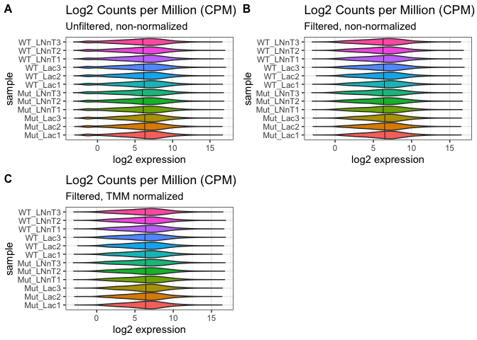
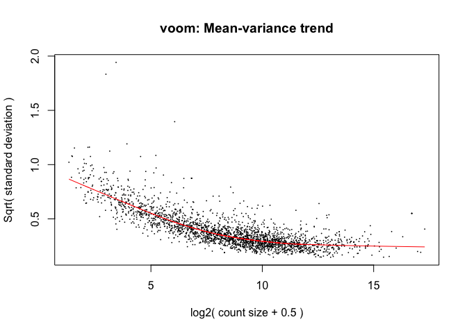

# Background

*Bifidobacterium longum* subsp. *infantis* (*B. infantis*) is a prevalent beneficial bacterium that colonizes the human neonatal gut and is uniquely adapted to efficiently use Human Milk Oligosaccharides (HMOs) as a carbon and energy source. While the metabolic pathways for HMO utilization in *B. infantis* have been studied in detail, the regulatory mechanisms governing utilization of these glycans in this bacterium remain poorly understood. A genomics-based regulon reconstruction approach used in this study implicated NagR, a transcription factor from the repressor, open reading frame, kinase (ROK) family, as a negative global regulator of genomic loci encoding lacto-N-tetraose (LNT) and lacto-N-neotetraose (LNnT) utilization pathways in *B. infantis*. This conjecture was corroborated by transcriptome profiling upon *nagR* genetic inactivation and experimental assessment of recombinant NagR binding affinity to predicted DNA motifs. The latter approach also implicated N-acetylglucosamine (GlcNAc), a universal intermediate of LNT and LNnT catabolism, and its phosphorylated derivatives as plausible NagR effectors. Reconstruction of NagR regulons in various *Bifidobacterium* lineages revealed multiple potential regulon expansion events, suggesting evolution from a local regulator of GlcNAc catabolism in ancestral bifidobacteria to a global regulator controlling foraging of mixtures of GlcNAc-containing host-derived glycans in infant gut-colonizing *B. infantis* and *Bifidobacterium bifidum*.

**Importance**

The predominance of bifidobacteria in the gut of breastfed infants is attributed to the ability of these bacteria to selectively utilize Human Milk Oligosaccharides (HMOs). Individual HMOs such as lacto-N-tetraose (LNT) and lacto-N-neotetraose (LNnT) are used as prebiotic additions to infant formulas to selectively stimulate the growth of bifidobacteria and confer multiple health benefits to preterm and malnourished children suffering from impaired (stunted) gut microbiota development. However, rational selection of HMO-based prebiotics is hampered by the incomplete knowledge of regulatory mechanisms governing HMO utilization in target bifidobacteria. This study describes NagR-mediated transcriptional regulation of LNT and LNnT utilization in *Bifidobacterium longum* subsp. *infantis*. The elucidated regulatory network appears optimally adapted to simultaneous utilization of multiple HMOs, providing an incentive to include HMO mixtures (rather than individual components) into infant formulas. The study also provides insights into the evolution of complex regulatory networks controlling carbohydrate metabolism in bifidobacteria.

**This supplementary code file below describes**:

1. Analysis of growth, HMO consumption, and organic acid production data
2. Analysis of RNA-seq data: (a) processing raw fastq files and mapping reads to the *Bifidobacterium longum* subsp. *infantis* ATCC 15697 transcriptome, (b) identification of differentially expressed genes between experimental conditions
3. Analysis of Electrophoretic Mobility Shift Assay (EMSA) data: processing gel quantification data and building 4-parameter logistic (4PL) models to infer EC~50~ values for NagR/NagR effectors

***

# Reproducibility and accessibility

All code used in this analysis, including the Rmarkdown document used to compile this supplementary code file, is available on GitHub **[here](https://github.com/Arzamasov/NagR_manuscript)**. Once the GitHub repo has been downloaded, navigate to `NagR_manuscript/` to find the Rmarkdown document as well as the RProject file. This should be your working directory for executing code. To reproduce RNA-seq data analysis you will also need to download raw fastq files from Gene Expression Omnibus, under accession [GSE196064](https://www.ncbi.nlm.nih.gov/geo/query/acc.cgi?acc=GSE196064). Downloaded fastq files should be placed to  `NagR_manuscript/data/rnaseq/fastq/`.

***

# R packages and external functions used

A set of R packages was used for this analysis. The [pacman](https://cran.r-project.org/web/packages/pacman/index.html) package was used to simplify downloading and loading the required packages. All graphics and data wrangling were handled using the [tidyverse suite of packages](https://www.tidyverse.org/).

```r
# install/load the pacman package for rapid installation of packages that are not in library
if (!require("pacman")) install.packages("pacman")
# use pacman to install/load all packages needed for the analysis
pacman::p_load('tidyverse', 'tximport', 'gt', 'tidyverse', 'edgeR', 'matrixStats', 'cowplot', 
               'ggrepel', 'pheatmap', 'drc', 'Cairo', 'ggpubr')
```

A set of external R functions was used to keep the code tidy. All used R scripts with functions can be found in `NagR_manuscript/code/`.

```r
source("code/profile.R") # calculates counts per million (CPM) for each gene 
# plots the distribution of CPM values for each sample
source("code/deg_list.R") # selects differential expressed genes (DEGs) based on input cut-offs
# outputs an annotated table with DEGs to a txt file
source("code/emsa.R") # builds a 4PL model for EMSA quantification data
# plots the fit from the 4PL model with 95% confidence intervals
```

***

# Analysis of growth, HMO consumption, and organic acid production data

## Growth data

Growth of WT and *nagR*-KO strains in MRS-CS supplemented with various carbon sources was measured by OD~600~. Data points (taken at 0, 4, 8, 12, and 24 h) represent the mean of three replicates; error bars depict 95% confidence intervals for the mean.

```r
# read growth data
growth_data <- read_tsv("data/growth/growth_data.txt") %>%
  filter(sugar != "control")
# plot data
growth_data %>%
  # rearrange plot order
  mutate(across(sugar, factor, levels=c("Lactose", "HMO", "Sucrose", "FOS"))) %>%
ggplot(aes(x = time, y = od, group = strain)) +
  # display mean and connect points by line
  stat_summary(
    fun = mean,
    geom='line',
    size = 0.7,
    aes(color=strain)) +
  # display 95% non-parametric confidence interval for the mean
  stat_summary(
    fun.data=mean_cl_boot,
    geom='errorbar',
    width=0.6,
    aes(color=strain)) +
  stat_summary(
    fun=mean,
    geom ='point',
    aes(fill=strain, shape=strain),
    size = 1.5)+
  scale_color_manual(name="Strain",
                    values=c(WT="#008800", Mut="#F48326")) +
  scale_fill_manual(name="Strain",
                    values=c(WT="#008800", Mut="#F48326")) +
  scale_shape_manual(name="Strain",
                    values=c(WT=21, Mut=24)) +
  scale_x_continuous(limits=c(-0.4, 24.4),
                     breaks=c(0, 4, 8, 12, 16, 20, 24)) +
  scale_y_continuous(limits=c(0, 6.5),
                     breaks=c(0, 1, 2, 3, 4, 5, 6)) +
  xlab("Time (h)") +
  ylab("OD600") +
  facet_wrap(. ~ sugar) +
  theme_bw(14) + 
  theme(axis.text=element_text(size=10), strip.text = element_text(size = 14))
```

<div class="figure" style="text-align: center">

<p class="caption">Fig. 2</p>
</div>

```r
# save the figure
ggsave("results/figures/figure_2.pdf", device = cairo_pdf, width = 6, height = 5)
```

***

## HMO consumption

HMO consumption of WT and *nagR*-KO strains grown in MRS-CS-HMO was measured by normal phase high-performance liquid chromatography (HPLC). Data points (taken at 0, 4, 8, 12, and 24 h) represent the mean of three replicates; error bars depict 95% confidence intervals for the mean.

```r
# read HMO consumption data
hmo_data <- read_tsv("data/metabolomics/HMO_concentration.txt")
# plot data
hmo_data %>%
  # rearrange plot order
  mutate(across(sugar, factor, levels=c("Lactose", "2'FL", "3FL", "DFL",
                                        "LNT", "LNnT", "LNFP I",
                                        "LNFP II/III", "LNDFH I",
                                        "LNDFH II",
                                        "LNTriose II", "Fucose"))) %>%
  ggplot(aes(x = time, y = conc, group = strain)) +
  # display mean and connect points by line
  stat_summary(
    fun = mean,
    geom='line',
    size = 1,
    aes(color=strain)) +
  # display 95% non-parametric confidence intervals for the mean
  stat_summary(
    fun.data=mean_cl_boot,
    geom='errorbar',
    width=0.6,
    aes(color=strain)) +
  stat_summary(
    fun=mean,
    geom ='point',
    aes(fill=strain, shape=strain),
    size = 3) +
  scale_color_manual(name="Strain",
                     values=c(WT="#008800", Mut="#F48326")) +
  scale_fill_manual(name="Strain",
                     values=c(WT="#008800", Mut="#F48326")) +
  scale_shape_manual(name="Strain",
                     values=c(WT=21, Mut=24)) +
  scale_x_continuous(limits=c(-0.4, 24.4),
                     breaks=c(0, 4, 8, 12, 16, 20, 24)) +
  xlab("Time (h)") +
  ylab("Concentration (mM)") +
  # set different scales for each plot 
  facet_wrap(. ~ sugar, scales = "free") +
  theme_bw(14)
```

<div class="figure" style="text-align: center">

<p class="caption">Fig. S2C</p>
</div>

```r
# save the figure
ggsave("results/figures/figure_S2C.pdf", device = cairo_pdf, width = 12, height = 10)
```

***

## Organic acid production

Organic acid production of WT and *nagR*-KO strains grown in MRS-CS-HMO was measured by anion-exchange chromatography. Since MRS-CS contains baseline levels of acetate, formate, and lactate, measurements at 0 h were subtracted from subsequent ones (4, 8, 12, and 24 h). Data represent the mean of three replicates; error bars depict 95% confidence intervals for the mean.

```r
# read SCFA production data
scfa_data <- read_tsv("data/metabolomics/organic_acid_concentration.txt")
# plot data
scfa_data %>%
  # rearrange plot order
  mutate(across(scfa, factor, levels=c("Acetate", "Formate", "Lactate"))) %>%
  ggplot(aes(x = time, y = conc_substr, group = strain)) +
  # display mean and connect points by line
  stat_summary(
    fun = mean,
    geom='line',
    size = 1,
    aes(color=strain)) +
  # display 95% non-parametric confidence intervals for the mean
  stat_summary(
    fun.data=mean_cl_boot,
    geom='errorbar',
    width=0.6,
    aes(color=strain)) +
  stat_summary(
    fun=mean,
    geom ='point',
    aes(fill=strain, shape=strain),
    size = 3) +
  scale_color_manual(name="Strain",
                     values=c(WT="#008800", Mut="#F48326")) +
  scale_fill_manual(name="Strain",
                     values=c(WT="#008800", Mut="#F48326")) +
  scale_shape_manual(name="Strain",
                     values=c(WT=21, Mut=24)) +
  scale_x_continuous(limits=c(-0.4, 24.4),
                     breaks=c(0, 4, 8, 12, 16, 20, 24)) +
  xlab("Time (h)") +
  ylab("Concentration (mM)") +
  facet_wrap(. ~ scfa, scales = "free") +
  theme_bw(14)
```

<div class="figure" style="text-align: center">

<p class="caption">Fig. S2D</p>
</div>

```r
# save the figure
ggsave("results/figures/figure_S2D.pdf", device = cairo_pdf, width = 10, height = 5)
```

***

# Analysis of RNA-seq data

## Processing of raw fastq files and read mapping

The code chuck below describes processing of raw fastq files and mapping reads to the *Bifidobacterium longum* subsp. *infantis* ATCC 15697 transcriptome.
The following software is required (can be installed to a conda environment):

1. [FastQC (v0.11.9)](https://www.bioinformatics.babraham.ac.uk/projects/fastqc/)
2. [Cutadapt (v3.4)](https://cutadapt.readthedocs.io/en/stable/)
3. [Bowtie2 (v2.4.4)](http://bowtie-bio.sourceforge.net/bowtie2/index.shtml)
4. [Kallisto v0.46.2](https://pachterlab.github.io/kallisto/)
5. [MultiQC (v1.11)](https://multiqc.info/)
6. [Parallel (v20210222)](https://www.gnu.org/software/parallel/)

**Note**: due to size limitation, raw fastq files could not be stored in the GitHub repo. Thus, you will need to download the fastq files from the Gene Expression Omnibus, under accession [GSE196064](https://www.ncbi.nlm.nih.gov/geo/query/acc.cgi?acc=GSE196064). Downloaded fastq files should be in `data/rnaseq/fastq/`. 

The reference fasta files used for building Bowtie2 and Kallisto indeces can be found in `data/rnaseq/refs/`. 

**Note**: exact file names (without the .fastq.qz extension) should be entered into `data/rnaseq/runids.txt`.

Alternatively, you can run `code/qc_readmapping.sh` instead of the code chunk below.

Summary of the script:

1. Quality control of raw reads was carried out using FastQC
2. Illumina sequencing adapters and short reads (< 20 bp) were removed using Cutadapt
3. Reads were mapped against rRNA and tRNA gene sequences extracted from the *Bifidobacterium longum* subsp. *infantis* ATCC 15697 genome (GenBank accession no. CP001095.1) using Bowtie2. Unmapped (filtered) reads were saved and used further
4. Filtered reads were mapped to the *Bifidobacterium longum* subsp. *infantis* ATCC 15697 (CP001095.1) using Kallisto
5. The quality of raw/filtered reads, as well as the results of Bowtie2/Kallisto mapping were summarized in `data/rnaseq/multiqc_report.html` generated via MultiQC

```bash
source ~/.bash_profile
echo $BASH_VERSION
set -ex

# required software: fastqc (v0.11.9), cutadapt (v3.4), bowtie2 (v2.4.4), kallisto (v0.46.2)
# multiqc (1.11), and parallel (v20210222)
# sample names should be in data/rnaseq/runids.txt

# activate conda enviroment with required software
eval "$(command conda 'shell.bash' 'hook' 2> /dev/null)" # initializes conda in sub-shell
conda activate transcriptomics
conda info|egrep "conda version|active environment"

# create directories
mkdir data/rnaseq/qc1 # qc results for raw reads
mkdir data/rnaseq/qc2 # qc results for filtered reads
mkdir data/rnaseq/fq_trim # trimmed reads
mkdir data/rnaseq/fq_filt # filtered reads
mkdir data/rnaseq/sam # sam files produced during bowtie2 alignment; will be deleted
mkdir data/rnaseq/kallisto # kallisto mapping results

# run fastqc on raw reads
cat data/rnaseq/runids.txt | parallel "fastqc data/rnaseq/fastq/{}.fastq.gz \
--outdir data/rnaseq/qc1"

# trim adapters using cutadapt
cat data/rnaseq/runids.txt | parallel "cutadapt -m 20 -a AGATCGGAAGAGCACACGTCTGAACTCCAGTC \
-o data/rnaseq/fq_trim/{}.fastq.gz data/rnaseq/fastq/{}.fastq.gz \
&> data/rnaseq/fq_trim/{}.fastq.qz.log"

# filter reads mapping to rRNA and tRNA genes
# build bowtie2 index
bowtie2-build data/rnaseq/refs/Binfantis_ATCC15697_rRNA_tRNA.fasta \
data/rnaseq/refs/Binfantis_ATCC15697_rRNA_tRNA
# align reads via bowtie2; save ones that did not align to a separate file
cat data/rnaseq/runids.txt | \
parallel "bowtie2 -x data/rnaseq/refs/Binfantis_ATCC15697_rRNA_tRNA \
-U data/rnaseq/fq_trim/{}.fastq.gz \
-S data/rnaseq/sam/{}.sam \
--un data/rnaseq/fq_filt/{}.fastq \
&> data/rnaseq/fq_filt/{}.log"
cat data/rnaseq/runids.txt | parallel "gzip data/rnaseq/fq_filt/{}.fastq"

# run fastqc on filtered reads
cat data/rnaseq/runids.txt | parallel "fastqc data/rnaseq/fq_filt/{}.fastq.gz \
--outdir data/rnaseq/qc2"

# pseudolalign reads to transcriptome
# build kallisto index
kallisto index -i data/rnaseq/refs/Binfantis_ATCC15697_transcriptome.index \
data/rnaseq/refs/Binfantis_ATCC15697_transcriptome.fasta
# map reads to indexed reference via kallisto
cat data/rnaseq/runids.txt | parallel "kallisto quant \
-i data/rnaseq/refs/Binfantis_ATCC15697_transcriptome.index \
-o data/rnaseq/kallisto/{} \
--single \
-l 200 \
-s 20 \
data/rnaseq/fq_filt/{}.fastq.gz \
&> data/rnaseq/kallisto/{}_2.log"

# run multiqc
export LC_ALL=en_US.utf-8
export LANG=en_US.utf-8
multiqc -d . -o data/rnaseq

# remove directories with intermediate files
rm -rf data/rnaseq/qc1
rm -rf data/rnaseq/qc2
rm -rf data/rnaseq/fq_filt
rm -rf data/rnaseq/sam
```

***

## Importing count data into R

[TxImport](https://bioconductor.org/packages/release/bioc/html/tximport.html) was used to read Kallisto outputs into the R environment.

*Note*: before running the code, double-check that file names in the file_names column in `data/rnaseq/studydesign.txt` are identical to file names in `data/rnaseq/runids.txt`.

```r
# read the study design file
targets <- read_tsv("data/rnaseq/studydesign.txt")
# set file paths to Kallisto output folders with quantification data
files <- file.path("data/rnaseq/kallisto", targets$file_name, "abundance.tsv")
# check that all output files are present
all(file.exists(files))
```

```
## [1] TRUE
```

```r
# use 'tximport' to import Kallisto output into R
txi_kallisto <- tximport(files, 
                         type = "kallisto",
                         txOut = TRUE, # import at transcript level
                         countsFromAbundance = "lengthScaledTPM")

# capture variables of interest from the study design
condition <- as.factor(targets$condition)
condition <- factor(condition, levels = c("WT_Lac", "Mut_Lac", "WT_LNnT", "Mut_LNnT"))
batch <- as.factor(targets$batch)
strain <- as.factor(targets$strain)
carb <- as.factor(targets$carb)
# capture sample labels for later use
sampleLabels <- targets$sample

# saw a table with raw counts for GEO submission
raw_counts <- as.tibble(txi_kallisto$counts, rownames = "locus_tag")
colnames(raw_counts) <- c("geneID", sampleLabels)
write_tsv(raw_counts, "results/tables/Arzamasov_raw_count_matrix.txt")

# use gt package to produce the study design table
gt(targets) %>% 
  cols_align(
    align = "left",
    columns = TRUE
  )
```

```{=html}
<div id="qamcecrfda" style="overflow-x:auto;overflow-y:auto;width:auto;height:auto;">
<style>html {
  font-family: -apple-system, BlinkMacSystemFont, 'Segoe UI', Roboto, Oxygen, Ubuntu, Cantarell, 'Helvetica Neue', 'Fira Sans', 'Droid Sans', Arial, sans-serif;
}

#qamcecrfda .gt_table {
  display: table;
  border-collapse: collapse;
  margin-left: auto;
  margin-right: auto;
  color: #333333;
  font-size: 16px;
  font-weight: normal;
  font-style: normal;
  background-color: #FFFFFF;
  width: auto;
  border-top-style: solid;
  border-top-width: 2px;
  border-top-color: #A8A8A8;
  border-right-style: none;
  border-right-width: 2px;
  border-right-color: #D3D3D3;
  border-bottom-style: solid;
  border-bottom-width: 2px;
  border-bottom-color: #A8A8A8;
  border-left-style: none;
  border-left-width: 2px;
  border-left-color: #D3D3D3;
}

#qamcecrfda .gt_heading {
  background-color: #FFFFFF;
  text-align: center;
  border-bottom-color: #FFFFFF;
  border-left-style: none;
  border-left-width: 1px;
  border-left-color: #D3D3D3;
  border-right-style: none;
  border-right-width: 1px;
  border-right-color: #D3D3D3;
}

#qamcecrfda .gt_title {
  color: #333333;
  font-size: 125%;
  font-weight: initial;
  padding-top: 4px;
  padding-bottom: 4px;
  border-bottom-color: #FFFFFF;
  border-bottom-width: 0;
}

#qamcecrfda .gt_subtitle {
  color: #333333;
  font-size: 85%;
  font-weight: initial;
  padding-top: 0;
  padding-bottom: 6px;
  border-top-color: #FFFFFF;
  border-top-width: 0;
}

#qamcecrfda .gt_bottom_border {
  border-bottom-style: solid;
  border-bottom-width: 2px;
  border-bottom-color: #D3D3D3;
}

#qamcecrfda .gt_col_headings {
  border-top-style: solid;
  border-top-width: 2px;
  border-top-color: #D3D3D3;
  border-bottom-style: solid;
  border-bottom-width: 2px;
  border-bottom-color: #D3D3D3;
  border-left-style: none;
  border-left-width: 1px;
  border-left-color: #D3D3D3;
  border-right-style: none;
  border-right-width: 1px;
  border-right-color: #D3D3D3;
}

#qamcecrfda .gt_col_heading {
  color: #333333;
  background-color: #FFFFFF;
  font-size: 100%;
  font-weight: normal;
  text-transform: inherit;
  border-left-style: none;
  border-left-width: 1px;
  border-left-color: #D3D3D3;
  border-right-style: none;
  border-right-width: 1px;
  border-right-color: #D3D3D3;
  vertical-align: bottom;
  padding-top: 5px;
  padding-bottom: 6px;
  padding-left: 5px;
  padding-right: 5px;
  overflow-x: hidden;
}

#qamcecrfda .gt_column_spanner_outer {
  color: #333333;
  background-color: #FFFFFF;
  font-size: 100%;
  font-weight: normal;
  text-transform: inherit;
  padding-top: 0;
  padding-bottom: 0;
  padding-left: 4px;
  padding-right: 4px;
}

#qamcecrfda .gt_column_spanner_outer:first-child {
  padding-left: 0;
}

#qamcecrfda .gt_column_spanner_outer:last-child {
  padding-right: 0;
}

#qamcecrfda .gt_column_spanner {
  border-bottom-style: solid;
  border-bottom-width: 2px;
  border-bottom-color: #D3D3D3;
  vertical-align: bottom;
  padding-top: 5px;
  padding-bottom: 5px;
  overflow-x: hidden;
  display: inline-block;
  width: 100%;
}

#qamcecrfda .gt_group_heading {
  padding: 8px;
  color: #333333;
  background-color: #FFFFFF;
  font-size: 100%;
  font-weight: initial;
  text-transform: inherit;
  border-top-style: solid;
  border-top-width: 2px;
  border-top-color: #D3D3D3;
  border-bottom-style: solid;
  border-bottom-width: 2px;
  border-bottom-color: #D3D3D3;
  border-left-style: none;
  border-left-width: 1px;
  border-left-color: #D3D3D3;
  border-right-style: none;
  border-right-width: 1px;
  border-right-color: #D3D3D3;
  vertical-align: middle;
}

#qamcecrfda .gt_empty_group_heading {
  padding: 0.5px;
  color: #333333;
  background-color: #FFFFFF;
  font-size: 100%;
  font-weight: initial;
  border-top-style: solid;
  border-top-width: 2px;
  border-top-color: #D3D3D3;
  border-bottom-style: solid;
  border-bottom-width: 2px;
  border-bottom-color: #D3D3D3;
  vertical-align: middle;
}

#qamcecrfda .gt_from_md > :first-child {
  margin-top: 0;
}

#qamcecrfda .gt_from_md > :last-child {
  margin-bottom: 0;
}

#qamcecrfda .gt_row {
  padding-top: 8px;
  padding-bottom: 8px;
  padding-left: 5px;
  padding-right: 5px;
  margin: 10px;
  border-top-style: solid;
  border-top-width: 1px;
  border-top-color: #D3D3D3;
  border-left-style: none;
  border-left-width: 1px;
  border-left-color: #D3D3D3;
  border-right-style: none;
  border-right-width: 1px;
  border-right-color: #D3D3D3;
  vertical-align: middle;
  overflow-x: hidden;
}

#qamcecrfda .gt_stub {
  color: #333333;
  background-color: #FFFFFF;
  font-size: 100%;
  font-weight: initial;
  text-transform: inherit;
  border-right-style: solid;
  border-right-width: 2px;
  border-right-color: #D3D3D3;
  padding-left: 12px;
}

#qamcecrfda .gt_summary_row {
  color: #333333;
  background-color: #FFFFFF;
  text-transform: inherit;
  padding-top: 8px;
  padding-bottom: 8px;
  padding-left: 5px;
  padding-right: 5px;
}

#qamcecrfda .gt_first_summary_row {
  padding-top: 8px;
  padding-bottom: 8px;
  padding-left: 5px;
  padding-right: 5px;
  border-top-style: solid;
  border-top-width: 2px;
  border-top-color: #D3D3D3;
}

#qamcecrfda .gt_grand_summary_row {
  color: #333333;
  background-color: #FFFFFF;
  text-transform: inherit;
  padding-top: 8px;
  padding-bottom: 8px;
  padding-left: 5px;
  padding-right: 5px;
}

#qamcecrfda .gt_first_grand_summary_row {
  padding-top: 8px;
  padding-bottom: 8px;
  padding-left: 5px;
  padding-right: 5px;
  border-top-style: double;
  border-top-width: 6px;
  border-top-color: #D3D3D3;
}

#qamcecrfda .gt_striped {
  background-color: rgba(128, 128, 128, 0.05);
}

#qamcecrfda .gt_table_body {
  border-top-style: solid;
  border-top-width: 2px;
  border-top-color: #D3D3D3;
  border-bottom-style: solid;
  border-bottom-width: 2px;
  border-bottom-color: #D3D3D3;
}

#qamcecrfda .gt_footnotes {
  color: #333333;
  background-color: #FFFFFF;
  border-bottom-style: none;
  border-bottom-width: 2px;
  border-bottom-color: #D3D3D3;
  border-left-style: none;
  border-left-width: 2px;
  border-left-color: #D3D3D3;
  border-right-style: none;
  border-right-width: 2px;
  border-right-color: #D3D3D3;
}

#qamcecrfda .gt_footnote {
  margin: 0px;
  font-size: 90%;
  padding: 4px;
}

#qamcecrfda .gt_sourcenotes {
  color: #333333;
  background-color: #FFFFFF;
  border-bottom-style: none;
  border-bottom-width: 2px;
  border-bottom-color: #D3D3D3;
  border-left-style: none;
  border-left-width: 2px;
  border-left-color: #D3D3D3;
  border-right-style: none;
  border-right-width: 2px;
  border-right-color: #D3D3D3;
}

#qamcecrfda .gt_sourcenote {
  font-size: 90%;
  padding: 4px;
}

#qamcecrfda .gt_left {
  text-align: left;
}

#qamcecrfda .gt_center {
  text-align: center;
}

#qamcecrfda .gt_right {
  text-align: right;
  font-variant-numeric: tabular-nums;
}

#qamcecrfda .gt_font_normal {
  font-weight: normal;
}

#qamcecrfda .gt_font_bold {
  font-weight: bold;
}

#qamcecrfda .gt_font_italic {
  font-style: italic;
}

#qamcecrfda .gt_super {
  font-size: 65%;
}

#qamcecrfda .gt_footnote_marks {
  font-style: italic;
  font-weight: normal;
  font-size: 65%;
}
</style>
<table class="gt_table">
  
  <thead class="gt_col_headings">
    <tr>
      <th class="gt_col_heading gt_columns_bottom_border gt_left" rowspan="1" colspan="1">sample</th>
      <th class="gt_col_heading gt_columns_bottom_border gt_left" rowspan="1" colspan="1">file_name</th>
      <th class="gt_col_heading gt_columns_bottom_border gt_left" rowspan="1" colspan="1">condition</th>
      <th class="gt_col_heading gt_columns_bottom_border gt_left" rowspan="1" colspan="1">batch</th>
      <th class="gt_col_heading gt_columns_bottom_border gt_left" rowspan="1" colspan="1">strain</th>
      <th class="gt_col_heading gt_columns_bottom_border gt_left" rowspan="1" colspan="1">carb</th>
    </tr>
  </thead>
  <tbody class="gt_table_body">
    <tr><td class="gt_row gt_left">WT_Lac1</td>
<td class="gt_row gt_left">01_WT_Lac1_S53_merged_lanes</td>
<td class="gt_row gt_left">WT_Lac</td>
<td class="gt_row gt_left">1</td>
<td class="gt_row gt_left">ATCC15697</td>
<td class="gt_row gt_left">Lac</td></tr>
    <tr><td class="gt_row gt_left">Mut_Lac1</td>
<td class="gt_row gt_left">02_Mut_Lac1_S54_merged_lanes</td>
<td class="gt_row gt_left">Mut_Lac</td>
<td class="gt_row gt_left">1</td>
<td class="gt_row gt_left">M3</td>
<td class="gt_row gt_left">Lac</td></tr>
    <tr><td class="gt_row gt_left">WT_LNnT1</td>
<td class="gt_row gt_left">03_WT_LNnT1_S55_merged_lanes</td>
<td class="gt_row gt_left">WT_LNnT</td>
<td class="gt_row gt_left">2</td>
<td class="gt_row gt_left">ATCC15697</td>
<td class="gt_row gt_left">LNnT</td></tr>
    <tr><td class="gt_row gt_left">Mut_LNnT1</td>
<td class="gt_row gt_left">04_Mut_LNnT1_S56_merged_lanes</td>
<td class="gt_row gt_left">Mut_LNnT</td>
<td class="gt_row gt_left">2</td>
<td class="gt_row gt_left">M3</td>
<td class="gt_row gt_left">LNnT</td></tr>
    <tr><td class="gt_row gt_left">WT_Lac2</td>
<td class="gt_row gt_left">05_WT_Lac2_S57_merged_lanes</td>
<td class="gt_row gt_left">WT_Lac</td>
<td class="gt_row gt_left">1</td>
<td class="gt_row gt_left">ATCC15697</td>
<td class="gt_row gt_left">Lac</td></tr>
    <tr><td class="gt_row gt_left">Mut_Lac2</td>
<td class="gt_row gt_left">06_Mut_Lac2_S58_merged_lanes</td>
<td class="gt_row gt_left">Mut_Lac</td>
<td class="gt_row gt_left">1</td>
<td class="gt_row gt_left">M3</td>
<td class="gt_row gt_left">Lac</td></tr>
    <tr><td class="gt_row gt_left">WT_LNnT2</td>
<td class="gt_row gt_left">07_WT_LNnT2_S59_merged_lanes</td>
<td class="gt_row gt_left">WT_LNnT</td>
<td class="gt_row gt_left">2</td>
<td class="gt_row gt_left">ATCC15697</td>
<td class="gt_row gt_left">LNnT</td></tr>
    <tr><td class="gt_row gt_left">Mut_LNnT2</td>
<td class="gt_row gt_left">08_Mut_LNnT2_S60_merged_lanes</td>
<td class="gt_row gt_left">Mut_LNnT</td>
<td class="gt_row gt_left">2</td>
<td class="gt_row gt_left">M3</td>
<td class="gt_row gt_left">LNnT</td></tr>
    <tr><td class="gt_row gt_left">WT_Lac3</td>
<td class="gt_row gt_left">09_WT_Lac3_S61_merged_lanes</td>
<td class="gt_row gt_left">WT_Lac</td>
<td class="gt_row gt_left">1</td>
<td class="gt_row gt_left">ATCC15697</td>
<td class="gt_row gt_left">Lac</td></tr>
    <tr><td class="gt_row gt_left">Mut_Lac3</td>
<td class="gt_row gt_left">10_Mut_Lac3_S62_merged_lanes</td>
<td class="gt_row gt_left">Mut_Lac</td>
<td class="gt_row gt_left">1</td>
<td class="gt_row gt_left">M3</td>
<td class="gt_row gt_left">Lac</td></tr>
    <tr><td class="gt_row gt_left">WT_LNnT3</td>
<td class="gt_row gt_left">11_WT_LNnT3_S63_merged_lanes</td>
<td class="gt_row gt_left">WT_LNnT</td>
<td class="gt_row gt_left">2</td>
<td class="gt_row gt_left">ATCC15697</td>
<td class="gt_row gt_left">LNnT</td></tr>
    <tr><td class="gt_row gt_left">Mut_LNnT3</td>
<td class="gt_row gt_left">12_Mut_LNnT3_S64_merged_lanes</td>
<td class="gt_row gt_left">Mut_LNnT</td>
<td class="gt_row gt_left">2</td>
<td class="gt_row gt_left">M3</td>
<td class="gt_row gt_left">LNnT</td></tr>
  </tbody>
  
  
</table>
</div>
```
***

## Filtering and normalization


```r
myDGEList <- DGEList(txi_kallisto$counts)
# plot unfiltered, non-normalized CPM
p1 <- profile(myDGEList, sampleLabels, "Unfiltered, non-normalized")
# filter counts
cpm <- cpm(myDGEList)
keepers <- rowSums(cpm>1)>=3 # only keep genes that have cpm>1 (== not zeroes) 
# in more than 2 samples (minimal group size)
myDGEList.filtered <- myDGEList[keepers,]
# plot filtered, non-normalized CPM
p2 <- profile(myDGEList.filtered, sampleLabels, "Filtered, non-normalized")
# normalize counts via the TMM method implemented in edgeR
myDGEList.filtered.norm <- calcNormFactors(myDGEList.filtered, method = "TMM")
# plot filtered, normalized CPM
p3 <- profile(myDGEList.filtered.norm, sampleLabels, "Filtered, TMM normalized")
# compare distributions of the CPM values
plot_grid(p1, p2, p3, labels = c('A', 'B', 'C'), label_size = 12)
```

<!-- -->

Filtering was carried out to remove lowly expressed genes. Genes with less than 1 count per million (CPM) in at least 3 or more samples filtered out. This procedure reduced the number of genes from **2508** to **2366**.
In addition, the [TMM method](https://doi.org/10.1186/gb-2010-11-3-r25) was used for between-sample normalization.

***

## PCA plot \textcolor{red}{Fig. 2B}

Principal Component Analysis (PCA) plots reduce complex datasets to a 2D representation where each axis represents a source of variance (known or unknown) in the dataset.  As you can see from the plots below, Principal Component 1 (PC1; X-axis), which accounts for >38% of the variance in the data, is separating the samples based on carbon source. PC2 (Y-axis) accounts for a smaller source of variance (~21%) and can be attributed to variation between strains of *Bifidobacterium longum* subsp. *infantis* ATCC 15697: WT and *nagR*-KO.


```r
# running PCA
log2.cpm.filtered.norm <- cpm(myDGEList.filtered.norm, log=TRUE)
pca.res <- prcomp(t(log2.cpm.filtered.norm), scale.=F, retx=T)
pc.var <- pca.res$sdev^2 # sdev^2 captures eigenvalues from the PCA result
pc.per <- round(pc.var/sum(pc.var)*100, 1) # calculate percentage of the total variation 
# explained by each eigenvalue
# converting PCA result into a tibble for plotting
pca.res.df <- as_tibble(pca.res$x)

# plotting PCA
ggplot(pca.res.df) +
  aes(x=PC1, y=PC2, label=sampleLabels, shape = carb, fill = strain) +
  geom_point(size=4) +
  scale_shape_manual(name = "Carb. source",
                     breaks=c("Lac","LNnT"), 
                     values=c(21, 24),
                     labels=c("Lactose", "LNnT")) +
  scale_fill_manual(name = "Strain",
                     breaks=c("ATCC15697","M3"),
                     values=c("#008800", "#ffcf34"),
                     labels=c("WT", "nagR-KO")) +
  guides(fill = guide_legend(override.aes=list(shape=21))) +
  xlab(paste0("PC1 (",pc.per[1],"%",")")) + 
  ylab(paste0("PC2 (",pc.per[2],"%",")")) +
  labs(title= "PCA of B. infantis ATCC 15697: WT vs nagR-KO",
       subtitle = "Principal component analysis (PCA) showing clear separation 
       between growth on Lac and LNnT and between WT and nagR-KO",
       color = "strain", shape="carb") +
  coord_fixed(ratio=1.2) +
  theme_bw() +
  theme(plot.title = element_text(face="bold"))
```

<div class="figure" style="text-align: center">

<p class="caption">Fig. 2B</p>
</div>

```r
# save the figure
ggsave("results/figures/figure_2B.pdf", device = "pdf", width = 5, height = 5)
```

***

## Differentially expressed genes 

To identify differentially expressed genes (DEGs), precision weights were first applied to each gene based on its mean-variance relationship using [VOOM](https://genomebiology.biomedcentral.com/articles/10.1186/gb-2014-15-2-r29). Linear modeling and bayesian stats were employed using [Limma](https://academic.oup.com/nar/article/43/7/e47/2414268) to find genes that were up- or down-regulated by 2-fold or more at false-discovery rate (FDR) of 0.01.


```r
# setting up model matrix without intercept
design <- model.matrix(~0 + condition)
colnames(design) <- levels(condition)
# using VOOM function from Limma package to apply precision weights to each gene
v.DEGList.filtered.norm <- voom(myDGEList.filtered.norm, design, plot = TRUE)
```

<!-- -->

```r
fit <- lmFit(v.DEGList.filtered.norm, design)
# setting up contrast matrix for pairwise comparisons of interest
contrast.matrix <- makeContrasts(Mut_WT_Lac = Mut_Lac - WT_Lac,
                                Mut_WT_LNnT = Mut_LNnT - WT_LNnT,
                                LNnT_WT = WT_LNnT - WT_Lac,
                                LNnT_Mut = Mut_LNnT - Mut_Lac,
                                levels=design)
fits <- contrasts.fit(fit, contrast.matrix)
# extracting stats 
ebFit <- eBayes(fits)
```

***

DEGs were annotated based on a [RAST-annotated](https://doi.org/10.1093/nar/gkt1226) version of the *Bifidobacterium longum* subsp. *infantis* ATCC 15697 genome, which was additionally subjected to extensive manual curation in the web-based mcSEED environment, a private clone of the publicly available [SEED platform](https://doi.org/10.1093/nar/gki866). The manual curation focused on annotating genes encoding functional roles (transporters, glycoside hydrolases, downstream catabolic enzymes, transcriptional regulators) involved in carbohydrate metabolism.

DEGs: *Bifidobacterium longum* subsp. *infantis* ATCC 15697 grown in MRS-CS-Lac: *nagR*-KO vs WT

```r
# create a master annotation table
seed.ann <- read_tsv('data/rnaseq/annotation/SEED_annotations.tsv')
corr <- read_tsv('data/rnaseq/annotation/Binfantis_ATCC15697_GenBank_vs_mcSEED.txt')
final.ann <- right_join(seed.ann, corr, by = c('seed_id' = 'seed_id')) %>%
  dplyr::select(locus_tag, annotation)

# annotate DEGs
# Mut_Lac vs WT_Lac
myTopHits.Mut <- topTable(ebFit, adjust ="BH", coef=1, number=2600, sort.by="logFC")
deg_list(myTopHits.Mut, -1, 1, 0.01, "results/tables/DEG_Mut_Lac_vs_WT_Lac.txt")
```

```{=html}
<div id="bjvfocxvzd" style="overflow-x:auto;overflow-y:auto;width:1000px;height:500px;">
<style>html {
  font-family: -apple-system, BlinkMacSystemFont, 'Segoe UI', Roboto, Oxygen, Ubuntu, Cantarell, 'Helvetica Neue', 'Fira Sans', 'Droid Sans', Arial, sans-serif;
}

#bjvfocxvzd .gt_table {
  display: table;
  border-collapse: collapse;
  margin-left: auto;
  margin-right: auto;
  color: #333333;
  font-size: 16px;
  font-weight: normal;
  font-style: normal;
  background-color: #FFFFFF;
  width: auto;
  border-top-style: solid;
  border-top-width: 2px;
  border-top-color: #A8A8A8;
  border-right-style: none;
  border-right-width: 2px;
  border-right-color: #D3D3D3;
  border-bottom-style: solid;
  border-bottom-width: 2px;
  border-bottom-color: #A8A8A8;
  border-left-style: none;
  border-left-width: 2px;
  border-left-color: #D3D3D3;
}

#bjvfocxvzd .gt_heading {
  background-color: #FFFFFF;
  text-align: center;
  border-bottom-color: #FFFFFF;
  border-left-style: none;
  border-left-width: 1px;
  border-left-color: #D3D3D3;
  border-right-style: none;
  border-right-width: 1px;
  border-right-color: #D3D3D3;
}

#bjvfocxvzd .gt_title {
  color: #333333;
  font-size: 125%;
  font-weight: initial;
  padding-top: 4px;
  padding-bottom: 4px;
  border-bottom-color: #FFFFFF;
  border-bottom-width: 0;
}

#bjvfocxvzd .gt_subtitle {
  color: #333333;
  font-size: 85%;
  font-weight: initial;
  padding-top: 0;
  padding-bottom: 6px;
  border-top-color: #FFFFFF;
  border-top-width: 0;
}

#bjvfocxvzd .gt_bottom_border {
  border-bottom-style: solid;
  border-bottom-width: 2px;
  border-bottom-color: #D3D3D3;
}

#bjvfocxvzd .gt_col_headings {
  border-top-style: solid;
  border-top-width: 2px;
  border-top-color: #D3D3D3;
  border-bottom-style: solid;
  border-bottom-width: 2px;
  border-bottom-color: #D3D3D3;
  border-left-style: none;
  border-left-width: 1px;
  border-left-color: #D3D3D3;
  border-right-style: none;
  border-right-width: 1px;
  border-right-color: #D3D3D3;
}

#bjvfocxvzd .gt_col_heading {
  color: #333333;
  background-color: #FFFFFF;
  font-size: 100%;
  font-weight: normal;
  text-transform: inherit;
  border-left-style: none;
  border-left-width: 1px;
  border-left-color: #D3D3D3;
  border-right-style: none;
  border-right-width: 1px;
  border-right-color: #D3D3D3;
  vertical-align: bottom;
  padding-top: 5px;
  padding-bottom: 6px;
  padding-left: 5px;
  padding-right: 5px;
  overflow-x: hidden;
}

#bjvfocxvzd .gt_column_spanner_outer {
  color: #333333;
  background-color: #FFFFFF;
  font-size: 100%;
  font-weight: normal;
  text-transform: inherit;
  padding-top: 0;
  padding-bottom: 0;
  padding-left: 4px;
  padding-right: 4px;
}

#bjvfocxvzd .gt_column_spanner_outer:first-child {
  padding-left: 0;
}

#bjvfocxvzd .gt_column_spanner_outer:last-child {
  padding-right: 0;
}

#bjvfocxvzd .gt_column_spanner {
  border-bottom-style: solid;
  border-bottom-width: 2px;
  border-bottom-color: #D3D3D3;
  vertical-align: bottom;
  padding-top: 5px;
  padding-bottom: 5px;
  overflow-x: hidden;
  display: inline-block;
  width: 100%;
}

#bjvfocxvzd .gt_group_heading {
  padding: 8px;
  color: #333333;
  background-color: #FFFFFF;
  font-size: 100%;
  font-weight: initial;
  text-transform: inherit;
  border-top-style: solid;
  border-top-width: 2px;
  border-top-color: #D3D3D3;
  border-bottom-style: solid;
  border-bottom-width: 2px;
  border-bottom-color: #D3D3D3;
  border-left-style: none;
  border-left-width: 1px;
  border-left-color: #D3D3D3;
  border-right-style: none;
  border-right-width: 1px;
  border-right-color: #D3D3D3;
  vertical-align: middle;
}

#bjvfocxvzd .gt_empty_group_heading {
  padding: 0.5px;
  color: #333333;
  background-color: #FFFFFF;
  font-size: 100%;
  font-weight: initial;
  border-top-style: solid;
  border-top-width: 2px;
  border-top-color: #D3D3D3;
  border-bottom-style: solid;
  border-bottom-width: 2px;
  border-bottom-color: #D3D3D3;
  vertical-align: middle;
}

#bjvfocxvzd .gt_from_md > :first-child {
  margin-top: 0;
}

#bjvfocxvzd .gt_from_md > :last-child {
  margin-bottom: 0;
}

#bjvfocxvzd .gt_row {
  padding-top: 8px;
  padding-bottom: 8px;
  padding-left: 5px;
  padding-right: 5px;
  margin: 10px;
  border-top-style: solid;
  border-top-width: 1px;
  border-top-color: #D3D3D3;
  border-left-style: none;
  border-left-width: 1px;
  border-left-color: #D3D3D3;
  border-right-style: none;
  border-right-width: 1px;
  border-right-color: #D3D3D3;
  vertical-align: middle;
  overflow-x: hidden;
}

#bjvfocxvzd .gt_stub {
  color: #333333;
  background-color: #FFFFFF;
  font-size: 100%;
  font-weight: initial;
  text-transform: inherit;
  border-right-style: solid;
  border-right-width: 2px;
  border-right-color: #D3D3D3;
  padding-left: 12px;
}

#bjvfocxvzd .gt_summary_row {
  color: #333333;
  background-color: #FFFFFF;
  text-transform: inherit;
  padding-top: 8px;
  padding-bottom: 8px;
  padding-left: 5px;
  padding-right: 5px;
}

#bjvfocxvzd .gt_first_summary_row {
  padding-top: 8px;
  padding-bottom: 8px;
  padding-left: 5px;
  padding-right: 5px;
  border-top-style: solid;
  border-top-width: 2px;
  border-top-color: #D3D3D3;
}

#bjvfocxvzd .gt_grand_summary_row {
  color: #333333;
  background-color: #FFFFFF;
  text-transform: inherit;
  padding-top: 8px;
  padding-bottom: 8px;
  padding-left: 5px;
  padding-right: 5px;
}

#bjvfocxvzd .gt_first_grand_summary_row {
  padding-top: 8px;
  padding-bottom: 8px;
  padding-left: 5px;
  padding-right: 5px;
  border-top-style: double;
  border-top-width: 6px;
  border-top-color: #D3D3D3;
}

#bjvfocxvzd .gt_striped {
  background-color: rgba(128, 128, 128, 0.05);
}

#bjvfocxvzd .gt_table_body {
  border-top-style: solid;
  border-top-width: 2px;
  border-top-color: #D3D3D3;
  border-bottom-style: solid;
  border-bottom-width: 2px;
  border-bottom-color: #D3D3D3;
}

#bjvfocxvzd .gt_footnotes {
  color: #333333;
  background-color: #FFFFFF;
  border-bottom-style: none;
  border-bottom-width: 2px;
  border-bottom-color: #D3D3D3;
  border-left-style: none;
  border-left-width: 2px;
  border-left-color: #D3D3D3;
  border-right-style: none;
  border-right-width: 2px;
  border-right-color: #D3D3D3;
}

#bjvfocxvzd .gt_footnote {
  margin: 0px;
  font-size: 90%;
  padding: 4px;
}

#bjvfocxvzd .gt_sourcenotes {
  color: #333333;
  background-color: #FFFFFF;
  border-bottom-style: none;
  border-bottom-width: 2px;
  border-bottom-color: #D3D3D3;
  border-left-style: none;
  border-left-width: 2px;
  border-left-color: #D3D3D3;
  border-right-style: none;
  border-right-width: 2px;
  border-right-color: #D3D3D3;
}

#bjvfocxvzd .gt_sourcenote {
  font-size: 90%;
  padding: 4px;
}

#bjvfocxvzd .gt_left {
  text-align: left;
}

#bjvfocxvzd .gt_center {
  text-align: center;
}

#bjvfocxvzd .gt_right {
  text-align: right;
  font-variant-numeric: tabular-nums;
}

#bjvfocxvzd .gt_font_normal {
  font-weight: normal;
}

#bjvfocxvzd .gt_font_bold {
  font-weight: bold;
}

#bjvfocxvzd .gt_font_italic {
  font-style: italic;
}

#bjvfocxvzd .gt_super {
  font-size: 65%;
}

#bjvfocxvzd .gt_footnote_marks {
  font-style: italic;
  font-weight: normal;
  font-size: 65%;
}
</style>
<table class="gt_table">
  
  <thead class="gt_col_headings">
    <tr>
      <th class="gt_col_heading gt_columns_bottom_border gt_left" rowspan="1" colspan="1">locus_tag</th>
      <th class="gt_col_heading gt_columns_bottom_border gt_left" rowspan="1" colspan="1">annotation</th>
      <th class="gt_col_heading gt_columns_bottom_border gt_left" rowspan="1" colspan="1">logFC</th>
      <th class="gt_col_heading gt_columns_bottom_border gt_left" rowspan="1" colspan="1">AveExpr</th>
      <th class="gt_col_heading gt_columns_bottom_border gt_left" rowspan="1" colspan="1">t</th>
      <th class="gt_col_heading gt_columns_bottom_border gt_left" rowspan="1" colspan="1">P.Value</th>
      <th class="gt_col_heading gt_columns_bottom_border gt_left" rowspan="1" colspan="1">adj.P.Val</th>
      <th class="gt_col_heading gt_columns_bottom_border gt_left" rowspan="1" colspan="1">B</th>
    </tr>
  </thead>
  <tbody class="gt_table_body">
    <tr><td class="gt_row gt_left">Blon_0879</td>
<td class="gt_row gt_left">Predicted N-acetyl-glucosamine kinase 2, ROK family (EC 2.7.1.59)</td>
<td class="gt_row gt_left">4.711712</td>
<td class="gt_row gt_left">8.37910040</td>
<td class="gt_row gt_left">51.311101</td>
<td class="gt_row gt_left">1.005800e-16</td>
<td class="gt_row gt_left">2.974654e-14</td>
<td class="gt_row gt_left">28.3954752</td></tr>
    <tr><td class="gt_row gt_left">Blon_0881</td>
<td class="gt_row gt_left">Glucosamine-6-phosphate deaminase (EC 3.5.99.6)</td>
<td class="gt_row gt_left">3.376751</td>
<td class="gt_row gt_left">10.87997802</td>
<td class="gt_row gt_left">65.158097</td>
<td class="gt_row gt_left">4.197348e-18</td>
<td class="gt_row gt_left">2.710616e-15</td>
<td class="gt_row gt_left">31.9810110</td></tr>
    <tr><td class="gt_row gt_left">Blon_0882</td>
<td class="gt_row gt_left">N-acetylglucosamine-6-phosphate deacetylase (EC 3.5.1.25)</td>
<td class="gt_row gt_left">3.312737</td>
<td class="gt_row gt_left">10.94997694</td>
<td class="gt_row gt_left">33.372441</td>
<td class="gt_row gt_left">3.000992e-14</td>
<td class="gt_row gt_left">7.100347e-12</td>
<td class="gt_row gt_left">23.0771329</td></tr>
    <tr><td class="gt_row gt_left">Blon_2347</td>
<td class="gt_row gt_left">Type II HMOs transporter (Blon_2347) I, substrate-binding protein</td>
<td class="gt_row gt_left">2.940590</td>
<td class="gt_row gt_left">10.02580851</td>
<td class="gt_row gt_left">69.595522</td>
<td class="gt_row gt_left">1.746457e-18</td>
<td class="gt_row gt_left">2.066059e-15</td>
<td class="gt_row gt_left">32.8004617</td></tr>
    <tr><td class="gt_row gt_left">Blon_2341</td>
<td class="gt_row gt_left">hypothetical protein</td>
<td class="gt_row gt_left">2.665440</td>
<td class="gt_row gt_left">7.56783751</td>
<td class="gt_row gt_left">42.326249</td>
<td class="gt_row gt_left">1.293722e-15</td>
<td class="gt_row gt_left">3.401052e-13</td>
<td class="gt_row gt_left">26.2971052</td></tr>
    <tr><td class="gt_row gt_left">Blon_2344</td>
<td class="gt_row gt_left">Type II HMOs transporter (Blon_2344) II, substrate-binding protein</td>
<td class="gt_row gt_left">2.643824</td>
<td class="gt_row gt_left">11.11900279</td>
<td class="gt_row gt_left">58.097291</td>
<td class="gt_row gt_left">1.930101e-17</td>
<td class="gt_row gt_left">9.133239e-15</td>
<td class="gt_row gt_left">30.5365937</td></tr>
    <tr><td class="gt_row gt_left">Blon_2346</td>
<td class="gt_row gt_left">Type II HMOs transporter, permease protein 1</td>
<td class="gt_row gt_left">2.477550</td>
<td class="gt_row gt_left">9.82671345</td>
<td class="gt_row gt_left">51.664805</td>
<td class="gt_row gt_left">9.180814e-17</td>
<td class="gt_row gt_left">2.974654e-14</td>
<td class="gt_row gt_left">28.9793458</td></tr>
    <tr><td class="gt_row gt_left">Blon_2343</td>
<td class="gt_row gt_left">Type II HMOs transporter, permease protein 1</td>
<td class="gt_row gt_left">2.477550</td>
<td class="gt_row gt_left">9.82671345</td>
<td class="gt_row gt_left">51.664805</td>
<td class="gt_row gt_left">9.180814e-17</td>
<td class="gt_row gt_left">2.974654e-14</td>
<td class="gt_row gt_left">28.9793458</td></tr>
    <tr><td class="gt_row gt_left">Blon_2345</td>
<td class="gt_row gt_left">Type II HMOs transporter, permease protein 2</td>
<td class="gt_row gt_left">2.436624</td>
<td class="gt_row gt_left">9.59482716</td>
<td class="gt_row gt_left">32.830006</td>
<td class="gt_row gt_left">3.725453e-14</td>
<td class="gt_row gt_left">7.345351e-12</td>
<td class="gt_row gt_left">22.8747739</td></tr>
    <tr><td class="gt_row gt_left">Blon_2342</td>
<td class="gt_row gt_left">Type II HMOs transporter, permease protein 2</td>
<td class="gt_row gt_left">2.436624</td>
<td class="gt_row gt_left">9.59482716</td>
<td class="gt_row gt_left">32.830006</td>
<td class="gt_row gt_left">3.725453e-14</td>
<td class="gt_row gt_left">7.345351e-12</td>
<td class="gt_row gt_left">22.8747739</td></tr>
    <tr><td class="gt_row gt_left">Blon_1132</td>
<td class="gt_row gt_left">hypothetical protein</td>
<td class="gt_row gt_left">2.265375</td>
<td class="gt_row gt_left">-0.68574839</td>
<td class="gt_row gt_left">4.684697</td>
<td class="gt_row gt_left">3.982628e-04</td>
<td class="gt_row gt_left">2.591101e-03</td>
<td class="gt_row gt_left">0.2823428</td></tr>
    <tr><td class="gt_row gt_left">Blon_2352</td>
<td class="gt_row gt_left">Predicted HMO transporter Blon_2352, substrate-binding protein</td>
<td class="gt_row gt_left">1.678601</td>
<td class="gt_row gt_left">7.80705281</td>
<td class="gt_row gt_left">16.713410</td>
<td class="gt_row gt_left">2.461265e-10</td>
<td class="gt_row gt_left">2.773025e-08</td>
<td class="gt_row gt_left">13.8815547</td></tr>
    <tr><td class="gt_row gt_left">Blon_2183</td>
<td class="gt_row gt_left">PTS system, glucose-specific IIABC (EC 2.7.1.69) @ PTS system, fructose-specific IIABC (EC 2.7.1.202)</td>
<td class="gt_row gt_left">1.561461</td>
<td class="gt_row gt_left">8.56583126</td>
<td class="gt_row gt_left">15.032904</td>
<td class="gt_row gt_left">9.469948e-10</td>
<td class="gt_row gt_left">1.018450e-07</td>
<td class="gt_row gt_left">12.2102465</td></tr>
    <tr><td class="gt_row gt_left">Blon_1498</td>
<td class="gt_row gt_left">hypothetical protein</td>
<td class="gt_row gt_left">1.542179</td>
<td class="gt_row gt_left">-0.03480011</td>
<td class="gt_row gt_left">4.060887</td>
<td class="gt_row gt_left">1.281227e-03</td>
<td class="gt_row gt_left">6.575670e-03</td>
<td class="gt_row gt_left">-0.9015377</td></tr>
    <tr><td class="gt_row gt_left">Blon_2349</td>
<td class="gt_row gt_left">N-acetylneuraminate lyase (EC 4.1.3.3)</td>
<td class="gt_row gt_left">1.384182</td>
<td class="gt_row gt_left">6.56895607</td>
<td class="gt_row gt_left">10.197840</td>
<td class="gt_row gt_left">1.131931e-07</td>
<td class="gt_row gt_left">4.698508e-06</td>
<td class="gt_row gt_left">7.5087974</td></tr>
    <tr><td class="gt_row gt_left">Blon_2177</td>
<td class="gt_row gt_left">Lacto-N-biose and Galacto-N-biose ABC transporter 1, periplasmic substrate-binding protein @ Type I HMOs transporter, substrate-binding protein</td>
<td class="gt_row gt_left">1.373780</td>
<td class="gt_row gt_left">8.74292091</td>
<td class="gt_row gt_left">16.798008</td>
<td class="gt_row gt_left">2.307472e-10</td>
<td class="gt_row gt_left">2.729739e-08</td>
<td class="gt_row gt_left">13.8158766</td></tr>
    <tr><td class="gt_row gt_left">Blon_2351</td>
<td class="gt_row gt_left">Predicted HMO transporter Blon_2351, substrate-binding protein</td>
<td class="gt_row gt_left">1.358591</td>
<td class="gt_row gt_left">6.99228264</td>
<td class="gt_row gt_left">10.925903</td>
<td class="gt_row gt_left">4.944778e-08</td>
<td class="gt_row gt_left">2.437364e-06</td>
<td class="gt_row gt_left">8.3098144</td></tr>
    <tr><td class="gt_row gt_left">Blon_2444</td>
<td class="gt_row gt_left">Maltose/maltodextrin ABC transporter, substrate binding periplasmic protein MalE</td>
<td class="gt_row gt_left">1.308107</td>
<td class="gt_row gt_left">10.64676644</td>
<td class="gt_row gt_left">25.471923</td>
<td class="gt_row gt_left">1.047605e-12</td>
<td class="gt_row gt_left">1.652423e-10</td>
<td class="gt_row gt_left">19.3119203</td></tr>
    <tr><td class="gt_row gt_left">Blon_1192</td>
<td class="gt_row gt_left">hypothetical protein</td>
<td class="gt_row gt_left">1.275749</td>
<td class="gt_row gt_left">2.15116030</td>
<td class="gt_row gt_left">4.834240</td>
<td class="gt_row gt_left">3.029845e-04</td>
<td class="gt_row gt_left">2.114635e-03</td>
<td class="gt_row gt_left">0.1057623</td></tr>
    <tr><td class="gt_row gt_left">Blon_0883</td>
<td class="gt_row gt_left">Lacto-N-biose and Galacto-N-biose ABC transporter 2, periplasmic substrate-binding protein</td>
<td class="gt_row gt_left">1.268364</td>
<td class="gt_row gt_left">8.41445932</td>
<td class="gt_row gt_left">12.846988</td>
<td class="gt_row gt_left">6.789660e-09</td>
<td class="gt_row gt_left">5.182044e-07</td>
<td class="gt_row gt_left">10.2521419</td></tr>
    <tr><td class="gt_row gt_left">Blon_1198</td>
<td class="gt_row gt_left">NA</td>
<td class="gt_row gt_left">1.252649</td>
<td class="gt_row gt_left">3.96773228</td>
<td class="gt_row gt_left">11.204319</td>
<td class="gt_row gt_left">3.645155e-08</td>
<td class="gt_row gt_left">1.875536e-06</td>
<td class="gt_row gt_left">9.0515974</td></tr>
    <tr><td class="gt_row gt_left">Blon_1480</td>
<td class="gt_row gt_left">ABC transporter, substrate-binding protein</td>
<td class="gt_row gt_left">1.235028</td>
<td class="gt_row gt_left">6.55471943</td>
<td class="gt_row gt_left">13.332650</td>
<td class="gt_row gt_left">4.278789e-09</td>
<td class="gt_row gt_left">3.733364e-07</td>
<td class="gt_row gt_left">10.9065796</td></tr>
    <tr><td class="gt_row gt_left">Blon_0139</td>
<td class="gt_row gt_left">4-alpha-glucanotransferase (amylomaltase) (EC 2.4.1.25)</td>
<td class="gt_row gt_left">1.231955</td>
<td class="gt_row gt_left">9.76390084</td>
<td class="gt_row gt_left">21.815926</td>
<td class="gt_row gt_left">7.915021e-12</td>
<td class="gt_row gt_left">1.101585e-09</td>
<td class="gt_row gt_left">17.1988406</td></tr>
    <tr><td class="gt_row gt_left">Blon_2176</td>
<td class="gt_row gt_left">Lacto-N-biose and Galacto-N-biose ABC transporter 1, permease component 1 @ Type I HMOs transporter, permease protein 1</td>
<td class="gt_row gt_left">1.212418</td>
<td class="gt_row gt_left">6.21720796</td>
<td class="gt_row gt_left">9.133952</td>
<td class="gt_row gt_left">4.144019e-07</td>
<td class="gt_row gt_left">1.324966e-05</td>
<td class="gt_row gt_left">6.3851498</td></tr>
    <tr><td class="gt_row gt_left">Blon_1200</td>
<td class="gt_row gt_left">N-formylglutamate deformylase (EC 3.5.1.68)</td>
<td class="gt_row gt_left">1.145314</td>
<td class="gt_row gt_left">4.83205353</td>
<td class="gt_row gt_left">9.511771</td>
<td class="gt_row gt_left">2.580950e-07</td>
<td class="gt_row gt_left">9.114221e-06</td>
<td class="gt_row gt_left">6.7995360</td></tr>
    <tr><td class="gt_row gt_left">Blon_1251</td>
<td class="gt_row gt_left">hypothetical protein</td>
<td class="gt_row gt_left">1.134744</td>
<td class="gt_row gt_left">3.92274306</td>
<td class="gt_row gt_left">6.490234</td>
<td class="gt_row gt_left">1.793632e-05</td>
<td class="gt_row gt_left">2.357630e-04</td>
<td class="gt_row gt_left">2.6172580</td></tr>
    <tr><td class="gt_row gt_left">Blon_2442</td>
<td class="gt_row gt_left">Maltose/maltodextrin ABC transporter, permease protein MalF</td>
<td class="gt_row gt_left">1.118657</td>
<td class="gt_row gt_left">7.92225096</td>
<td class="gt_row gt_left">18.150381</td>
<td class="gt_row gt_left">8.549814e-11</td>
<td class="gt_row gt_left">1.123826e-08</td>
<td class="gt_row gt_left">14.8891371</td></tr>
    <tr><td class="gt_row gt_left">Blon_2350</td>
<td class="gt_row gt_left">Predicted HMO transporter Blon_2350, substrate-binding protein</td>
<td class="gt_row gt_left">1.108183</td>
<td class="gt_row gt_left">7.78574616</td>
<td class="gt_row gt_left">12.976381</td>
<td class="gt_row gt_left">5.995012e-09</td>
<td class="gt_row gt_left">4.728066e-07</td>
<td class="gt_row gt_left">10.3838409</td></tr>
    <tr><td class="gt_row gt_left">Blon_1831</td>
<td class="gt_row gt_left">putative lysin</td>
<td class="gt_row gt_left">1.071344</td>
<td class="gt_row gt_left">1.13415020</td>
<td class="gt_row gt_left">4.603344</td>
<td class="gt_row gt_left">4.626708e-04</td>
<td class="gt_row gt_left">2.903658e-03</td>
<td class="gt_row gt_left">-0.2911472</td></tr>
    <tr><td class="gt_row gt_left">Blon_2359</td>
<td class="gt_row gt_left">ABC transporter, permease component 2</td>
<td class="gt_row gt_left">1.060271</td>
<td class="gt_row gt_left">1.91311524</td>
<td class="gt_row gt_left">4.555870</td>
<td class="gt_row gt_left">5.051523e-04</td>
<td class="gt_row gt_left">3.088347e-03</td>
<td class="gt_row gt_left">-0.3165468</td></tr>
    <tr><td class="gt_row gt_left">Blon_1246</td>
<td class="gt_row gt_left">hypothetical protein</td>
<td class="gt_row gt_left">1.053514</td>
<td class="gt_row gt_left">4.65031271</td>
<td class="gt_row gt_left">10.645123</td>
<td class="gt_row gt_left">6.768789e-08</td>
<td class="gt_row gt_left">3.079799e-06</td>
<td class="gt_row gt_left">8.3098189</td></tr>
    <tr><td class="gt_row gt_left">Blon_2441</td>
<td class="gt_row gt_left">Maltose/maltodextrin ABC transporter, permease protein MalG</td>
<td class="gt_row gt_left">1.048579</td>
<td class="gt_row gt_left">7.83196884</td>
<td class="gt_row gt_left">10.866159</td>
<td class="gt_row gt_left">5.283516e-08</td>
<td class="gt_row gt_left">2.551183e-06</td>
<td class="gt_row gt_left">8.0955659</td></tr>
    <tr><td class="gt_row gt_left">Blon_2361</td>
<td class="gt_row gt_left">ABC transporter, ATP-binding protein</td>
<td class="gt_row gt_left">1.039609</td>
<td class="gt_row gt_left">3.95078129</td>
<td class="gt_row gt_left">8.007448</td>
<td class="gt_row gt_left">1.861862e-06</td>
<td class="gt_row gt_left">4.155817e-05</td>
<td class="gt_row gt_left">4.8767476</td></tr>
    <tr><td class="gt_row gt_left">Blon_0884</td>
<td class="gt_row gt_left">Lacto-N-biose and Galacto-N-biose ABC transporter 2, permease component 1</td>
<td class="gt_row gt_left">1.028420</td>
<td class="gt_row gt_left">6.89379794</td>
<td class="gt_row gt_left">7.882930</td>
<td class="gt_row gt_left">2.217900e-06</td>
<td class="gt_row gt_left">4.814267e-05</td>
<td class="gt_row gt_left">4.3881306</td></tr>
    <tr><td class="gt_row gt_left">Blon_2332</td>
<td class="gt_row gt_left">Lactose and galactose permease, GPH translocator family</td>
<td class="gt_row gt_left">1.020814</td>
<td class="gt_row gt_left">9.95188368</td>
<td class="gt_row gt_left">23.855123</td>
<td class="gt_row gt_left">2.469718e-12</td>
<td class="gt_row gt_left">3.652095e-10</td>
<td class="gt_row gt_left">18.4116245</td></tr>
    <tr><td class="gt_row gt_left">Blon_1199</td>
<td class="gt_row gt_left">hypothetical protein</td>
<td class="gt_row gt_left">1.013346</td>
<td class="gt_row gt_left">2.35911549</td>
<td class="gt_row gt_left">5.366498</td>
<td class="gt_row gt_left">1.172197e-04</td>
<td class="gt_row gt_left">1.004861e-03</td>
<td class="gt_row gt_left">0.9993105</td></tr>
    <tr><td class="gt_row gt_left">Blon_1244</td>
<td class="gt_row gt_left">hypothetical protein</td>
<td class="gt_row gt_left">1.000828</td>
<td class="gt_row gt_left">5.18750757</td>
<td class="gt_row gt_left">6.617294</td>
<td class="gt_row gt_left">1.466627e-05</td>
<td class="gt_row gt_left">2.029263e-04</td>
<td class="gt_row gt_left">2.5590644</td></tr>
    <tr><td class="gt_row gt_left">Blon_0789</td>
<td class="gt_row gt_left">Sucrose specific transcriptional regulator CscR, LacI family</td>
<td class="gt_row gt_left">-1.161817</td>
<td class="gt_row gt_left">8.17013301</td>
<td class="gt_row gt_left">-28.264009</td>
<td class="gt_row gt_left">2.676777e-13</td>
<td class="gt_row gt_left">4.871733e-11</td>
<td class="gt_row gt_left">20.8401518</td></tr>
    <tr><td class="gt_row gt_left">Blon_0786</td>
<td class="gt_row gt_left">ABC-type nitrate/sulfonate/bicarbonate transport system, permease component</td>
<td class="gt_row gt_left">-1.816807</td>
<td class="gt_row gt_left">6.49555380</td>
<td class="gt_row gt_left">-27.531347</td>
<td class="gt_row gt_left">3.779544e-13</td>
<td class="gt_row gt_left">6.387430e-11</td>
<td class="gt_row gt_left">20.6456579</td></tr>
    <tr><td class="gt_row gt_left">Blon_0788</td>
<td class="gt_row gt_left">Sucrose permease, major facilitator superfamily</td>
<td class="gt_row gt_left">-5.848889</td>
<td class="gt_row gt_left">7.85019450</td>
<td class="gt_row gt_left">-64.729501</td>
<td class="gt_row gt_left">4.582614e-18</td>
<td class="gt_row gt_left">2.710616e-15</td>
<td class="gt_row gt_left">31.2075165</td></tr>
    <tr><td class="gt_row gt_left">Blon_0787</td>
<td class="gt_row gt_left">Exo-beta-(2-1/2-6)-fructofuranosidase 2, GH32</td>
<td class="gt_row gt_left">-6.564522</td>
<td class="gt_row gt_left">8.20871055</td>
<td class="gt_row gt_left">-80.934852</td>
<td class="gt_row gt_left">2.340007e-19</td>
<td class="gt_row gt_left">5.536456e-16</td>
<td class="gt_row gt_left">33.4143599</td></tr>
  </tbody>
  
  
</table>
</div>
```

***

DEGs: *Bifidobacterium longum* subsp. *infantis* ATCC 15697 WT: grown in MRS-CS-LNnT vs grown in MRS-CS-Lac

```r
# annotate DEGs
# WT_LNnT vs WT_Lac
myTopHits.WT <- topTable(ebFit, adjust ="BH", coef=3, number=2600, sort.by="logFC")
deg_list(myTopHits.WT, -1, 1, 0.01, "results/tables/DEG_WT_LNnT_vs_WT_Lac.txt")
```

```{=html}
<div id="efxxwdagut" style="overflow-x:auto;overflow-y:auto;width:1000px;height:500px;">
<style>html {
  font-family: -apple-system, BlinkMacSystemFont, 'Segoe UI', Roboto, Oxygen, Ubuntu, Cantarell, 'Helvetica Neue', 'Fira Sans', 'Droid Sans', Arial, sans-serif;
}

#efxxwdagut .gt_table {
  display: table;
  border-collapse: collapse;
  margin-left: auto;
  margin-right: auto;
  color: #333333;
  font-size: 16px;
  font-weight: normal;
  font-style: normal;
  background-color: #FFFFFF;
  width: auto;
  border-top-style: solid;
  border-top-width: 2px;
  border-top-color: #A8A8A8;
  border-right-style: none;
  border-right-width: 2px;
  border-right-color: #D3D3D3;
  border-bottom-style: solid;
  border-bottom-width: 2px;
  border-bottom-color: #A8A8A8;
  border-left-style: none;
  border-left-width: 2px;
  border-left-color: #D3D3D3;
}

#efxxwdagut .gt_heading {
  background-color: #FFFFFF;
  text-align: center;
  border-bottom-color: #FFFFFF;
  border-left-style: none;
  border-left-width: 1px;
  border-left-color: #D3D3D3;
  border-right-style: none;
  border-right-width: 1px;
  border-right-color: #D3D3D3;
}

#efxxwdagut .gt_title {
  color: #333333;
  font-size: 125%;
  font-weight: initial;
  padding-top: 4px;
  padding-bottom: 4px;
  border-bottom-color: #FFFFFF;
  border-bottom-width: 0;
}

#efxxwdagut .gt_subtitle {
  color: #333333;
  font-size: 85%;
  font-weight: initial;
  padding-top: 0;
  padding-bottom: 6px;
  border-top-color: #FFFFFF;
  border-top-width: 0;
}

#efxxwdagut .gt_bottom_border {
  border-bottom-style: solid;
  border-bottom-width: 2px;
  border-bottom-color: #D3D3D3;
}

#efxxwdagut .gt_col_headings {
  border-top-style: solid;
  border-top-width: 2px;
  border-top-color: #D3D3D3;
  border-bottom-style: solid;
  border-bottom-width: 2px;
  border-bottom-color: #D3D3D3;
  border-left-style: none;
  border-left-width: 1px;
  border-left-color: #D3D3D3;
  border-right-style: none;
  border-right-width: 1px;
  border-right-color: #D3D3D3;
}

#efxxwdagut .gt_col_heading {
  color: #333333;
  background-color: #FFFFFF;
  font-size: 100%;
  font-weight: normal;
  text-transform: inherit;
  border-left-style: none;
  border-left-width: 1px;
  border-left-color: #D3D3D3;
  border-right-style: none;
  border-right-width: 1px;
  border-right-color: #D3D3D3;
  vertical-align: bottom;
  padding-top: 5px;
  padding-bottom: 6px;
  padding-left: 5px;
  padding-right: 5px;
  overflow-x: hidden;
}

#efxxwdagut .gt_column_spanner_outer {
  color: #333333;
  background-color: #FFFFFF;
  font-size: 100%;
  font-weight: normal;
  text-transform: inherit;
  padding-top: 0;
  padding-bottom: 0;
  padding-left: 4px;
  padding-right: 4px;
}

#efxxwdagut .gt_column_spanner_outer:first-child {
  padding-left: 0;
}

#efxxwdagut .gt_column_spanner_outer:last-child {
  padding-right: 0;
}

#efxxwdagut .gt_column_spanner {
  border-bottom-style: solid;
  border-bottom-width: 2px;
  border-bottom-color: #D3D3D3;
  vertical-align: bottom;
  padding-top: 5px;
  padding-bottom: 5px;
  overflow-x: hidden;
  display: inline-block;
  width: 100%;
}

#efxxwdagut .gt_group_heading {
  padding: 8px;
  color: #333333;
  background-color: #FFFFFF;
  font-size: 100%;
  font-weight: initial;
  text-transform: inherit;
  border-top-style: solid;
  border-top-width: 2px;
  border-top-color: #D3D3D3;
  border-bottom-style: solid;
  border-bottom-width: 2px;
  border-bottom-color: #D3D3D3;
  border-left-style: none;
  border-left-width: 1px;
  border-left-color: #D3D3D3;
  border-right-style: none;
  border-right-width: 1px;
  border-right-color: #D3D3D3;
  vertical-align: middle;
}

#efxxwdagut .gt_empty_group_heading {
  padding: 0.5px;
  color: #333333;
  background-color: #FFFFFF;
  font-size: 100%;
  font-weight: initial;
  border-top-style: solid;
  border-top-width: 2px;
  border-top-color: #D3D3D3;
  border-bottom-style: solid;
  border-bottom-width: 2px;
  border-bottom-color: #D3D3D3;
  vertical-align: middle;
}

#efxxwdagut .gt_from_md > :first-child {
  margin-top: 0;
}

#efxxwdagut .gt_from_md > :last-child {
  margin-bottom: 0;
}

#efxxwdagut .gt_row {
  padding-top: 8px;
  padding-bottom: 8px;
  padding-left: 5px;
  padding-right: 5px;
  margin: 10px;
  border-top-style: solid;
  border-top-width: 1px;
  border-top-color: #D3D3D3;
  border-left-style: none;
  border-left-width: 1px;
  border-left-color: #D3D3D3;
  border-right-style: none;
  border-right-width: 1px;
  border-right-color: #D3D3D3;
  vertical-align: middle;
  overflow-x: hidden;
}

#efxxwdagut .gt_stub {
  color: #333333;
  background-color: #FFFFFF;
  font-size: 100%;
  font-weight: initial;
  text-transform: inherit;
  border-right-style: solid;
  border-right-width: 2px;
  border-right-color: #D3D3D3;
  padding-left: 12px;
}

#efxxwdagut .gt_summary_row {
  color: #333333;
  background-color: #FFFFFF;
  text-transform: inherit;
  padding-top: 8px;
  padding-bottom: 8px;
  padding-left: 5px;
  padding-right: 5px;
}

#efxxwdagut .gt_first_summary_row {
  padding-top: 8px;
  padding-bottom: 8px;
  padding-left: 5px;
  padding-right: 5px;
  border-top-style: solid;
  border-top-width: 2px;
  border-top-color: #D3D3D3;
}

#efxxwdagut .gt_grand_summary_row {
  color: #333333;
  background-color: #FFFFFF;
  text-transform: inherit;
  padding-top: 8px;
  padding-bottom: 8px;
  padding-left: 5px;
  padding-right: 5px;
}

#efxxwdagut .gt_first_grand_summary_row {
  padding-top: 8px;
  padding-bottom: 8px;
  padding-left: 5px;
  padding-right: 5px;
  border-top-style: double;
  border-top-width: 6px;
  border-top-color: #D3D3D3;
}

#efxxwdagut .gt_striped {
  background-color: rgba(128, 128, 128, 0.05);
}

#efxxwdagut .gt_table_body {
  border-top-style: solid;
  border-top-width: 2px;
  border-top-color: #D3D3D3;
  border-bottom-style: solid;
  border-bottom-width: 2px;
  border-bottom-color: #D3D3D3;
}

#efxxwdagut .gt_footnotes {
  color: #333333;
  background-color: #FFFFFF;
  border-bottom-style: none;
  border-bottom-width: 2px;
  border-bottom-color: #D3D3D3;
  border-left-style: none;
  border-left-width: 2px;
  border-left-color: #D3D3D3;
  border-right-style: none;
  border-right-width: 2px;
  border-right-color: #D3D3D3;
}

#efxxwdagut .gt_footnote {
  margin: 0px;
  font-size: 90%;
  padding: 4px;
}

#efxxwdagut .gt_sourcenotes {
  color: #333333;
  background-color: #FFFFFF;
  border-bottom-style: none;
  border-bottom-width: 2px;
  border-bottom-color: #D3D3D3;
  border-left-style: none;
  border-left-width: 2px;
  border-left-color: #D3D3D3;
  border-right-style: none;
  border-right-width: 2px;
  border-right-color: #D3D3D3;
}

#efxxwdagut .gt_sourcenote {
  font-size: 90%;
  padding: 4px;
}

#efxxwdagut .gt_left {
  text-align: left;
}

#efxxwdagut .gt_center {
  text-align: center;
}

#efxxwdagut .gt_right {
  text-align: right;
  font-variant-numeric: tabular-nums;
}

#efxxwdagut .gt_font_normal {
  font-weight: normal;
}

#efxxwdagut .gt_font_bold {
  font-weight: bold;
}

#efxxwdagut .gt_font_italic {
  font-style: italic;
}

#efxxwdagut .gt_super {
  font-size: 65%;
}

#efxxwdagut .gt_footnote_marks {
  font-style: italic;
  font-weight: normal;
  font-size: 65%;
}
</style>
<table class="gt_table">
  
  <thead class="gt_col_headings">
    <tr>
      <th class="gt_col_heading gt_columns_bottom_border gt_left" rowspan="1" colspan="1">locus_tag</th>
      <th class="gt_col_heading gt_columns_bottom_border gt_left" rowspan="1" colspan="1">annotation</th>
      <th class="gt_col_heading gt_columns_bottom_border gt_left" rowspan="1" colspan="1">logFC</th>
      <th class="gt_col_heading gt_columns_bottom_border gt_left" rowspan="1" colspan="1">AveExpr</th>
      <th class="gt_col_heading gt_columns_bottom_border gt_left" rowspan="1" colspan="1">t</th>
      <th class="gt_col_heading gt_columns_bottom_border gt_left" rowspan="1" colspan="1">P.Value</th>
      <th class="gt_col_heading gt_columns_bottom_border gt_left" rowspan="1" colspan="1">adj.P.Val</th>
      <th class="gt_col_heading gt_columns_bottom_border gt_left" rowspan="1" colspan="1">B</th>
    </tr>
  </thead>
  <tbody class="gt_table_body">
    <tr><td class="gt_row gt_left">Blon_0879</td>
<td class="gt_row gt_left">Predicted N-acetyl-glucosamine kinase 2, ROK family (EC 2.7.1.59)</td>
<td class="gt_row gt_left">4.557787</td>
<td class="gt_row gt_left">8.379100</td>
<td class="gt_row gt_left">49.443911</td>
<td class="gt_row gt_left">1.645545e-16</td>
<td class="gt_row gt_left">6.488933e-14</td>
<td class="gt_row gt_left">27.8857831</td></tr>
    <tr><td class="gt_row gt_left">Blon_0881</td>
<td class="gt_row gt_left">Glucosamine-6-phosphate deaminase (EC 3.5.99.6)</td>
<td class="gt_row gt_left">4.045866</td>
<td class="gt_row gt_left">10.879978</td>
<td class="gt_row gt_left">78.547804</td>
<td class="gt_row gt_left">3.486539e-19</td>
<td class="gt_row gt_left">4.124575e-16</td>
<td class="gt_row gt_left">34.2390766</td></tr>
    <tr><td class="gt_row gt_left">Blon_0882</td>
<td class="gt_row gt_left">N-acetylglucosamine-6-phosphate deacetylase (EC 3.5.1.25)</td>
<td class="gt_row gt_left">4.025067</td>
<td class="gt_row gt_left">10.949977</td>
<td class="gt_row gt_left">40.822302</td>
<td class="gt_row gt_left">2.089455e-15</td>
<td class="gt_row gt_left">5.492945e-13</td>
<td class="gt_row gt_left">25.8362940</td></tr>
    <tr><td class="gt_row gt_left">Blon_2347</td>
<td class="gt_row gt_left">Type II HMOs transporter (Blon_2347) I, substrate-binding protein</td>
<td class="gt_row gt_left">3.667998</td>
<td class="gt_row gt_left">10.025809</td>
<td class="gt_row gt_left">87.481221</td>
<td class="gt_row gt_left">8.302252e-20</td>
<td class="gt_row gt_left">1.964313e-16</td>
<td class="gt_row gt_left">35.4821783</td></tr>
    <tr><td class="gt_row gt_left">Blon_2344</td>
<td class="gt_row gt_left">Type II HMOs transporter (Blon_2344) II, substrate-binding protein</td>
<td class="gt_row gt_left">3.256334</td>
<td class="gt_row gt_left">11.119003</td>
<td class="gt_row gt_left">71.965093</td>
<td class="gt_row gt_left">1.118363e-18</td>
<td class="gt_row gt_left">8.820156e-16</td>
<td class="gt_row gt_left">33.2747773</td></tr>
    <tr><td class="gt_row gt_left">Blon_2346</td>
<td class="gt_row gt_left">Type II HMOs transporter, permease protein 1</td>
<td class="gt_row gt_left">3.023648</td>
<td class="gt_row gt_left">9.826713</td>
<td class="gt_row gt_left">63.410256</td>
<td class="gt_row gt_left">6.026994e-18</td>
<td class="gt_row gt_left">2.851974e-15</td>
<td class="gt_row gt_left">31.6061258</td></tr>
    <tr><td class="gt_row gt_left">Blon_2343</td>
<td class="gt_row gt_left">Type II HMOs transporter, permease protein 1</td>
<td class="gt_row gt_left">3.023648</td>
<td class="gt_row gt_left">9.826713</td>
<td class="gt_row gt_left">63.410256</td>
<td class="gt_row gt_left">6.026994e-18</td>
<td class="gt_row gt_left">2.851974e-15</td>
<td class="gt_row gt_left">31.6061258</td></tr>
    <tr><td class="gt_row gt_left">Blon_2341</td>
<td class="gt_row gt_left">hypothetical protein</td>
<td class="gt_row gt_left">2.937604</td>
<td class="gt_row gt_left">7.567838</td>
<td class="gt_row gt_left">46.750468</td>
<td class="gt_row gt_left">3.461230e-16</td>
<td class="gt_row gt_left">1.119449e-13</td>
<td class="gt_row gt_left">27.5251253</td></tr>
    <tr><td class="gt_row gt_left">Blon_2349</td>
<td class="gt_row gt_left">N-acetylneuraminate lyase (EC 4.1.3.3)</td>
<td class="gt_row gt_left">2.901672</td>
<td class="gt_row gt_left">6.568956</td>
<td class="gt_row gt_left">22.678378</td>
<td class="gt_row gt_left">4.778041e-12</td>
<td class="gt_row gt_left">5.949918e-10</td>
<td class="gt_row gt_left">18.0593482</td></tr>
    <tr><td class="gt_row gt_left">Blon_2351</td>
<td class="gt_row gt_left">Predicted HMO transporter Blon_2351, substrate-binding protein</td>
<td class="gt_row gt_left">2.899749</td>
<td class="gt_row gt_left">6.992283</td>
<td class="gt_row gt_left">24.711207</td>
<td class="gt_row gt_left">1.557836e-12</td>
<td class="gt_row gt_left">2.112849e-10</td>
<td class="gt_row gt_left">19.1776426</td></tr>
    <tr><td class="gt_row gt_left">Blon_2345</td>
<td class="gt_row gt_left">Type II HMOs transporter, permease protein 2</td>
<td class="gt_row gt_left">2.889455</td>
<td class="gt_row gt_left">9.594827</td>
<td class="gt_row gt_left">39.090740</td>
<td class="gt_row gt_left">3.709390e-15</td>
<td class="gt_row gt_left">7.978561e-13</td>
<td class="gt_row gt_left">25.2633771</td></tr>
    <tr><td class="gt_row gt_left">Blon_2342</td>
<td class="gt_row gt_left">Type II HMOs transporter, permease protein 2</td>
<td class="gt_row gt_left">2.889455</td>
<td class="gt_row gt_left">9.594827</td>
<td class="gt_row gt_left">39.090740</td>
<td class="gt_row gt_left">3.709390e-15</td>
<td class="gt_row gt_left">7.978561e-13</td>
<td class="gt_row gt_left">25.2633771</td></tr>
    <tr><td class="gt_row gt_left">Blon_2352</td>
<td class="gt_row gt_left">Predicted HMO transporter Blon_2352, substrate-binding protein</td>
<td class="gt_row gt_left">2.809842</td>
<td class="gt_row gt_left">7.807053</td>
<td class="gt_row gt_left">29.046276</td>
<td class="gt_row gt_left">1.869564e-13</td>
<td class="gt_row gt_left">3.159564e-11</td>
<td class="gt_row gt_left">21.3474173</td></tr>
    <tr><td class="gt_row gt_left">Blon_2350</td>
<td class="gt_row gt_left">Predicted HMO transporter Blon_2350, substrate-binding protein</td>
<td class="gt_row gt_left">2.637091</td>
<td class="gt_row gt_left">7.785746</td>
<td class="gt_row gt_left">32.464932</td>
<td class="gt_row gt_left">4.317611e-14</td>
<td class="gt_row gt_left">8.204712e-12</td>
<td class="gt_row gt_left">22.7950297</td></tr>
    <tr><td class="gt_row gt_left">Blon_2177</td>
<td class="gt_row gt_left">Lacto-N-biose and Galacto-N-biose ABC transporter 1, periplasmic substrate-binding protein @ Type I HMOs transporter, substrate-binding protein</td>
<td class="gt_row gt_left">2.286112</td>
<td class="gt_row gt_left">8.742921</td>
<td class="gt_row gt_left">28.709982</td>
<td class="gt_row gt_left">2.178934e-13</td>
<td class="gt_row gt_left">3.436905e-11</td>
<td class="gt_row gt_left">21.1290100</td></tr>
    <tr><td class="gt_row gt_left">Blon_2475</td>
<td class="gt_row gt_left">Maltose/maltodextrin transport ATP-binding protein MalK (EC 3.6.3.19)</td>
<td class="gt_row gt_left">2.184337</td>
<td class="gt_row gt_left">11.600959</td>
<td class="gt_row gt_left">46.436375</td>
<td class="gt_row gt_left">3.785119e-16</td>
<td class="gt_row gt_left">1.119449e-13</td>
<td class="gt_row gt_left">27.5469465</td></tr>
    <tr><td class="gt_row gt_left">Blon_2348</td>
<td class="gt_row gt_left">HMO cluster exo-alpha-(2-3/2-6)-sialidase, GH33</td>
<td class="gt_row gt_left">2.177168</td>
<td class="gt_row gt_left">7.027739</td>
<td class="gt_row gt_left">32.358846</td>
<td class="gt_row gt_left">4.508083e-14</td>
<td class="gt_row gt_left">8.204712e-12</td>
<td class="gt_row gt_left">22.7748930</td></tr>
    <tr><td class="gt_row gt_left">Blon_0883</td>
<td class="gt_row gt_left">Lacto-N-biose and Galacto-N-biose ABC transporter 2, periplasmic substrate-binding protein</td>
<td class="gt_row gt_left">2.047359</td>
<td class="gt_row gt_left">8.414459</td>
<td class="gt_row gt_left">21.278755</td>
<td class="gt_row gt_left">1.094405e-11</td>
<td class="gt_row gt_left">1.125809e-09</td>
<td class="gt_row gt_left">17.0594715</td></tr>
    <tr><td class="gt_row gt_left">Blon_2176</td>
<td class="gt_row gt_left">Lacto-N-biose and Galacto-N-biose ABC transporter 1, permease component 1 @ Type I HMOs transporter, permease protein 1</td>
<td class="gt_row gt_left">2.043958</td>
<td class="gt_row gt_left">6.217208</td>
<td class="gt_row gt_left">16.041946</td>
<td class="gt_row gt_left">4.152228e-10</td>
<td class="gt_row gt_left">3.274724e-08</td>
<td class="gt_row gt_left">13.5957246</td></tr>
    <tr><td class="gt_row gt_left">Blon_2175</td>
<td class="gt_row gt_left">Lacto-N-biose and Galacto-N-biose ABC transporter 1, permease component 2 @ Type I HMOs transporter, permease protein 2</td>
<td class="gt_row gt_left">1.988426</td>
<td class="gt_row gt_left">6.459792</td>
<td class="gt_row gt_left">17.091030</td>
<td class="gt_row gt_left">1.849552e-10</td>
<td class="gt_row gt_left">1.620756e-08</td>
<td class="gt_row gt_left">14.3797264</td></tr>
    <tr><td class="gt_row gt_left">Blon_0884</td>
<td class="gt_row gt_left">Lacto-N-biose and Galacto-N-biose ABC transporter 2, permease component 1</td>
<td class="gt_row gt_left">1.813769</td>
<td class="gt_row gt_left">6.893798</td>
<td class="gt_row gt_left">14.407359</td>
<td class="gt_row gt_left">1.619260e-09</td>
<td class="gt_row gt_left">1.094620e-07</td>
<td class="gt_row gt_left">12.0113565</td></tr>
    <tr><td class="gt_row gt_left">Blon_2174</td>
<td class="gt_row gt_left">1,3-beta-galactosyl-N-acetylhexosamine phosphorylase (EC 2.4.1.211)</td>
<td class="gt_row gt_left">1.740218</td>
<td class="gt_row gt_left">8.116541</td>
<td class="gt_row gt_left">16.254985</td>
<td class="gt_row gt_left">3.509921e-10</td>
<td class="gt_row gt_left">2.863612e-08</td>
<td class="gt_row gt_left">13.4387707</td></tr>
    <tr><td class="gt_row gt_left">Blon_2173</td>
<td class="gt_row gt_left">N-acetylhexosamine 1-kinase (EC 2.7.1.162)</td>
<td class="gt_row gt_left">1.477987</td>
<td class="gt_row gt_left">6.995738</td>
<td class="gt_row gt_left">13.929152</td>
<td class="gt_row gt_left">2.474864e-09</td>
<td class="gt_row gt_left">1.501418e-07</td>
<td class="gt_row gt_left">11.5402317</td></tr>
    <tr><td class="gt_row gt_left">Blon_2172</td>
<td class="gt_row gt_left">UTP-hexose-1-phosphate uridylyltransferase involved in lacto-N-biose utilization, predicted</td>
<td class="gt_row gt_left">1.472635</td>
<td class="gt_row gt_left">7.271580</td>
<td class="gt_row gt_left">13.571085</td>
<td class="gt_row gt_left">3.429132e-09</td>
<td class="gt_row gt_left">2.028332e-07</td>
<td class="gt_row gt_left">11.1501681</td></tr>
    <tr><td class="gt_row gt_left">Blon_2064</td>
<td class="gt_row gt_left">Transcriptional regulator of galactose metabolism, DeoR family</td>
<td class="gt_row gt_left">1.286102</td>
<td class="gt_row gt_left">8.219709</td>
<td class="gt_row gt_left">22.462415</td>
<td class="gt_row gt_left">5.412343e-12</td>
<td class="gt_row gt_left">6.402802e-10</td>
<td class="gt_row gt_left">17.7374026</td></tr>
    <tr><td class="gt_row gt_left">Blon_1549</td>
<td class="gt_row gt_left">hypothetical protein</td>
<td class="gt_row gt_left">1.221940</td>
<td class="gt_row gt_left">2.040166</td>
<td class="gt_row gt_left">5.073437</td>
<td class="gt_row gt_left">1.968147e-04</td>
<td class="gt_row gt_left">2.572727e-03</td>
<td class="gt_row gt_left">0.6758862</td></tr>
    <tr><td class="gt_row gt_left">Blon_0787</td>
<td class="gt_row gt_left">Exo-beta-(2-1/2-6)-fructofuranosidase 2, GH32</td>
<td class="gt_row gt_left">1.137170</td>
<td class="gt_row gt_left">8.208711</td>
<td class="gt_row gt_left">26.574300</td>
<td class="gt_row gt_left">6.012738e-13</td>
<td class="gt_row gt_left">8.891336e-11</td>
<td class="gt_row gt_left">19.8678702</td></tr>
    <tr><td class="gt_row gt_left">Blon_0788</td>
<td class="gt_row gt_left">Sucrose permease, major facilitator superfamily</td>
<td class="gt_row gt_left">1.062091</td>
<td class="gt_row gt_left">7.850195</td>
<td class="gt_row gt_left">21.392532</td>
<td class="gt_row gt_left">1.021157e-11</td>
<td class="gt_row gt_left">1.098208e-09</td>
<td class="gt_row gt_left">16.8920282</td></tr>
    <tr><td class="gt_row gt_left">Blon_2332</td>
<td class="gt_row gt_left">Lactose and galactose permease, GPH translocator family</td>
<td class="gt_row gt_left">1.058245</td>
<td class="gt_row gt_left">9.951884</td>
<td class="gt_row gt_left">24.652089</td>
<td class="gt_row gt_left">1.607408e-12</td>
<td class="gt_row gt_left">2.112849e-10</td>
<td class="gt_row gt_left">18.9000068</td></tr>
    <tr><td class="gt_row gt_left">Blon_0885</td>
<td class="gt_row gt_left">Lacto-N-biose and Galacto-N-biose ABC transporter 2, permease component 2</td>
<td class="gt_row gt_left">1.046920</td>
<td class="gt_row gt_left">7.666201</td>
<td class="gt_row gt_left">15.519581</td>
<td class="gt_row gt_left">6.324481e-10</td>
<td class="gt_row gt_left">4.827007e-08</td>
<td class="gt_row gt_left">12.8155620</td></tr>
    <tr><td class="gt_row gt_left">Blon_0419</td>
<td class="gt_row gt_left">ABC-type anion transport system, duplicated permease component</td>
<td class="gt_row gt_left">-1.032662</td>
<td class="gt_row gt_left">7.235231</td>
<td class="gt_row gt_left">-15.324390</td>
<td class="gt_row gt_left">7.425734e-10</td>
<td class="gt_row gt_left">5.324026e-08</td>
<td class="gt_row gt_left">12.6169492</td></tr>
    <tr><td class="gt_row gt_left">Blon_0387</td>
<td class="gt_row gt_left">Riboflavin synthase eubacterial/eukaryotic (EC 2.5.1.9)</td>
<td class="gt_row gt_left">-1.066484</td>
<td class="gt_row gt_left">6.547532</td>
<td class="gt_row gt_left">-10.578805</td>
<td class="gt_row gt_left">7.296957e-08</td>
<td class="gt_row gt_left">3.452920e-06</td>
<td class="gt_row gt_left">7.9030667</td></tr>
    <tr><td class="gt_row gt_left">Blon_0389</td>
<td class="gt_row gt_left">6,7-dimethyl-8-ribityllumazine synthase (EC 2.5.1.78)</td>
<td class="gt_row gt_left">-1.091751</td>
<td class="gt_row gt_left">7.335855</td>
<td class="gt_row gt_left">-20.910029</td>
<td class="gt_row gt_left">1.373205e-11</td>
<td class="gt_row gt_left">1.353751e-09</td>
<td class="gt_row gt_left">16.8340909</td></tr>
    <tr><td class="gt_row gt_left">Blon_0388</td>
<td class="gt_row gt_left">GTP cyclohydrolase II (EC 3.5.4.25) / 3,4-dihydroxy-2-butanone 4-phosphate synthase (EC 4.1.99.12)</td>
<td class="gt_row gt_left">-1.099324</td>
<td class="gt_row gt_left">7.848994</td>
<td class="gt_row gt_left">-19.888326</td>
<td class="gt_row gt_left">2.628145e-11</td>
<td class="gt_row gt_left">2.487276e-09</td>
<td class="gt_row gt_left">16.0900993</td></tr>
    <tr><td class="gt_row gt_left">Blon_0153</td>
<td class="gt_row gt_left">NA</td>
<td class="gt_row gt_left">-1.482523</td>
<td class="gt_row gt_left">1.241736</td>
<td class="gt_row gt_left">-4.243049</td>
<td class="gt_row gt_left">9.069486e-04</td>
<td class="gt_row gt_left">7.947557e-03</td>
<td class="gt_row gt_left">-0.6089336</td></tr>
    <tr><td class="gt_row gt_left">Blon_1831</td>
<td class="gt_row gt_left">putative lysin</td>
<td class="gt_row gt_left">-5.176343</td>
<td class="gt_row gt_left">1.134150</td>
<td class="gt_row gt_left">-12.285129</td>
<td class="gt_row gt_left">1.180696e-08</td>
<td class="gt_row gt_left">5.943672e-07</td>
<td class="gt_row gt_left">9.6843645</td></tr>
  </tbody>
  
  
</table>
</div>
```
***

## Volcano plot: *Bifidobacterium longum* subsp. *infantis* ATCC 15697 grown in MRS-CS-Lac: *nagR*-KO vs WT \textcolor{red}{Fig. 2C}

Volcano plots are convenient ways to represent gene expression data because they combine magnitude of change (X-axis) with significance (Y-axis). Since the Y-axis is the inverse log10 of the adjusted Pvalue, higher points are more significant.
In the case of this particular plot, there are many genes in the upper right of the plot, which represent genes that are significantly **upregulated** in the *nagR*-KO mutant grown in MRS-CS-Lac, compared to WT grown in MRS-CS-Lac.


```r
# list stats for all genes in the dataset to be used for making volcano plot
myTopHits <- topTable(ebFit, adjust ="BH", coef=1, number=2600, sort.by="logFC")
myTopHits.df <- myTopHits %>%
  as_tibble(rownames = "geneID")
# select only genes with significant logFC and adj.P.Val
myTopHits.df.de <- subset(myTopHits.df, (logFC > 1 | logFC < -1) & adj.P.Val < 0.01)
# create a vector containing locus_tags of genes predicted to be in the NagR regulon
targets.nagR <- c("Blon_0879", "Blon_0881", "Blon_0882", "Blon_2171", "Blon_2172","Blon_2173", 
                  "Blon_2174", "Blon_2175", "Blon_2176", "Blon_2177", "Blon_2331", "Blon_2332",
                  "Blon_2341", "Blon_2342", "Blon_2343", "Blon_2344", "Blon_2345", "Blon_2346", 
                  "Blon_2347", "Blon_2348", "Blon_2349", "Blon_2350", "Blon_2351", "Blon_2352", 
                  "Blon_2354")
# create a vector containing locus_tags of genes predicted to be in the CscR regulon
targets.cscR <- c("Blon_0789", "Blon_0788", "Blon_0787", "Blon_0786")
# subset volcano plot data based targets.nagR and targets.cscR
myTopHits.nagR <- subset(myTopHits.df, geneID %in% targets.nagR)
myTopHits.cscR <- subset(myTopHits.df, geneID %in% targets.cscR)
# subset data labels(NagR regulon) for volcano plot
myTopHits.df$nagR <- myTopHits.df$geneID
myTopHits.nagR_selected <- myTopHits.df$nagR %in% myTopHits.nagR$geneID
myTopHits.df$nagR[!myTopHits.nagR_selected] <- NA
# subset data labels(CscR regulon) for volcano plot
myTopHits.df$cscR <- myTopHits.df$geneID
myTopHits.cscR_selected <- myTopHits.df$cscR %in% myTopHits.cscR$geneID
myTopHits.df$cscR[!myTopHits.cscR_selected] <- NA

# create the volcano plot
ggplot(myTopHits.df) +
  aes(y=-log10(adj.P.Val), x=logFC, text = paste("Symbol:", geneID)) +
  geom_point(size=3, shape = 16, color="black", alpha=.3) +
  geom_point(mapping=NULL, myTopHits.nagR, size = 3, shape = 16, color= "sienna2",
             inherit.aes = TRUE) +
  geom_point(mapping=NULL, myTopHits.cscR , size = 3, shape = 16, color= "slateblue",
             inherit.aes = TRUE) +
  geom_text_repel(aes(label = nagR), size = 3, fontface=2, color="black", min.segment.length = 0,
                  seed = 42, box.padding = 0.5, max.overlaps = 100) +
  geom_text_repel(aes(label = cscR), size = 3, fontface=2, color="black", min.segment.length = 0,
                  seed = 42, box.padding = 0.5, max.overlaps = 100) +
  geom_hline(yintercept = -log10(0.01), linetype="longdash", colour="grey", size=0.6) +
  geom_vline(xintercept = 1, linetype="longdash", colour="#BE684D", size=0.6) +
  geom_vline(xintercept = -1, linetype="longdash", colour="#2C467A", size=0.6) +
  annotate("text", x=-6, y=-log10(0.01)+0.3,
           label=paste("Padj<0.01"), size=5, fontface="bold") +
  scale_x_continuous(limits=c(-7,5), breaks = -7:5) +
  labs(title="Volcano plot",
       subtitle = "B. infantis ATCC15697 grown in MRS-CS-Lac: nagR-KO vs WT") +
  theme(plot.title = element_text(face="bold")) +
  theme_cowplot()
```

<div class="figure" style="text-align: center">

<p class="caption">Fig. 3C</p>
</div>

```r
# save the figure
ggsave("results/figures/figure_2C.pdf", device = "pdf", width = 8, height = 5)
```

***

## Volcano plot: *Bifidobacterium longum* subsp. *infantis* ATCC 15697 WT: grown in MRS-CS-LNnT vs grown in MRS-CS-Lac \textcolor{red}{Fig. 2D}


```r
# listing stats for all genes in the dataset to be used for making volcano plot
myTopHits3 <- topTable(ebFit, adjust ="BH", coef=3, number=2600, sort.by="logFC")
myTopHits.df3 <- myTopHits3 %>%
  as_tibble(rownames = "geneID")
# select only genes with significant logFC and adj.P.Val
myTopHits.df3.de <- subset(myTopHits.df3, (logFC > 1 | logFC < -1) & adj.P.Val < 0.01)
# subset volcano plot data based targets.nagR and targets.cscR
myTopHits.nagR3 <- subset(myTopHits.df3, geneID %in% targets.nagR)
myTopHits.cscR3 <- subset(myTopHits.df3, geneID %in% targets.cscR)
# subset volcano plot data labels (NagR-controlled genes)
myTopHits.df3$nagR <- myTopHits.df3$geneID
myTopHits.nagR_selected3 <- myTopHits.df3$nagR %in% myTopHits.nagR3$geneID
myTopHits.df3$nagR[!myTopHits.nagR_selected3] <- NA
# subset volcano plot data labels (CscR-controlled genes)
myTopHits.df3$cscR <- myTopHits.df3$geneID
myTopHits.cscR_selected3 <- myTopHits.df3$cscR %in% myTopHits.cscR3$geneID
myTopHits.df3$cscR[!myTopHits.cscR_selected3] <- NA

# create a volcano plot
ggplot(myTopHits.df3) +
  aes(y=-log10(adj.P.Val), x=logFC, text = paste("Symbol:", geneID)) +
  geom_point(size=3, shape = 16, color = "black", alpha =.3) +
  geom_point(mapping=NULL, myTopHits.nagR3, size = 3, shape = 16, color = "sienna2",
             inherit.aes = TRUE) +
  geom_point(mapping=NULL, myTopHits.cscR3 , size = 3, shape = 16, color = "slateblue",
             inherit.aes = TRUE) +
  geom_text_repel(aes(label = nagR), size = 3, fontface=2, color="black", min.segment.length = 0,
                  seed = 42, box.padding = 0.5, max.overlaps = 100) +
  geom_text_repel(aes(label = cscR), size = 3, fontface=2, color="black", mmin.segment.length = 0,
                  seed = 42, box.padding = 0.5, max.overlaps = 100) +
  geom_hline(yintercept = -log10(0.01), linetype="longdash", colour="grey", size=0.6) +
  geom_vline(xintercept = 1, linetype="longdash", colour="#BE684D", size=0.6) +
  geom_vline(xintercept = -1, linetype="longdash", colour="#2C467A", size=0.6) +
  annotate("text", x=-6, y=-log10(0.01)+0.3,
           label=paste("Padj<0.01"), size=5, fontface="bold") +
  scale_x_continuous(limits=c(-5.5,5), breaks = -6:5) +
  labs(title="Volcano plot",
       subtitle = "B. infantis ATCC15697 WT: grown in LNnT vs Lac") +
  theme(plot.title = element_text(face="bold")) +
  theme_cowplot()
```

<div class="figure" style="text-align: center">

<p class="caption">Fig. 3D</p>
</div>

```r
# save the figure
ggsave("results/figures/figure_2D.pdf", device = "pdf", width = 8, height = 5)
```

***

## Heatmap \textcolor{red}{Fig. S3}

Heatmap was plotted using the [pheatmap](https://CRAN.R-project.org/package=pheatmap) package. Rows are clustered by hierarchical clustering. Data are scaled by row Z-score.


```r
colnames(v.DEGList.filtered.norm$E) <- sampleLabels
diffGenes <- v.DEGList.filtered.norm$E
diffGenes.df <- as_tibble(diffGenes, rownames = "geneID")
diffGenes.df.two_conditions <- subset(diffGenes.df, geneID %in% myTopHits.df.de$geneID 
                                      | geneID %in% myTopHits.df3.de$geneID) %>%
    relocate(geneID, WT_Lac1, WT_Lac2, WT_Lac3, Mut_Lac1, Mut_Lac2, Mut_Lac3, 
             WT_LNnT1, WT_LNnT2, WT_LNnT3, Mut_LNnT1, Mut_LNnT2, Mut_LNnT3)
diffGenes.two_conditions <- as.matrix(diffGenes.df.two_conditions[,-1])
rownames(diffGenes.two_conditions) <- diffGenes.df.two_conditions$geneID
# plot the heatmap
pheatmap(diffGenes.two_conditions,
         scale = "row",
         cluster_rows = F,
         cluster_cols = F,
         angle_col = 45,
         gaps_col = c(3, 6, 9),
         cellwidth = 10,
         cellheight = 10,
         #filename = "results/figures/figure_S3.pdf")
)
```

<div class="figure" style="text-align: center">

<p class="caption">Fig. S3</p>
</div>

***

# Analysis of Electrophoretic Mobility Shift Assay (EMSA) data

## Determining EC~50~ for NagR \textcolor{red}{Fig. S4}

EC~50~ for NagR is defined as NagR concentration (nM) at which 50% of a particular DNA probe (containing a predicted NagR-binding site) is shifted in an EMSA experiment. To calculate EC~50~ values, EMSA gels were visualized via Odyssey CLx. Bands were quantified in Image Studio v5.2, and shift percentages (how much of the probe is shifted at a particular NagR concentration) were calculated. The resulting data (`data/emsa/NagR_data.txt`) were imported into R and approximated by a 4-parameter logistic (4PL) equation implemented in the [drc package](https://journals.plos.org/plosone/article?id=10.1371/journal.pone.0146021). In the 4PL model, the lower limit was fixed at 0 and the upper limit at 1.

```r
# read gel quantification data
emsa_data <- read_tsv("data/emsa/NagR_data.txt")
# split data for each probe into separate tibbles
data_Blon_0879 <- filter(emsa_data, site == "Blon_0879")
data_Blon_0881_I <- filter(emsa_data, site == "Blon_0881_I")
data_Blon_2177 <- filter(emsa_data, site == "Blon_2177")
data_Blon_2344 <- filter(emsa_data, site == "Blon_2344")
data_Blon_2347 <- filter(emsa_data, site == "Blon_2347")
data_Blon_2350 <- filter(emsa_data, site == "Blon_2350")
probes_data <- lst(data_Blon_0879, data_Blon_0881_I, data_Blon_2177, 
              data_Blon_2344, data_Blon_2347, data_Blon_2350)
# fit the 4-parameter logistic model
models <- lapply(probes_data, fourPL_model)
# print summary for each model
model_summary <- lapply(models, summary)
print(model_summary)
```

```
## $data_Blon_0879
## 
## Model fitted: Log-logistic (ED50 as parameter) with lower limit at 0 and upper limit at 1 (2 parms)
## 
## Parameter estimates:
## 
##                   Estimate Std. Error t-value   p-value    
## Slope:(Intercept) -3.41086    0.38351 -8.8939 2.022e-05 ***
## EC50:(Intercept)  13.48218    0.48959 27.5378 3.261e-09 ***
## ---
## Signif. codes:  0 '***' 0.001 '**' 0.01 '*' 0.05 '.' 0.1 ' ' 1
## 
## Residual standard error:
## 
##  0.04324023 (8 degrees of freedom)
## 
## $data_Blon_0881_I
## 
## Model fitted: Log-logistic (ED50 as parameter) with lower limit at 0 and upper limit at 1 (2 parms)
## 
## Parameter estimates:
## 
##                   Estimate Std. Error t-value   p-value    
## Slope:(Intercept) -2.20635    0.44946 -4.9088  0.001181 ** 
## EC50:(Intercept)  22.65238    1.81796 12.4603 1.608e-06 ***
## ---
## Signif. codes:  0 '***' 0.001 '**' 0.01 '*' 0.05 '.' 0.1 ' ' 1
## 
## Residual standard error:
## 
##  0.06889999 (8 degrees of freedom)
## 
## $data_Blon_2177
## 
## Model fitted: Log-logistic (ED50 as parameter) with lower limit at 0 and upper limit at 1 (2 parms)
## 
## Parameter estimates:
## 
##                    Estimate Std. Error t-value   p-value    
## Slope:(Intercept)  -0.92028    0.11233 -8.1928 3.677e-05 ***
## EC50:(Intercept)  140.39781   23.07344  6.0848 0.0002944 ***
## ---
## Signif. codes:  0 '***' 0.001 '**' 0.01 '*' 0.05 '.' 0.1 ' ' 1
## 
## Residual standard error:
## 
##  0.07237161 (8 degrees of freedom)
## 
## $data_Blon_2344
## 
## Model fitted: Log-logistic (ED50 as parameter) with lower limit at 0 and upper limit at 1 (2 parms)
## 
## Parameter estimates:
## 
##                   Estimate Std. Error t-value   p-value    
## Slope:(Intercept) -7.07459    0.79865 -8.8582 2.082e-05 ***
## EC50:(Intercept)  14.03981    0.23161 60.6174 6.096e-12 ***
## ---
## Signif. codes:  0 '***' 0.001 '**' 0.01 '*' 0.05 '.' 0.1 ' ' 1
## 
## Residual standard error:
## 
##  0.03009977 (8 degrees of freedom)
## 
## $data_Blon_2347
## 
## Model fitted: Log-logistic (ED50 as parameter) with lower limit at 0 and upper limit at 1 (2 parms)
## 
## Parameter estimates:
## 
##                   Estimate Std. Error t-value   p-value    
## Slope:(Intercept) -3.07428    0.34441 -8.9261  0.000294 ***
## EC50:(Intercept)  13.42257    0.58037 23.1278 2.812e-06 ***
## ---
## Signif. codes:  0 '***' 0.001 '**' 0.01 '*' 0.05 '.' 0.1 ' ' 1
## 
## Residual standard error:
## 
##  0.03630326 (5 degrees of freedom)
## 
## $data_Blon_2350
## 
## Model fitted: Log-logistic (ED50 as parameter) with lower limit at 0 and upper limit at 1 (2 parms)
## 
## Parameter estimates:
## 
##                    Estimate Std. Error t-value   p-value    
## Slope:(Intercept)  -0.84253    0.13914 -6.0553 0.0003041 ***
## EC50:(Intercept)  178.26884   41.23875  4.3228 0.0025363 ** 
## ---
## Signif. codes:  0 '***' 0.001 '**' 0.01 '*' 0.05 '.' 0.1 ' ' 1
## 
## Residual standard error:
## 
##  0.09711114 (8 degrees of freedom)
```

Plot quantification data and the resulting 4PL fit with 95% confidence intervals.

```r
# plot data
plot_Blon_0879 <- plot_fit(models$data_Blon_0879, data_Blon_0879, 1000)
plot_Blon_0881_I <- plot_fit(models$data_Blon_0881_I, data_Blon_0881_I, 1000)
plot_Blon_2177 <- plot_fit(models$data_Blon_2177, data_Blon_2177, 2000)
plot_Blon_2344 <- plot_fit(models$data_Blon_2344, data_Blon_2344, 1000)
plot_Blon_2347 <- plot_fit(models$data_Blon_2347, data_Blon_2347, 1000)
plot_Blon_2350 <- plot_fit(models$data_Blon_2350, data_Blon_2350, 2000)
plot_grid(plot_Blon_0879, plot_Blon_0881_I, plot_Blon_2177, 
               plot_Blon_2344, plot_Blon_2347, plot_Blon_2350,
          labels = c('Blon_0879', 'Blon_0881_I', 'Blon_2177', 
                     'Blon_2344', 'Blon_2347', 'Blon_2350'),
          ncol = 1,
          label_size = 12,
          label_x = 0, label_y = 0,
          hjust = -0.5, vjust = -0.5)
```

<div class="figure" style="text-align: center">

<p class="caption">Fig. S4</p>
</div>

```r
# save the figure
ggsave("results/figures/figure_S4.pdf", device = cairo_pdf, width = 5, height = 15)
```

***

## Correlation between RNA-seq and EMSA-data \textcolor{red}{Fig. 3C}

Pearson correlation coefficient was calculated between log~2~EC~50~ values determined by EMSA and log~2~(FoldChange) of genes in the RNA-seq experiment (*nagR*-KO grown in MRS-CS-Lac vs WT grown in MRS-CS-Lac).

```r
# read data
emsa_data_corr <- read_tsv("data/emsa/NagR_EMSA_vs_RNA_seq.txt")
# plot data
ggplot(emsa_data_corr, aes(x = logFC_mut_Lac, y = logEC50)) +
  geom_point(size = 3) +
  geom_smooth(method = lm) + 
  scale_x_continuous(name ="log2FC") +
  scale_y_continuous(name ="log2EC50") +
  # print Pearson R^2
  stat_cor(method = "pearson", 
           label.y = 1.0, 
           aes(label = paste(..r.label.., ..p.label.., sep = "~`,`~"))) +
  theme_cowplot()
```

<div class="figure" style="text-align: center">

<p class="caption">Fig. 3C</p>
</div>

```r
# save the figure
ggsave("results/figures/figure_3C.pdf", device = cairo_pdf, width = 5, height = 5)
```

***

## Determining EC~50~ values for NagR effectors \textcolor{red}{Fig. 3D}

EC~50~ value for an effector is defined as effector concentration which inhibits 50% of the "control" shift (shift without the effector). To calculate EC~50~ values, EMSA gels were visualized via Odyssey CLx. Bands were quantified in Image Studio v5.2, and shift percentages (how much of the probe is shifted at a particular effector concentration) were calculated. The shift percentage w/ effector was divided by shift percentage w/o effector ("control" shift). The resulting data (`data/emsa/NagR_effector_data.txt`) were imported into R and approximated by a 4-parameter logistic (4PL) equation implemented in the drc package. In the 4PL model, the upper limit was fixed at 1.

```r
# 4-parameter logistic model; upper limit is fixed to 1
# input: tibble with data
fourPL_model_eff <- function(site_data){
  drm(percent_max_shift~conc_mM, 
      data = site_data,
      fct = LL.4(fixed=c(NA,NA,1,NA), names=c("Slope", "Min", "Max", "EC50")))
}
# read gel quantification data
emsa_data_eff <- read_tsv("data/emsa/NagR_effector_data.txt")
# split data for each effector into separate tibbles
data_GlcNAc <- filter(emsa_data_eff, effector == "GlcNAc")
data_GlcNAc1P <- filter(emsa_data_eff, effector == "GlcNAc1P")
data_GlcNAc6P <- filter(emsa_data_eff, effector == "GlcNAc6P")
probes_data_eff <- lst(data_GlcNAc, data_GlcNAc1P, data_GlcNAc6P)
# fit the 4-parameter logistic model
models_eff <- lapply(probes_data_eff, fourPL_model_eff)
# print summary for each model
model_summary_eff <- lapply(models_eff, summary)
print(model_summary_eff)
```

```
## $data_GlcNAc
## 
## Model fitted: Log-logistic (ED50 as parameter) (3 parms)
## 
## Parameter estimates:
## 
##                   Estimate Std. Error t-value   p-value    
## Slope:(Intercept) 2.100877   0.494005  4.2527 0.0027887 ** 
## Min:(Intercept)   0.527303   0.023641 22.3046 1.726e-08 ***
## EC50:(Intercept)  0.327653   0.047489  6.8996 0.0001246 ***
## ---
## Signif. codes:  0 '***' 0.001 '**' 0.01 '*' 0.05 '.' 0.1 ' ' 1
## 
## Residual standard error:
## 
##  0.0409181 (8 degrees of freedom)
## 
## $data_GlcNAc1P
## 
## Model fitted: Log-logistic (ED50 as parameter) (3 parms)
## 
## Parameter estimates:
## 
##                   Estimate Std. Error t-value   p-value    
## Slope:(Intercept) 1.677098   0.315507  5.3156 0.0007148 ***
## Min:(Intercept)   0.132259   0.038519  3.4336 0.0089070 ** 
## EC50:(Intercept)  0.487074   0.057809  8.4255 3.001e-05 ***
## ---
## Signif. codes:  0 '***' 0.001 '**' 0.01 '*' 0.05 '.' 0.1 ' ' 1
## 
## Residual standard error:
## 
##  0.05658287 (8 degrees of freedom)
## 
## $data_GlcNAc6P
## 
## Model fitted: Log-logistic (ED50 as parameter) (3 parms)
## 
## Parameter estimates:
## 
##                   Estimate Std. Error t-value p-value
## Slope:(Intercept)  2.79546    8.26298  0.3383  0.7521
## Min:(Intercept)    0.50531    0.54244  0.9315  0.4043
## EC50:(Intercept)   4.46491    7.74990  0.5761  0.5954
## 
## Residual standard error:
## 
##  0.06341104 (4 degrees of freedom)
```

Plot quantification data and the resulting 4PL fit with 95% confidence intervals.

```r
# GlcNAc fit for ggplot 
conf_site_GlcNAc <- expand.grid(conc_mM=exp(seq(log(0.01), log(10), length=100)))
# calculate predicted values and respective 95% confidence intervals 
# from the model using the "predict" function
pm_site_GlcNAc <- predict(models_eff$data_GlcNAc, 
                          newdata=conf_site_GlcNAc, 
                          interval="confidence")
# new data with predictions/confidence intervals
conf_site_GlcNAc$p <- pm_site_GlcNAc[,1]
conf_site_GlcNAc$pmin <- pm_site_GlcNAc[,2]
conf_site_GlcNAc$pmax <- pm_site_GlcNAc[,3]
EC50_GlcNAc <- models_eff$data_GlcNAc$coefficients[3]
new_GlcNAc <- data.frame(x=c(EC50_GlcNAc))
yvalue_GlcNAc <- predict(models_eff$data_GlcNAc, newdata = new_GlcNAc)
# GlcNAc1P fit for ggplot 
conf_site_GlcNAc1P <- expand.grid(conc_mM=exp(seq(log(0.01), log(10), length=100)))
# calculate predicted values and respective 95% confidence intervals
# from the model using the "predict" function
pm_site_GlcNAc1P <- predict(models_eff$data_GlcNAc1P,
                            conf_site_GlcNAc1P,
                            interval="confidence")
# new data with predictions/confidence intervals
conf_site_GlcNAc1P$p <- pm_site_GlcNAc1P[,1]
conf_site_GlcNAc1P$pmin <- pm_site_GlcNAc1P[,2]
conf_site_GlcNAc1P$pmax <- pm_site_GlcNAc1P[,3]
EC50_GlcNAc1P <- models_eff$data_GlcNAc1P$coefficients[3]
new_GlcNAc1P <- data.frame(x=c(EC50_GlcNAc1P))
yvalue_GlcNAc1P <-  predict(models_eff$data_GlcNAc1P, newdata = new_GlcNAc1P)
# plot data
ggplot() +
  geom_line(data=conf_site_GlcNAc, aes(x=conc_mM, y=p), color = "#ffcf34") +
  geom_ribbon(data=conf_site_GlcNAc, aes(x=conc_mM, y=p, ymin=pmin, ymax=pmax), alpha=0.2) +
  geom_line(data=conf_site_GlcNAc1P, aes(x=conc_mM, y=p), color = "#008800") +
  geom_ribbon(data=conf_site_GlcNAc1P, aes(x=conc_mM, y=p, ymin=pmin, ymax=pmax), alpha=0.2) +
  geom_point(data = data_GlcNAc, aes(x = conc_mM, y = percent_max_shift, fill="GlcNAc"),
             size=4, pch=21) + 
  geom_point(data = data_GlcNAc1P, aes(x = conc_mM, y = percent_max_shift, fill="GlcNAc1P"),
             size=4, pch=21) +
  geom_point(aes(x = EC50_GlcNAc, y = yvalue_GlcNAc, fill="GlcNAc"), size = 7, pch=21) +
  geom_point(aes(x = EC50_GlcNAc1P, y = yvalue_GlcNAc1P, fill="GlcNAc1P"), size = 7, pch=21) +
  geom_point(aes(x = 0, y = 1), size = 4, pch=21, fill = "black") +
  scale_fill_manual(name="Effector",
      values=c(GlcNAc="#ffcf34", GlcNAc1P="#008800")) +
  scale_x_continuous(trans=scales::pseudo_log_trans(base=10),
                     limits=c(0, 10),
                     breaks=c(0, 0.5, 1, 3, 5, 10)) +
  scale_y_continuous(limits=c(0, 1),
                     breaks=c(0, 0.25, 0.5, 0.75, 1)) +
  annotate("text", x=1.7, y=0.8, 
           label= paste("EC50 =",signif(EC50_GlcNAc, 4), "mM"),
           size = 4.5) +
  annotate("text", x=1, y=0.4, 
           label= paste("EC50 =",signif(EC50_GlcNAc1P, 4), "mM"),
           size = 4.5) +
  xlab("Effector (mM)") +
  ylab("Shift w/ effector / Shift w/o effector (%)") + 
  theme_cowplot(12)
```

<div class="figure" style="text-align: center">

<p class="caption">Fig. 3D</p>
</div>

```r
# save the figure
ggsave("results/figures/figure_3E.pdf", device = cairo_pdf, width = 6, height = 5)
```

***

# Session info

The output from running 'sessionInfo' is shown below and details all packages necessary to reproduce the results in this report.


```r
sessionInfo()
```

```
## R version 4.1.2 (2021-11-01)
## Platform: x86_64-apple-darwin17.0 (64-bit)
## Running under: macOS Catalina 10.15.7
## 
## Matrix products: default
## BLAS:   /Library/Frameworks/R.framework/Versions/4.1/Resources/lib/libRblas.0.dylib
## LAPACK: /Library/Frameworks/R.framework/Versions/4.1/Resources/lib/libRlapack.dylib
## 
## locale:
## [1] en_US.UTF-8/en_US.UTF-8/en_US.UTF-8/C/en_US.UTF-8/en_US.UTF-8
## 
## attached base packages:
## [1] stats     graphics  grDevices utils     datasets  methods   base     
## 
## other attached packages:
##  [1] ggpubr_0.4.0       Cairo_1.5-14       drc_3.0-1          MASS_7.3-54       
##  [5] pheatmap_1.0.12    ggrepel_0.9.1      cowplot_1.1.1      matrixStats_0.61.0
##  [9] edgeR_3.36.0       limma_3.50.0       gt_0.3.1           tximport_1.22.0   
## [13] forcats_0.5.1      stringr_1.4.0      dplyr_1.0.7        purrr_0.3.4       
## [17] readr_2.1.1        tidyr_1.1.4        tibble_3.1.6       ggplot2_3.3.5     
## [21] tidyverse_1.3.1    pacman_0.5.1       knitr_1.37         tinytex_0.36      
## [25] rmarkdown_2.11    
## 
## loaded via a namespace (and not attached):
##  [1] TH.data_1.1-0       colorspace_2.0-2    ggsignif_0.6.3     
##  [4] ellipsis_0.3.2      htmlTable_2.4.0     base64enc_0.1-3    
##  [7] fs_1.5.2            rstudioapi_0.13     farver_2.1.0       
## [10] bit64_4.0.5         fansi_0.5.0         mvtnorm_1.1-3      
## [13] lubridate_1.8.0     xml2_1.3.3          codetools_0.2-18   
## [16] splines_4.1.2       Formula_1.2-4       jsonlite_1.7.2     
## [19] broom_0.7.11        cluster_2.1.2       dbplyr_2.1.1       
## [22] png_0.1-7           compiler_4.1.2      httr_1.4.2         
## [25] backports_1.4.1     assertthat_0.2.1    Matrix_1.4-0       
## [28] fastmap_1.1.0       cli_3.1.0           htmltools_0.5.2    
## [31] tools_4.1.2         gtable_0.3.0        glue_1.6.0         
## [34] Rcpp_1.0.7          carData_3.0-5       cellranger_1.1.0   
## [37] jquerylib_0.1.4     rhdf5filters_1.6.0  vctrs_0.3.8        
## [40] nlme_3.1-153        xfun_0.29           rvest_1.0.2        
## [43] lifecycle_1.0.1     gtools_3.9.2        rstatix_0.7.0      
## [46] zoo_1.8-9           scales_1.1.1        vroom_1.5.7        
## [49] hms_1.1.1           parallel_4.1.2      sandwich_3.0-1     
## [52] rhdf5_2.38.0        RColorBrewer_1.1-2  yaml_2.2.1         
## [55] gridExtra_2.3       sass_0.4.0          rpart_4.1-15       
## [58] latticeExtra_0.6-29 stringi_1.7.6       highr_0.9          
## [61] plotrix_3.8-2       checkmate_2.0.0     rlang_0.4.12       
## [64] pkgconfig_2.0.3     evaluate_0.14       lattice_0.20-45    
## [67] Rhdf5lib_1.16.0     labeling_0.4.2      htmlwidgets_1.5.4  
## [70] bit_4.0.4           tidyselect_1.1.1    magrittr_2.0.1     
## [73] R6_2.5.1            generics_0.1.1      Hmisc_4.6-0        
## [76] multcomp_1.4-18     DBI_1.1.2           mgcv_1.8-38        
## [79] pillar_1.6.4        haven_2.4.3         foreign_0.8-81     
## [82] withr_2.4.3         survival_3.2-13     abind_1.4-5        
## [85] nnet_7.3-16         modelr_0.1.8        crayon_1.4.2       
## [88] car_3.0-12          utf8_1.2.2          tzdb_0.2.0         
## [91] jpeg_0.1-9          locfit_1.5-9.4      grid_4.1.2         
## [94] readxl_1.3.1        data.table_1.14.2   reprex_2.0.1       
## [97] digest_0.6.29       munsell_0.5.0
```

