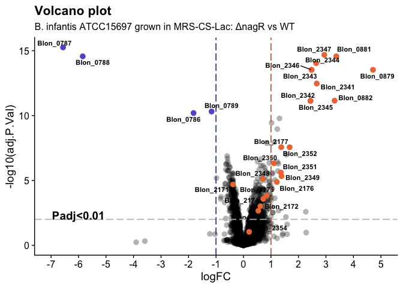
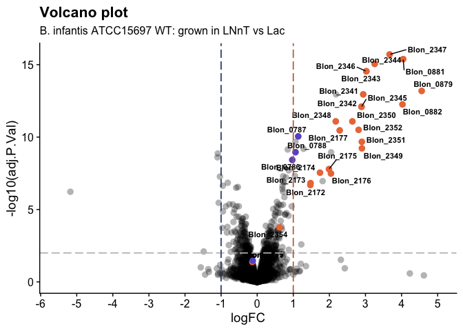

# Background

**Insert background text**

The code below describes:
1. Analysis of RNA-seq data: processing of raw fastq files and mapping reads to the *Bifidobacterium longum* subsp. *infantis* ATCC 15697 transcriptome
2. Analysis of EMSA data: processing of gel quantification data and building of 4-PL models

***

# Reproducibility and accessibility

To reproduce **all** steps listed below, you will need to download raw fastq files from the Gene Expression Omnibus, under accession [instert_accession](https://www.ncbi.nlm.nih.gov/geo/query/acc.cgi?acc=instert_accession). All code used in this analysis, including the Rmarkdown document used to compile this supplementary code file, is available on GitHub **[here](https://github.com/Arzamasov/NagR_manuscript)**. Once the GitHub repo has been downloaded, navigate to `NagR_manuscript/` to find the Rmarkdown document as well as an RProject file. This should be your working directory for executing code. Downloaded fastq files should be placed in: `NagR_manuscript/data/fastq/`.

***

# R packages used

A set of R packages was used for this analysis. All graphics and data wrangling were handled using the [tidyverse suite of packages](https://www.tidyverse.org/). All packages used are available from the Comprehensive R Archive Network (CRAN), Bioconductor.org, or Github.  


```r
library(tidyverse)
library(tximport)
library(gt)
library(edgeR)
library(matrixStats)
library(cowplot)
library(ggrepel)
library(pheatmap)
```

***

# External R functions used

A set of external R functions was used to keep the code tidy. All used R scripts with functions can be found in `NagR_manuscript/code/`.


```r
source("code/profile.R") # calculates counts per million (CPM) for each gene, 
# and plots the distribution of CPM values for each sample
source("code/deg_list.R") # selects differential expressed genes (DEGs) based on input cut-offs,
# outputs an annotated tables with DEGs to a txt file 
```

***

## Introduction

The code chuck below describes processing of raw fastq files and mapping reads to the *Bifidobacterium longum* subsp. *infantis* ATCC 15697 transcriptome.
The following software is required (can be installed to a conda environment):

1. [FastQC (v0.11.9)](https://www.bioinformatics.babraham.ac.uk/projects/fastqc/)
2. [Cutadapt (v3.4)](https://cutadapt.readthedocs.io/en/stable/)
3. [Bowtie2 (v2.4.4)](http://bowtie-bio.sourceforge.net/bowtie2/index.shtml)
4. [Kallisto v0.46.2](https://pachterlab.github.io/kallisto/)
5. [MultiQC (v1.11)](https://multiqc.info/)
6. [Parallel (v20210222)](https://www.gnu.org/software/parallel/)

*Note*: due to size limitation, raw fastq files and indexed references could not be stored in the GitHub repo.
Thus, you will need to download the fastq files from the Gene Expression Omnibus, under accession [instert_accession](https://www.ncbi.nlm.nih.gov/geo/query/acc.cgi?acc=instert_accession). Downloaded fastq files should be in `data/fastq/`. The reference fasta files should be in `data/refs/`. Sample names should be in `data/runids.txt`.

Alternatively, you can run `code/qc_readmapping.sh` instead of the code chunk below.

## Summary of the script

1. Quality control of raw reads was carried out using FastQC
2. Illumina sequencing adapters and short reads (< 20 bp) were removed using Cutadapt
3. Reads were mapped against rRNA and tRNA gene sequences extracted from the *Bifidobacterium longum* subsp. *infantis* ATCC 15697 genome (GenBank accession no. CP001095.1) using Bowtie2. Unmapped (filtered) reads were saved and used further
4. Filtered reads were mapped to the *Bifidobacterium longum* subsp. *infantis* ATCC 15697 (CP001095.1) using Kallisto
5. The quality of raw/filtered reads, as well as the results of Bowtie2/Kallisto mapping were summarized in `data/multiqc_report.html` generated via MultiQC


```bash
#!/bin/bash
echo $BASH_VERSION
set -ex

# required software: fastqc (v0.11.9), cutadapt (v3.4), bowtie2 (v2.4.4), kallisto (v0.46.2), multiqc (1.11), and parallel (v20210222)
# sample names should be in data/runids.txt

# activate conda enviroment with required software
eval "$(command conda 'shell.bash' 'hook' 2> /dev/null)" # initializes conda in sub-shell
conda activate transcriptomics
conda info|egrep "conda version|active environment"

# create directories
mkdir data/qc1 # qc results for raw reads
mkdir data/qc2 # qc results for filtered reads
mkdir data/fq_trim # trimmed reads
mkdir data/fq_filt # filtered reads
mkdir data/sam # sam files produced during bowtie2 alignment; will be deleted
mkdir data/kallisto # kallisto mapping results

# run fastqc on raw reads
cat data/runids.txt | parallel "fastqc data/fastq/{}.fastq.gz --outdir data/qc1"

# trim adapters using cutadapt
cat data/runids.txt | parallel "cutadapt -m 20 -a AGATCGGAAGAGCACACGTCTGAACTCCAGTC \
-o data/fq_trim/{}.fastq.gz data/fastq/{}.fastq.gz \
&> data/fq_trim/{}.fastq.qz.log"

# filter reads mapping to rRNA and tRNA genes
# build bowtie2 index
bowtie2-build data/refs/Binfantis_ATCC15697_rRNA_tRNA.fasta data/refs/Binfantis_ATCC15697_rRNA_tRNA
# align reads via bowtie2; save ones that did not align to a separate file
cat data/runids.txt | parallel "bowtie2 -x data/refs/Binfantis_ATCC15697_rRNA_tRNA \
-U data/fq_trim/{}.fastq.gz \
-S data/sam/{}.sam \
--un data/fq_filt/{}.fastq \
&> data/fq_filt/{}.log"
rm -rf data/sam
cat data/runids.txt | parallel "gzip data/fq_filt/{}.fastq"

# run fastqc on filtered reads
cat data/runids.txt | parallel "fastqc data/fq_filt/{}.fastq.gz --outdir data/qc2"

# pseudolalign reads to transcriptome
# build kallisto index
kallisto index -i data/refs/Binfantis_ATCC15697_transcriptome.index data/refs/Binfantis_ATCC15697_transcriptome.fasta
# map reads to indexed reference via kallisto
cat data/runids.txt | parallel "kallisto quant -i data/refs/Binfantis_ATCC15697_transcriptome.index \
-o data/kallisto/{} \
--single \
-l 200 \
-s 20 \
data/fq_filt/{}.fastq.gz \
&> data/kallisto/{}_2.log"

# run multiqc
export LC_ALL=en_US.utf-8
export LANG=en_US.utf-8
multiqc -d . -o data
```

***

# Using R/bioconductor to import and analyze RNA-seq data

## Importing count data into R

After read mapping with Kallisto, [TxImport](https://bioconductor.org/packages/release/bioc/html/tximport.html) was used to read Kallisto outputs into the R environment.


```r
# read the study design file
targets <- read_tsv("data/studydesign.txt")
# set file paths to Kallisto output folders with quantification data
files <- file.path("data/kallisto", targets$file_name, "abundance.tsv")
# check that all output files are present
all(file.exists(files))
```

```
## [1] TRUE
```

```r
# use 'tximport' to import Kallisto output into R
txi_kallisto <- tximport(files, 
                         type = "kallisto",
                         txOut = TRUE, # import at transcript level
                         countsFromAbundance = "lengthScaledTPM")

# capture variables of interest from the study design
condition <- as.factor(targets$condition)
condition <- factor(condition, levels = c("WT_Lac", "Mut_Lac", "WT_LNnT", "Mut_LNnT"))
batch <- as.factor(targets$batch)
strain <- as.factor(targets$strain)
carb <- as.factor(targets$carb)
# capture sample labels for later use
sampleLabels <- targets$sample

# saw a table with raw counts for GEO submission
raw_counts <- as.tibble(txi_kallisto$counts, rownames = "locus_tag")
colnames(raw_counts) <- c("geneID", sampleLabels)
write_tsv(raw_counts, "results/tables/GEO_kallisto_raw_counts.txt")

# use gt package to produce the study design table
gt(targets) %>% 
  cols_align(
    align = "left",
    columns = TRUE
  )
```

```{=html}
<div id="hbchqpcibq" style="overflow-x:auto;overflow-y:auto;width:auto;height:auto;">
<style>html {
  font-family: -apple-system, BlinkMacSystemFont, 'Segoe UI', Roboto, Oxygen, Ubuntu, Cantarell, 'Helvetica Neue', 'Fira Sans', 'Droid Sans', Arial, sans-serif;
}

#hbchqpcibq .gt_table {
  display: table;
  border-collapse: collapse;
  margin-left: auto;
  margin-right: auto;
  color: #333333;
  font-size: 16px;
  font-weight: normal;
  font-style: normal;
  background-color: #FFFFFF;
  width: auto;
  border-top-style: solid;
  border-top-width: 2px;
  border-top-color: #A8A8A8;
  border-right-style: none;
  border-right-width: 2px;
  border-right-color: #D3D3D3;
  border-bottom-style: solid;
  border-bottom-width: 2px;
  border-bottom-color: #A8A8A8;
  border-left-style: none;
  border-left-width: 2px;
  border-left-color: #D3D3D3;
}

#hbchqpcibq .gt_heading {
  background-color: #FFFFFF;
  text-align: center;
  border-bottom-color: #FFFFFF;
  border-left-style: none;
  border-left-width: 1px;
  border-left-color: #D3D3D3;
  border-right-style: none;
  border-right-width: 1px;
  border-right-color: #D3D3D3;
}

#hbchqpcibq .gt_title {
  color: #333333;
  font-size: 125%;
  font-weight: initial;
  padding-top: 4px;
  padding-bottom: 4px;
  border-bottom-color: #FFFFFF;
  border-bottom-width: 0;
}

#hbchqpcibq .gt_subtitle {
  color: #333333;
  font-size: 85%;
  font-weight: initial;
  padding-top: 0;
  padding-bottom: 6px;
  border-top-color: #FFFFFF;
  border-top-width: 0;
}

#hbchqpcibq .gt_bottom_border {
  border-bottom-style: solid;
  border-bottom-width: 2px;
  border-bottom-color: #D3D3D3;
}

#hbchqpcibq .gt_col_headings {
  border-top-style: solid;
  border-top-width: 2px;
  border-top-color: #D3D3D3;
  border-bottom-style: solid;
  border-bottom-width: 2px;
  border-bottom-color: #D3D3D3;
  border-left-style: none;
  border-left-width: 1px;
  border-left-color: #D3D3D3;
  border-right-style: none;
  border-right-width: 1px;
  border-right-color: #D3D3D3;
}

#hbchqpcibq .gt_col_heading {
  color: #333333;
  background-color: #FFFFFF;
  font-size: 100%;
  font-weight: normal;
  text-transform: inherit;
  border-left-style: none;
  border-left-width: 1px;
  border-left-color: #D3D3D3;
  border-right-style: none;
  border-right-width: 1px;
  border-right-color: #D3D3D3;
  vertical-align: bottom;
  padding-top: 5px;
  padding-bottom: 6px;
  padding-left: 5px;
  padding-right: 5px;
  overflow-x: hidden;
}

#hbchqpcibq .gt_column_spanner_outer {
  color: #333333;
  background-color: #FFFFFF;
  font-size: 100%;
  font-weight: normal;
  text-transform: inherit;
  padding-top: 0;
  padding-bottom: 0;
  padding-left: 4px;
  padding-right: 4px;
}

#hbchqpcibq .gt_column_spanner_outer:first-child {
  padding-left: 0;
}

#hbchqpcibq .gt_column_spanner_outer:last-child {
  padding-right: 0;
}

#hbchqpcibq .gt_column_spanner {
  border-bottom-style: solid;
  border-bottom-width: 2px;
  border-bottom-color: #D3D3D3;
  vertical-align: bottom;
  padding-top: 5px;
  padding-bottom: 5px;
  overflow-x: hidden;
  display: inline-block;
  width: 100%;
}

#hbchqpcibq .gt_group_heading {
  padding: 8px;
  color: #333333;
  background-color: #FFFFFF;
  font-size: 100%;
  font-weight: initial;
  text-transform: inherit;
  border-top-style: solid;
  border-top-width: 2px;
  border-top-color: #D3D3D3;
  border-bottom-style: solid;
  border-bottom-width: 2px;
  border-bottom-color: #D3D3D3;
  border-left-style: none;
  border-left-width: 1px;
  border-left-color: #D3D3D3;
  border-right-style: none;
  border-right-width: 1px;
  border-right-color: #D3D3D3;
  vertical-align: middle;
}

#hbchqpcibq .gt_empty_group_heading {
  padding: 0.5px;
  color: #333333;
  background-color: #FFFFFF;
  font-size: 100%;
  font-weight: initial;
  border-top-style: solid;
  border-top-width: 2px;
  border-top-color: #D3D3D3;
  border-bottom-style: solid;
  border-bottom-width: 2px;
  border-bottom-color: #D3D3D3;
  vertical-align: middle;
}

#hbchqpcibq .gt_from_md > :first-child {
  margin-top: 0;
}

#hbchqpcibq .gt_from_md > :last-child {
  margin-bottom: 0;
}

#hbchqpcibq .gt_row {
  padding-top: 8px;
  padding-bottom: 8px;
  padding-left: 5px;
  padding-right: 5px;
  margin: 10px;
  border-top-style: solid;
  border-top-width: 1px;
  border-top-color: #D3D3D3;
  border-left-style: none;
  border-left-width: 1px;
  border-left-color: #D3D3D3;
  border-right-style: none;
  border-right-width: 1px;
  border-right-color: #D3D3D3;
  vertical-align: middle;
  overflow-x: hidden;
}

#hbchqpcibq .gt_stub {
  color: #333333;
  background-color: #FFFFFF;
  font-size: 100%;
  font-weight: initial;
  text-transform: inherit;
  border-right-style: solid;
  border-right-width: 2px;
  border-right-color: #D3D3D3;
  padding-left: 12px;
}

#hbchqpcibq .gt_summary_row {
  color: #333333;
  background-color: #FFFFFF;
  text-transform: inherit;
  padding-top: 8px;
  padding-bottom: 8px;
  padding-left: 5px;
  padding-right: 5px;
}

#hbchqpcibq .gt_first_summary_row {
  padding-top: 8px;
  padding-bottom: 8px;
  padding-left: 5px;
  padding-right: 5px;
  border-top-style: solid;
  border-top-width: 2px;
  border-top-color: #D3D3D3;
}

#hbchqpcibq .gt_grand_summary_row {
  color: #333333;
  background-color: #FFFFFF;
  text-transform: inherit;
  padding-top: 8px;
  padding-bottom: 8px;
  padding-left: 5px;
  padding-right: 5px;
}

#hbchqpcibq .gt_first_grand_summary_row {
  padding-top: 8px;
  padding-bottom: 8px;
  padding-left: 5px;
  padding-right: 5px;
  border-top-style: double;
  border-top-width: 6px;
  border-top-color: #D3D3D3;
}

#hbchqpcibq .gt_striped {
  background-color: rgba(128, 128, 128, 0.05);
}

#hbchqpcibq .gt_table_body {
  border-top-style: solid;
  border-top-width: 2px;
  border-top-color: #D3D3D3;
  border-bottom-style: solid;
  border-bottom-width: 2px;
  border-bottom-color: #D3D3D3;
}

#hbchqpcibq .gt_footnotes {
  color: #333333;
  background-color: #FFFFFF;
  border-bottom-style: none;
  border-bottom-width: 2px;
  border-bottom-color: #D3D3D3;
  border-left-style: none;
  border-left-width: 2px;
  border-left-color: #D3D3D3;
  border-right-style: none;
  border-right-width: 2px;
  border-right-color: #D3D3D3;
}

#hbchqpcibq .gt_footnote {
  margin: 0px;
  font-size: 90%;
  padding: 4px;
}

#hbchqpcibq .gt_sourcenotes {
  color: #333333;
  background-color: #FFFFFF;
  border-bottom-style: none;
  border-bottom-width: 2px;
  border-bottom-color: #D3D3D3;
  border-left-style: none;
  border-left-width: 2px;
  border-left-color: #D3D3D3;
  border-right-style: none;
  border-right-width: 2px;
  border-right-color: #D3D3D3;
}

#hbchqpcibq .gt_sourcenote {
  font-size: 90%;
  padding: 4px;
}

#hbchqpcibq .gt_left {
  text-align: left;
}

#hbchqpcibq .gt_center {
  text-align: center;
}

#hbchqpcibq .gt_right {
  text-align: right;
  font-variant-numeric: tabular-nums;
}

#hbchqpcibq .gt_font_normal {
  font-weight: normal;
}

#hbchqpcibq .gt_font_bold {
  font-weight: bold;
}

#hbchqpcibq .gt_font_italic {
  font-style: italic;
}

#hbchqpcibq .gt_super {
  font-size: 65%;
}

#hbchqpcibq .gt_footnote_marks {
  font-style: italic;
  font-weight: normal;
  font-size: 65%;
}
</style>
<table class="gt_table">
  
  <thead class="gt_col_headings">
    <tr>
      <th class="gt_col_heading gt_columns_bottom_border gt_left" rowspan="1" colspan="1">sample</th>
      <th class="gt_col_heading gt_columns_bottom_border gt_left" rowspan="1" colspan="1">file_name</th>
      <th class="gt_col_heading gt_columns_bottom_border gt_left" rowspan="1" colspan="1">condition</th>
      <th class="gt_col_heading gt_columns_bottom_border gt_left" rowspan="1" colspan="1">batch</th>
      <th class="gt_col_heading gt_columns_bottom_border gt_left" rowspan="1" colspan="1">strain</th>
      <th class="gt_col_heading gt_columns_bottom_border gt_left" rowspan="1" colspan="1">carb</th>
    </tr>
  </thead>
  <tbody class="gt_table_body">
    <tr><td class="gt_row gt_left">WT_Lac1</td>
<td class="gt_row gt_left">25-JCM-lac1_S53_L001_R1_001</td>
<td class="gt_row gt_left">WT_Lac</td>
<td class="gt_row gt_left">1</td>
<td class="gt_row gt_left">ATCC15697</td>
<td class="gt_row gt_left">Lac</td></tr>
    <tr><td class="gt_row gt_left">Mut_Lac1</td>
<td class="gt_row gt_left">26-M3-lac1_S54_L001_R1_001</td>
<td class="gt_row gt_left">Mut_Lac</td>
<td class="gt_row gt_left">1</td>
<td class="gt_row gt_left">M3</td>
<td class="gt_row gt_left">Lac</td></tr>
    <tr><td class="gt_row gt_left">WT_LNnT1</td>
<td class="gt_row gt_left">27-JCM-LNnT-1_S55_L001_R1_001</td>
<td class="gt_row gt_left">WT_LNnT</td>
<td class="gt_row gt_left">2</td>
<td class="gt_row gt_left">ATCC15697</td>
<td class="gt_row gt_left">LNnT</td></tr>
    <tr><td class="gt_row gt_left">Mut_LNnT1</td>
<td class="gt_row gt_left">28-M3-LNnT-1_S56_L001_R1_001</td>
<td class="gt_row gt_left">Mut_LNnT</td>
<td class="gt_row gt_left">2</td>
<td class="gt_row gt_left">M3</td>
<td class="gt_row gt_left">LNnT</td></tr>
    <tr><td class="gt_row gt_left">WT_Lac2</td>
<td class="gt_row gt_left">29-JCM-lac2_S57_L001_R1_001</td>
<td class="gt_row gt_left">WT_Lac</td>
<td class="gt_row gt_left">1</td>
<td class="gt_row gt_left">ATCC15697</td>
<td class="gt_row gt_left">Lac</td></tr>
    <tr><td class="gt_row gt_left">Mut_Lac2</td>
<td class="gt_row gt_left">30-M3-lac2_S58_L001_R1_001</td>
<td class="gt_row gt_left">Mut_Lac</td>
<td class="gt_row gt_left">1</td>
<td class="gt_row gt_left">M3</td>
<td class="gt_row gt_left">Lac</td></tr>
    <tr><td class="gt_row gt_left">WT_LNnT2</td>
<td class="gt_row gt_left">31-JCM-LNnT-2_S59_L001_R1_001</td>
<td class="gt_row gt_left">WT_LNnT</td>
<td class="gt_row gt_left">2</td>
<td class="gt_row gt_left">ATCC15697</td>
<td class="gt_row gt_left">LNnT</td></tr>
    <tr><td class="gt_row gt_left">Mut_LNnT2</td>
<td class="gt_row gt_left">32-M3-LNnT-2_S60_L001_R1_001</td>
<td class="gt_row gt_left">Mut_LNnT</td>
<td class="gt_row gt_left">2</td>
<td class="gt_row gt_left">M3</td>
<td class="gt_row gt_left">LNnT</td></tr>
    <tr><td class="gt_row gt_left">WT_Lac3</td>
<td class="gt_row gt_left">33-JCM-lac3_S61_L001_R1_001</td>
<td class="gt_row gt_left">WT_Lac</td>
<td class="gt_row gt_left">1</td>
<td class="gt_row gt_left">ATCC15697</td>
<td class="gt_row gt_left">Lac</td></tr>
    <tr><td class="gt_row gt_left">Mut_Lac3</td>
<td class="gt_row gt_left">34-M3-lac3_S62_L001_R1_001</td>
<td class="gt_row gt_left">Mut_Lac</td>
<td class="gt_row gt_left">1</td>
<td class="gt_row gt_left">M3</td>
<td class="gt_row gt_left">Lac</td></tr>
    <tr><td class="gt_row gt_left">WT_LNnT3</td>
<td class="gt_row gt_left">35-JCM-LNnT-3_S63_L001_R1_001</td>
<td class="gt_row gt_left">WT_LNnT</td>
<td class="gt_row gt_left">2</td>
<td class="gt_row gt_left">ATCC15697</td>
<td class="gt_row gt_left">LNnT</td></tr>
    <tr><td class="gt_row gt_left">Mut_LNnT3</td>
<td class="gt_row gt_left">36-M3-LNnT-3_S64_L001_R1_001</td>
<td class="gt_row gt_left">Mut_LNnT</td>
<td class="gt_row gt_left">2</td>
<td class="gt_row gt_left">M3</td>
<td class="gt_row gt_left">LNnT</td></tr>
  </tbody>
  
  
</table>
</div>
```

## Filtering and normalization


```r
myDGEList <- DGEList(txi_kallisto$counts)
# plot unfiltered, non-normalized CPM
p1 <- profile(myDGEList, sampleLabels, "Unfiltered, non-normalized")
# filter counts
cpm <- cpm(myDGEList)
keepers <- rowSums(cpm>1)>=3 # only keep genes that have cpm>1 (== not zeroes) in more than 2 samples (minimal group size)
myDGEList.filtered <- myDGEList[keepers,]
# plot filtered, non-normalized CPM
p2 <- profile(myDGEList.filtered, sampleLabels, "Filtered, non-normalized")
# normalize counts via the TMM method implemented in edgeR
myDGEList.filtered.norm <- calcNormFactors(myDGEList.filtered, method = "TMM")
# plot filtered, normalized CPM
p3 <- profile(myDGEList.filtered.norm, sampleLabels, "Filtered, TMM normalized")
# compare distributions of the CPM values
plot_grid(p1, p2, p3, labels = c('A', 'B', 'C'), label_size = 12)
```

<!-- -->

Filtering was carried out to remove lowly expressed genes. Genes with less than 1 count per million (CPM) in at least 3 or more samples filtered out. This procedure reduced the number of genes from **2508** to **2366**.
In addition, the [TMM method](https://doi.org/10.1186/gb-2010-11-3-r25) was used for between-sample normalization.

## PCA plot

Principal Component Analysis (PCA) plots reduce complex datasets to a 2D representation where each axis represents a source of variance (known or unknown) in the dataset.  As you can see from the plots below, Principal Component 1 (PC1; X-axis), which accounts for >38% of the variance in the data, is separating the samples based on carbon source. PC2 (Y-axis) accounts for a smaller source of variance (~21%) and can be attributed to variation between strains of *Bifidobacterium longum* subsp. *infantis* ATCC 15697: WT and *ΔnagR*.


```r
# running PCA
log2.cpm.filtered.norm <- cpm(myDGEList.filtered.norm, log=TRUE)
pca.res <- prcomp(t(log2.cpm.filtered.norm), scale.=F, retx=T)
pc.var <- pca.res$sdev^2 # sdev^2 captures eigenvalues from the PCA result
pc.per <- round(pc.var/sum(pc.var)*100, 1) # calculate percentage of the total variation explained by each eigenvalue
# converting PCA result into a tibble for plotting
pca.res.df <- as_tibble(pca.res$x)

# plotting PCA
ggplot(pca.res.df) +
  aes(x=PC1, y=PC2, label=sampleLabels, shape = carb, fill = strain) +
  geom_point(size=4) +
  scale_shape_manual(name = "Carb. source",
                     breaks=c("Lac","LNnT"), 
                     values=c(21, 24),
                     labels=c("Lactose", "LNnT")) +
  scale_fill_manual(name = "Strain",
                     breaks=c("ATCC15697","M3"),
                     values=c("#008800", "#ffcf34"),
                     labels=c("WT", "ΔnagR")) +
  guides(fill = guide_legend(override.aes=list(shape=21))) +
  xlab(paste0("PC1 (",pc.per[1],"%",")")) + 
  ylab(paste0("PC2 (",pc.per[2],"%",")")) +
  labs(title= "PCA of B. infantis ATCC 15697: WT vs ΔnagR",
       subtitle = "Principal component analysis (PCA) showing clear separation \nbetween growth on Lac and LNnT and between WT and ΔnagR",
       color = "strain", shape="carb") +
  coord_fixed(ratio=1.2) +
  theme_bw() +
  theme(plot.title = element_text(face="bold"))
```

-1.png)<!-- -->

```r
# save the figure as pdf
ggsave("results/figures/figure_2B.pdf", device = "pdf", width = 5, height = 5)
```

## Differentially expressed genes 

To identify differentially expressed genes (DEGs), precision weights were first applied to each gene based on its mean-variance relationship using [VOOM](https://genomebiology.biomedcentral.com/articles/10.1186/gb-2014-15-2-r29).  Linear modeling and bayesian stats were employed using [Limma](https://academic.oup.com/nar/article/43/7/e47/2414268) to find genes that were up- or down-regulated by 2-fold or more at false-discovery rate (FDR) of 0.01.


```r
# setting up model matrix without intercept
design <- model.matrix(~0 + condition)
colnames(design) <- levels(condition)
# using VOOM function from Limma package to apply precision weights to each gene
v.DEGList.filtered.norm <- voom(myDGEList.filtered.norm, design, plot = TRUE)
```

<!-- -->

```r
fit <- lmFit(v.DEGList.filtered.norm, design)
# setting up contrast matrix for pairwise comparisons of interest
contrast.matrix <- makeContrasts(Mut_WT_Lac = Mut_Lac - WT_Lac,
                                Mut_WT_LNnT = Mut_LNnT - WT_LNnT,
                                LNnT_WT = WT_LNnT - WT_Lac,
                                LNnT_Mut = Mut_LNnT - Mut_Lac,
                                levels=design)
fits <- contrasts.fit(fit, contrast.matrix)
# extracting stats 
ebFit <- eBayes(fits)
```

DEGs were annotated based on a [RAST-annotated](https://doi.org/10.1093/nar/gkt1226) version of the *Bifidobacterium longum* subsp. *infantis* ATCC 15697 genome, which was additionally subjected to extensive manual curation performed in the web-based mcSEED environment, a private clone of the publicly available [SEED platform](https://doi.org/10.1093/nar/gki866). The manual curation focused on annotating genes encoding functional roles (transporters, glycoside hydrolases, downstream catabolic enzymes, transcriptional regulators) for bifidobacterial carbohydrate metabolism.


```r
# create a master annotation table
seed.ann <- read_tsv('data/annotation/SEED_annotations.tsv')
corr <- read_tsv('data/annotation/Binfantis_ATCC15697_GenBank_vs_mcSEED.txt')
final.ann <- right_join(seed.ann, corr, by = c('seed_id' = 'seed_id')) %>%
  select(locus_tag, annotation)

# annotate DEGs
# Mut_Lac vs WT_Lac
myTopHits.Mut <- topTable(ebFit, adjust ="BH", coef=1, number=2600, sort.by="logFC")
deg_list(myTopHits.Mut, -1, 1, 0.01, "results/tables/DEG_Mut_Lac_vs_WT_Lac.txt")
```

```{=html}
<div id="npkwxrgery" style="overflow-x:auto;overflow-y:auto;width:auto;height:auto;">
<style>html {
  font-family: -apple-system, BlinkMacSystemFont, 'Segoe UI', Roboto, Oxygen, Ubuntu, Cantarell, 'Helvetica Neue', 'Fira Sans', 'Droid Sans', Arial, sans-serif;
}

#npkwxrgery .gt_table {
  display: table;
  border-collapse: collapse;
  margin-left: auto;
  margin-right: auto;
  color: #333333;
  font-size: 16px;
  font-weight: normal;
  font-style: normal;
  background-color: #FFFFFF;
  width: auto;
  border-top-style: solid;
  border-top-width: 2px;
  border-top-color: #A8A8A8;
  border-right-style: none;
  border-right-width: 2px;
  border-right-color: #D3D3D3;
  border-bottom-style: solid;
  border-bottom-width: 2px;
  border-bottom-color: #A8A8A8;
  border-left-style: none;
  border-left-width: 2px;
  border-left-color: #D3D3D3;
}

#npkwxrgery .gt_heading {
  background-color: #FFFFFF;
  text-align: center;
  border-bottom-color: #FFFFFF;
  border-left-style: none;
  border-left-width: 1px;
  border-left-color: #D3D3D3;
  border-right-style: none;
  border-right-width: 1px;
  border-right-color: #D3D3D3;
}

#npkwxrgery .gt_title {
  color: #333333;
  font-size: 125%;
  font-weight: initial;
  padding-top: 4px;
  padding-bottom: 4px;
  border-bottom-color: #FFFFFF;
  border-bottom-width: 0;
}

#npkwxrgery .gt_subtitle {
  color: #333333;
  font-size: 85%;
  font-weight: initial;
  padding-top: 0;
  padding-bottom: 6px;
  border-top-color: #FFFFFF;
  border-top-width: 0;
}

#npkwxrgery .gt_bottom_border {
  border-bottom-style: solid;
  border-bottom-width: 2px;
  border-bottom-color: #D3D3D3;
}

#npkwxrgery .gt_col_headings {
  border-top-style: solid;
  border-top-width: 2px;
  border-top-color: #D3D3D3;
  border-bottom-style: solid;
  border-bottom-width: 2px;
  border-bottom-color: #D3D3D3;
  border-left-style: none;
  border-left-width: 1px;
  border-left-color: #D3D3D3;
  border-right-style: none;
  border-right-width: 1px;
  border-right-color: #D3D3D3;
}

#npkwxrgery .gt_col_heading {
  color: #333333;
  background-color: #FFFFFF;
  font-size: 100%;
  font-weight: normal;
  text-transform: inherit;
  border-left-style: none;
  border-left-width: 1px;
  border-left-color: #D3D3D3;
  border-right-style: none;
  border-right-width: 1px;
  border-right-color: #D3D3D3;
  vertical-align: bottom;
  padding-top: 5px;
  padding-bottom: 6px;
  padding-left: 5px;
  padding-right: 5px;
  overflow-x: hidden;
}

#npkwxrgery .gt_column_spanner_outer {
  color: #333333;
  background-color: #FFFFFF;
  font-size: 100%;
  font-weight: normal;
  text-transform: inherit;
  padding-top: 0;
  padding-bottom: 0;
  padding-left: 4px;
  padding-right: 4px;
}

#npkwxrgery .gt_column_spanner_outer:first-child {
  padding-left: 0;
}

#npkwxrgery .gt_column_spanner_outer:last-child {
  padding-right: 0;
}

#npkwxrgery .gt_column_spanner {
  border-bottom-style: solid;
  border-bottom-width: 2px;
  border-bottom-color: #D3D3D3;
  vertical-align: bottom;
  padding-top: 5px;
  padding-bottom: 5px;
  overflow-x: hidden;
  display: inline-block;
  width: 100%;
}

#npkwxrgery .gt_group_heading {
  padding: 8px;
  color: #333333;
  background-color: #FFFFFF;
  font-size: 100%;
  font-weight: initial;
  text-transform: inherit;
  border-top-style: solid;
  border-top-width: 2px;
  border-top-color: #D3D3D3;
  border-bottom-style: solid;
  border-bottom-width: 2px;
  border-bottom-color: #D3D3D3;
  border-left-style: none;
  border-left-width: 1px;
  border-left-color: #D3D3D3;
  border-right-style: none;
  border-right-width: 1px;
  border-right-color: #D3D3D3;
  vertical-align: middle;
}

#npkwxrgery .gt_empty_group_heading {
  padding: 0.5px;
  color: #333333;
  background-color: #FFFFFF;
  font-size: 100%;
  font-weight: initial;
  border-top-style: solid;
  border-top-width: 2px;
  border-top-color: #D3D3D3;
  border-bottom-style: solid;
  border-bottom-width: 2px;
  border-bottom-color: #D3D3D3;
  vertical-align: middle;
}

#npkwxrgery .gt_from_md > :first-child {
  margin-top: 0;
}

#npkwxrgery .gt_from_md > :last-child {
  margin-bottom: 0;
}

#npkwxrgery .gt_row {
  padding-top: 8px;
  padding-bottom: 8px;
  padding-left: 5px;
  padding-right: 5px;
  margin: 10px;
  border-top-style: solid;
  border-top-width: 1px;
  border-top-color: #D3D3D3;
  border-left-style: none;
  border-left-width: 1px;
  border-left-color: #D3D3D3;
  border-right-style: none;
  border-right-width: 1px;
  border-right-color: #D3D3D3;
  vertical-align: middle;
  overflow-x: hidden;
}

#npkwxrgery .gt_stub {
  color: #333333;
  background-color: #FFFFFF;
  font-size: 100%;
  font-weight: initial;
  text-transform: inherit;
  border-right-style: solid;
  border-right-width: 2px;
  border-right-color: #D3D3D3;
  padding-left: 12px;
}

#npkwxrgery .gt_summary_row {
  color: #333333;
  background-color: #FFFFFF;
  text-transform: inherit;
  padding-top: 8px;
  padding-bottom: 8px;
  padding-left: 5px;
  padding-right: 5px;
}

#npkwxrgery .gt_first_summary_row {
  padding-top: 8px;
  padding-bottom: 8px;
  padding-left: 5px;
  padding-right: 5px;
  border-top-style: solid;
  border-top-width: 2px;
  border-top-color: #D3D3D3;
}

#npkwxrgery .gt_grand_summary_row {
  color: #333333;
  background-color: #FFFFFF;
  text-transform: inherit;
  padding-top: 8px;
  padding-bottom: 8px;
  padding-left: 5px;
  padding-right: 5px;
}

#npkwxrgery .gt_first_grand_summary_row {
  padding-top: 8px;
  padding-bottom: 8px;
  padding-left: 5px;
  padding-right: 5px;
  border-top-style: double;
  border-top-width: 6px;
  border-top-color: #D3D3D3;
}

#npkwxrgery .gt_striped {
  background-color: rgba(128, 128, 128, 0.05);
}

#npkwxrgery .gt_table_body {
  border-top-style: solid;
  border-top-width: 2px;
  border-top-color: #D3D3D3;
  border-bottom-style: solid;
  border-bottom-width: 2px;
  border-bottom-color: #D3D3D3;
}

#npkwxrgery .gt_footnotes {
  color: #333333;
  background-color: #FFFFFF;
  border-bottom-style: none;
  border-bottom-width: 2px;
  border-bottom-color: #D3D3D3;
  border-left-style: none;
  border-left-width: 2px;
  border-left-color: #D3D3D3;
  border-right-style: none;
  border-right-width: 2px;
  border-right-color: #D3D3D3;
}

#npkwxrgery .gt_footnote {
  margin: 0px;
  font-size: 90%;
  padding: 4px;
}

#npkwxrgery .gt_sourcenotes {
  color: #333333;
  background-color: #FFFFFF;
  border-bottom-style: none;
  border-bottom-width: 2px;
  border-bottom-color: #D3D3D3;
  border-left-style: none;
  border-left-width: 2px;
  border-left-color: #D3D3D3;
  border-right-style: none;
  border-right-width: 2px;
  border-right-color: #D3D3D3;
}

#npkwxrgery .gt_sourcenote {
  font-size: 90%;
  padding: 4px;
}

#npkwxrgery .gt_left {
  text-align: left;
}

#npkwxrgery .gt_center {
  text-align: center;
}

#npkwxrgery .gt_right {
  text-align: right;
  font-variant-numeric: tabular-nums;
}

#npkwxrgery .gt_font_normal {
  font-weight: normal;
}

#npkwxrgery .gt_font_bold {
  font-weight: bold;
}

#npkwxrgery .gt_font_italic {
  font-style: italic;
}

#npkwxrgery .gt_super {
  font-size: 65%;
}

#npkwxrgery .gt_footnote_marks {
  font-style: italic;
  font-weight: normal;
  font-size: 65%;
}
</style>
<table class="gt_table">
  
  <thead class="gt_col_headings">
    <tr>
      <th class="gt_col_heading gt_columns_bottom_border gt_left" rowspan="1" colspan="1">locus_tag</th>
      <th class="gt_col_heading gt_columns_bottom_border gt_left" rowspan="1" colspan="1">annotation</th>
      <th class="gt_col_heading gt_columns_bottom_border gt_left" rowspan="1" colspan="1">logFC</th>
      <th class="gt_col_heading gt_columns_bottom_border gt_left" rowspan="1" colspan="1">AveExpr</th>
      <th class="gt_col_heading gt_columns_bottom_border gt_left" rowspan="1" colspan="1">t</th>
      <th class="gt_col_heading gt_columns_bottom_border gt_left" rowspan="1" colspan="1">P.Value</th>
      <th class="gt_col_heading gt_columns_bottom_border gt_left" rowspan="1" colspan="1">adj.P.Val</th>
      <th class="gt_col_heading gt_columns_bottom_border gt_left" rowspan="1" colspan="1">B</th>
    </tr>
  </thead>
  <tbody class="gt_table_body">
    <tr><td class="gt_row gt_left">Blon_0879</td>
<td class="gt_row gt_left">Predicted N-acetyl-glucosamine kinase 2, ROK family (EC 2.7.1.59)</td>
<td class="gt_row gt_left">4.711712</td>
<td class="gt_row gt_left">8.37910040</td>
<td class="gt_row gt_left">51.311101</td>
<td class="gt_row gt_left">1.005800e-16</td>
<td class="gt_row gt_left">2.974654e-14</td>
<td class="gt_row gt_left">28.3954752</td></tr>
    <tr><td class="gt_row gt_left">Blon_0881</td>
<td class="gt_row gt_left">Glucosamine-6-phosphate deaminase (EC 3.5.99.6)</td>
<td class="gt_row gt_left">3.376751</td>
<td class="gt_row gt_left">10.87997802</td>
<td class="gt_row gt_left">65.158097</td>
<td class="gt_row gt_left">4.197348e-18</td>
<td class="gt_row gt_left">2.710616e-15</td>
<td class="gt_row gt_left">31.9810110</td></tr>
    <tr><td class="gt_row gt_left">Blon_0882</td>
<td class="gt_row gt_left">N-acetylglucosamine-6-phosphate deacetylase (EC 3.5.1.25)</td>
<td class="gt_row gt_left">3.312737</td>
<td class="gt_row gt_left">10.94997694</td>
<td class="gt_row gt_left">33.372441</td>
<td class="gt_row gt_left">3.000992e-14</td>
<td class="gt_row gt_left">7.100347e-12</td>
<td class="gt_row gt_left">23.0771329</td></tr>
    <tr><td class="gt_row gt_left">Blon_2347</td>
<td class="gt_row gt_left">Type II HMOs transporter (Blon_2347) I, substrate-binding protein</td>
<td class="gt_row gt_left">2.940590</td>
<td class="gt_row gt_left">10.02580851</td>
<td class="gt_row gt_left">69.595522</td>
<td class="gt_row gt_left">1.746457e-18</td>
<td class="gt_row gt_left">2.066059e-15</td>
<td class="gt_row gt_left">32.8004617</td></tr>
    <tr><td class="gt_row gt_left">Blon_2341</td>
<td class="gt_row gt_left">hypothetical protein</td>
<td class="gt_row gt_left">2.665440</td>
<td class="gt_row gt_left">7.56783751</td>
<td class="gt_row gt_left">42.326249</td>
<td class="gt_row gt_left">1.293722e-15</td>
<td class="gt_row gt_left">3.401052e-13</td>
<td class="gt_row gt_left">26.2971052</td></tr>
    <tr><td class="gt_row gt_left">Blon_2344</td>
<td class="gt_row gt_left">Type II HMOs transporter (Blon_2344) II, substrate-binding protein</td>
<td class="gt_row gt_left">2.643824</td>
<td class="gt_row gt_left">11.11900279</td>
<td class="gt_row gt_left">58.097291</td>
<td class="gt_row gt_left">1.930101e-17</td>
<td class="gt_row gt_left">9.133239e-15</td>
<td class="gt_row gt_left">30.5365937</td></tr>
    <tr><td class="gt_row gt_left">Blon_2346</td>
<td class="gt_row gt_left">Type II HMOs transporter, permease protein 1</td>
<td class="gt_row gt_left">2.477550</td>
<td class="gt_row gt_left">9.82671345</td>
<td class="gt_row gt_left">51.664805</td>
<td class="gt_row gt_left">9.180814e-17</td>
<td class="gt_row gt_left">2.974654e-14</td>
<td class="gt_row gt_left">28.9793458</td></tr>
    <tr><td class="gt_row gt_left">Blon_2343</td>
<td class="gt_row gt_left">Type II HMOs transporter, permease protein 1</td>
<td class="gt_row gt_left">2.477550</td>
<td class="gt_row gt_left">9.82671345</td>
<td class="gt_row gt_left">51.664805</td>
<td class="gt_row gt_left">9.180814e-17</td>
<td class="gt_row gt_left">2.974654e-14</td>
<td class="gt_row gt_left">28.9793458</td></tr>
    <tr><td class="gt_row gt_left">Blon_2345</td>
<td class="gt_row gt_left">Type II HMOs transporter, permease protein 2</td>
<td class="gt_row gt_left">2.436624</td>
<td class="gt_row gt_left">9.59482716</td>
<td class="gt_row gt_left">32.830006</td>
<td class="gt_row gt_left">3.725453e-14</td>
<td class="gt_row gt_left">7.345351e-12</td>
<td class="gt_row gt_left">22.8747739</td></tr>
    <tr><td class="gt_row gt_left">Blon_2342</td>
<td class="gt_row gt_left">Type II HMOs transporter, permease protein 2</td>
<td class="gt_row gt_left">2.436624</td>
<td class="gt_row gt_left">9.59482716</td>
<td class="gt_row gt_left">32.830006</td>
<td class="gt_row gt_left">3.725453e-14</td>
<td class="gt_row gt_left">7.345351e-12</td>
<td class="gt_row gt_left">22.8747739</td></tr>
    <tr><td class="gt_row gt_left">Blon_1132</td>
<td class="gt_row gt_left">hypothetical protein</td>
<td class="gt_row gt_left">2.265375</td>
<td class="gt_row gt_left">-0.68574839</td>
<td class="gt_row gt_left">4.684697</td>
<td class="gt_row gt_left">3.982628e-04</td>
<td class="gt_row gt_left">2.591101e-03</td>
<td class="gt_row gt_left">0.2823428</td></tr>
    <tr><td class="gt_row gt_left">Blon_2352</td>
<td class="gt_row gt_left">Predicted HMO transporter Blon_2352, substrate-binding protein</td>
<td class="gt_row gt_left">1.678601</td>
<td class="gt_row gt_left">7.80705281</td>
<td class="gt_row gt_left">16.713410</td>
<td class="gt_row gt_left">2.461265e-10</td>
<td class="gt_row gt_left">2.773025e-08</td>
<td class="gt_row gt_left">13.8815547</td></tr>
    <tr><td class="gt_row gt_left">Blon_2183</td>
<td class="gt_row gt_left">PTS system, glucose-specific IIABC (EC 2.7.1.69) @ PTS system, fructose-specific IIABC (EC 2.7.1.202)</td>
<td class="gt_row gt_left">1.561461</td>
<td class="gt_row gt_left">8.56583126</td>
<td class="gt_row gt_left">15.032904</td>
<td class="gt_row gt_left">9.469948e-10</td>
<td class="gt_row gt_left">1.018450e-07</td>
<td class="gt_row gt_left">12.2102465</td></tr>
    <tr><td class="gt_row gt_left">Blon_1498</td>
<td class="gt_row gt_left">hypothetical protein</td>
<td class="gt_row gt_left">1.542179</td>
<td class="gt_row gt_left">-0.03480011</td>
<td class="gt_row gt_left">4.060887</td>
<td class="gt_row gt_left">1.281227e-03</td>
<td class="gt_row gt_left">6.575670e-03</td>
<td class="gt_row gt_left">-0.9015377</td></tr>
    <tr><td class="gt_row gt_left">Blon_2349</td>
<td class="gt_row gt_left">N-acetylneuraminate lyase (EC 4.1.3.3)</td>
<td class="gt_row gt_left">1.384182</td>
<td class="gt_row gt_left">6.56895607</td>
<td class="gt_row gt_left">10.197840</td>
<td class="gt_row gt_left">1.131931e-07</td>
<td class="gt_row gt_left">4.698508e-06</td>
<td class="gt_row gt_left">7.5087974</td></tr>
    <tr><td class="gt_row gt_left">Blon_2177</td>
<td class="gt_row gt_left">Lacto-N-biose and Galacto-N-biose ABC transporter 1, periplasmic substrate-binding protein @ Type I HMOs transporter, substrate-binding protein</td>
<td class="gt_row gt_left">1.373780</td>
<td class="gt_row gt_left">8.74292091</td>
<td class="gt_row gt_left">16.798008</td>
<td class="gt_row gt_left">2.307472e-10</td>
<td class="gt_row gt_left">2.729739e-08</td>
<td class="gt_row gt_left">13.8158766</td></tr>
    <tr><td class="gt_row gt_left">Blon_2351</td>
<td class="gt_row gt_left">Predicted HMO transporter Blon_2351, substrate-binding protein</td>
<td class="gt_row gt_left">1.358591</td>
<td class="gt_row gt_left">6.99228264</td>
<td class="gt_row gt_left">10.925903</td>
<td class="gt_row gt_left">4.944778e-08</td>
<td class="gt_row gt_left">2.437364e-06</td>
<td class="gt_row gt_left">8.3098144</td></tr>
    <tr><td class="gt_row gt_left">Blon_2444</td>
<td class="gt_row gt_left">Maltose/maltodextrin ABC transporter, substrate binding periplasmic protein MalE</td>
<td class="gt_row gt_left">1.308107</td>
<td class="gt_row gt_left">10.64676644</td>
<td class="gt_row gt_left">25.471923</td>
<td class="gt_row gt_left">1.047605e-12</td>
<td class="gt_row gt_left">1.652423e-10</td>
<td class="gt_row gt_left">19.3119203</td></tr>
    <tr><td class="gt_row gt_left">Blon_1192</td>
<td class="gt_row gt_left">hypothetical protein</td>
<td class="gt_row gt_left">1.275749</td>
<td class="gt_row gt_left">2.15116030</td>
<td class="gt_row gt_left">4.834240</td>
<td class="gt_row gt_left">3.029845e-04</td>
<td class="gt_row gt_left">2.114635e-03</td>
<td class="gt_row gt_left">0.1057623</td></tr>
    <tr><td class="gt_row gt_left">Blon_0883</td>
<td class="gt_row gt_left">Lacto-N-biose and Galacto-N-biose ABC transporter 2, periplasmic substrate-binding protein</td>
<td class="gt_row gt_left">1.268364</td>
<td class="gt_row gt_left">8.41445932</td>
<td class="gt_row gt_left">12.846988</td>
<td class="gt_row gt_left">6.789660e-09</td>
<td class="gt_row gt_left">5.182044e-07</td>
<td class="gt_row gt_left">10.2521419</td></tr>
    <tr><td class="gt_row gt_left">Blon_1198</td>
<td class="gt_row gt_left">NA</td>
<td class="gt_row gt_left">1.252649</td>
<td class="gt_row gt_left">3.96773228</td>
<td class="gt_row gt_left">11.204319</td>
<td class="gt_row gt_left">3.645155e-08</td>
<td class="gt_row gt_left">1.875536e-06</td>
<td class="gt_row gt_left">9.0515974</td></tr>
    <tr><td class="gt_row gt_left">Blon_1480</td>
<td class="gt_row gt_left">ABC transporter, substrate-binding protein</td>
<td class="gt_row gt_left">1.235028</td>
<td class="gt_row gt_left">6.55471943</td>
<td class="gt_row gt_left">13.332650</td>
<td class="gt_row gt_left">4.278789e-09</td>
<td class="gt_row gt_left">3.733364e-07</td>
<td class="gt_row gt_left">10.9065796</td></tr>
    <tr><td class="gt_row gt_left">Blon_0139</td>
<td class="gt_row gt_left">4-alpha-glucanotransferase (amylomaltase) (EC 2.4.1.25)</td>
<td class="gt_row gt_left">1.231955</td>
<td class="gt_row gt_left">9.76390084</td>
<td class="gt_row gt_left">21.815926</td>
<td class="gt_row gt_left">7.915021e-12</td>
<td class="gt_row gt_left">1.101585e-09</td>
<td class="gt_row gt_left">17.1988406</td></tr>
    <tr><td class="gt_row gt_left">Blon_2176</td>
<td class="gt_row gt_left">Lacto-N-biose and Galacto-N-biose ABC transporter 1, permease component 1 @ Type I HMOs transporter, permease protein 1</td>
<td class="gt_row gt_left">1.212418</td>
<td class="gt_row gt_left">6.21720796</td>
<td class="gt_row gt_left">9.133952</td>
<td class="gt_row gt_left">4.144019e-07</td>
<td class="gt_row gt_left">1.324966e-05</td>
<td class="gt_row gt_left">6.3851498</td></tr>
    <tr><td class="gt_row gt_left">Blon_1200</td>
<td class="gt_row gt_left">N-formylglutamate deformylase (EC 3.5.1.68)</td>
<td class="gt_row gt_left">1.145314</td>
<td class="gt_row gt_left">4.83205353</td>
<td class="gt_row gt_left">9.511771</td>
<td class="gt_row gt_left">2.580950e-07</td>
<td class="gt_row gt_left">9.114221e-06</td>
<td class="gt_row gt_left">6.7995360</td></tr>
    <tr><td class="gt_row gt_left">Blon_1251</td>
<td class="gt_row gt_left">hypothetical protein</td>
<td class="gt_row gt_left">1.134744</td>
<td class="gt_row gt_left">3.92274306</td>
<td class="gt_row gt_left">6.490234</td>
<td class="gt_row gt_left">1.793632e-05</td>
<td class="gt_row gt_left">2.357630e-04</td>
<td class="gt_row gt_left">2.6172580</td></tr>
    <tr><td class="gt_row gt_left">Blon_2442</td>
<td class="gt_row gt_left">Maltose/maltodextrin ABC transporter, permease protein MalF</td>
<td class="gt_row gt_left">1.118657</td>
<td class="gt_row gt_left">7.92225096</td>
<td class="gt_row gt_left">18.150381</td>
<td class="gt_row gt_left">8.549814e-11</td>
<td class="gt_row gt_left">1.123826e-08</td>
<td class="gt_row gt_left">14.8891371</td></tr>
    <tr><td class="gt_row gt_left">Blon_2350</td>
<td class="gt_row gt_left">Predicted HMO transporter Blon_2350, substrate-binding protein</td>
<td class="gt_row gt_left">1.108183</td>
<td class="gt_row gt_left">7.78574616</td>
<td class="gt_row gt_left">12.976381</td>
<td class="gt_row gt_left">5.995012e-09</td>
<td class="gt_row gt_left">4.728066e-07</td>
<td class="gt_row gt_left">10.3838409</td></tr>
    <tr><td class="gt_row gt_left">Blon_1831</td>
<td class="gt_row gt_left">putative lysin</td>
<td class="gt_row gt_left">1.071344</td>
<td class="gt_row gt_left">1.13415020</td>
<td class="gt_row gt_left">4.603344</td>
<td class="gt_row gt_left">4.626708e-04</td>
<td class="gt_row gt_left">2.903658e-03</td>
<td class="gt_row gt_left">-0.2911472</td></tr>
    <tr><td class="gt_row gt_left">Blon_2359</td>
<td class="gt_row gt_left">ABC transporter, permease component 2</td>
<td class="gt_row gt_left">1.060271</td>
<td class="gt_row gt_left">1.91311524</td>
<td class="gt_row gt_left">4.555870</td>
<td class="gt_row gt_left">5.051523e-04</td>
<td class="gt_row gt_left">3.088347e-03</td>
<td class="gt_row gt_left">-0.3165468</td></tr>
    <tr><td class="gt_row gt_left">Blon_1246</td>
<td class="gt_row gt_left">hypothetical protein</td>
<td class="gt_row gt_left">1.053514</td>
<td class="gt_row gt_left">4.65031271</td>
<td class="gt_row gt_left">10.645123</td>
<td class="gt_row gt_left">6.768789e-08</td>
<td class="gt_row gt_left">3.079799e-06</td>
<td class="gt_row gt_left">8.3098189</td></tr>
    <tr><td class="gt_row gt_left">Blon_2441</td>
<td class="gt_row gt_left">Maltose/maltodextrin ABC transporter, permease protein MalG</td>
<td class="gt_row gt_left">1.048579</td>
<td class="gt_row gt_left">7.83196884</td>
<td class="gt_row gt_left">10.866159</td>
<td class="gt_row gt_left">5.283516e-08</td>
<td class="gt_row gt_left">2.551183e-06</td>
<td class="gt_row gt_left">8.0955659</td></tr>
    <tr><td class="gt_row gt_left">Blon_2361</td>
<td class="gt_row gt_left">ABC transporter, ATP-binding protein</td>
<td class="gt_row gt_left">1.039609</td>
<td class="gt_row gt_left">3.95078129</td>
<td class="gt_row gt_left">8.007448</td>
<td class="gt_row gt_left">1.861862e-06</td>
<td class="gt_row gt_left">4.155817e-05</td>
<td class="gt_row gt_left">4.8767476</td></tr>
    <tr><td class="gt_row gt_left">Blon_0884</td>
<td class="gt_row gt_left">Lacto-N-biose and Galacto-N-biose ABC transporter 2, permease component 1</td>
<td class="gt_row gt_left">1.028420</td>
<td class="gt_row gt_left">6.89379794</td>
<td class="gt_row gt_left">7.882930</td>
<td class="gt_row gt_left">2.217900e-06</td>
<td class="gt_row gt_left">4.814267e-05</td>
<td class="gt_row gt_left">4.3881306</td></tr>
    <tr><td class="gt_row gt_left">Blon_2332</td>
<td class="gt_row gt_left">Lactose and galactose permease, GPH translocator family</td>
<td class="gt_row gt_left">1.020814</td>
<td class="gt_row gt_left">9.95188368</td>
<td class="gt_row gt_left">23.855123</td>
<td class="gt_row gt_left">2.469718e-12</td>
<td class="gt_row gt_left">3.652095e-10</td>
<td class="gt_row gt_left">18.4116245</td></tr>
    <tr><td class="gt_row gt_left">Blon_1199</td>
<td class="gt_row gt_left">hypothetical protein</td>
<td class="gt_row gt_left">1.013346</td>
<td class="gt_row gt_left">2.35911549</td>
<td class="gt_row gt_left">5.366498</td>
<td class="gt_row gt_left">1.172197e-04</td>
<td class="gt_row gt_left">1.004861e-03</td>
<td class="gt_row gt_left">0.9993105</td></tr>
    <tr><td class="gt_row gt_left">Blon_1244</td>
<td class="gt_row gt_left">hypothetical protein</td>
<td class="gt_row gt_left">1.000828</td>
<td class="gt_row gt_left">5.18750757</td>
<td class="gt_row gt_left">6.617294</td>
<td class="gt_row gt_left">1.466627e-05</td>
<td class="gt_row gt_left">2.029263e-04</td>
<td class="gt_row gt_left">2.5590644</td></tr>
    <tr><td class="gt_row gt_left">Blon_0789</td>
<td class="gt_row gt_left">Sucrose specific transcriptional regulator CscR, LacI family</td>
<td class="gt_row gt_left">-1.161817</td>
<td class="gt_row gt_left">8.17013301</td>
<td class="gt_row gt_left">-28.264009</td>
<td class="gt_row gt_left">2.676777e-13</td>
<td class="gt_row gt_left">4.871733e-11</td>
<td class="gt_row gt_left">20.8401518</td></tr>
    <tr><td class="gt_row gt_left">Blon_0786</td>
<td class="gt_row gt_left">ABC-type nitrate/sulfonate/bicarbonate transport system, permease component</td>
<td class="gt_row gt_left">-1.816807</td>
<td class="gt_row gt_left">6.49555380</td>
<td class="gt_row gt_left">-27.531347</td>
<td class="gt_row gt_left">3.779544e-13</td>
<td class="gt_row gt_left">6.387430e-11</td>
<td class="gt_row gt_left">20.6456579</td></tr>
    <tr><td class="gt_row gt_left">Blon_0788</td>
<td class="gt_row gt_left">Sucrose permease, major facilitator superfamily</td>
<td class="gt_row gt_left">-5.848889</td>
<td class="gt_row gt_left">7.85019450</td>
<td class="gt_row gt_left">-64.729501</td>
<td class="gt_row gt_left">4.582614e-18</td>
<td class="gt_row gt_left">2.710616e-15</td>
<td class="gt_row gt_left">31.2075165</td></tr>
    <tr><td class="gt_row gt_left">Blon_0787</td>
<td class="gt_row gt_left">Exo-beta-(2-1/2-6)-fructofuranosidase 2, GH32</td>
<td class="gt_row gt_left">-6.564522</td>
<td class="gt_row gt_left">8.20871055</td>
<td class="gt_row gt_left">-80.934852</td>
<td class="gt_row gt_left">2.340007e-19</td>
<td class="gt_row gt_left">5.536456e-16</td>
<td class="gt_row gt_left">33.4143599</td></tr>
  </tbody>
  
  
</table>
</div>
```

```r
# annotate DEGs
# WT_LNnT vs WT_Lac
myTopHits.WT <- topTable(ebFit, adjust ="BH", coef=3, number=2600, sort.by="logFC")
deg_list(myTopHits.WT, -1, 1, 0.01, "results/tables/DEG_WT_LNnT_vs_WT_Lac.txt")
```

```{=html}
<div id="nnabusokgw" style="overflow-x:auto;overflow-y:auto;width:auto;height:auto;">
<style>html {
  font-family: -apple-system, BlinkMacSystemFont, 'Segoe UI', Roboto, Oxygen, Ubuntu, Cantarell, 'Helvetica Neue', 'Fira Sans', 'Droid Sans', Arial, sans-serif;
}

#nnabusokgw .gt_table {
  display: table;
  border-collapse: collapse;
  margin-left: auto;
  margin-right: auto;
  color: #333333;
  font-size: 16px;
  font-weight: normal;
  font-style: normal;
  background-color: #FFFFFF;
  width: auto;
  border-top-style: solid;
  border-top-width: 2px;
  border-top-color: #A8A8A8;
  border-right-style: none;
  border-right-width: 2px;
  border-right-color: #D3D3D3;
  border-bottom-style: solid;
  border-bottom-width: 2px;
  border-bottom-color: #A8A8A8;
  border-left-style: none;
  border-left-width: 2px;
  border-left-color: #D3D3D3;
}

#nnabusokgw .gt_heading {
  background-color: #FFFFFF;
  text-align: center;
  border-bottom-color: #FFFFFF;
  border-left-style: none;
  border-left-width: 1px;
  border-left-color: #D3D3D3;
  border-right-style: none;
  border-right-width: 1px;
  border-right-color: #D3D3D3;
}

#nnabusokgw .gt_title {
  color: #333333;
  font-size: 125%;
  font-weight: initial;
  padding-top: 4px;
  padding-bottom: 4px;
  border-bottom-color: #FFFFFF;
  border-bottom-width: 0;
}

#nnabusokgw .gt_subtitle {
  color: #333333;
  font-size: 85%;
  font-weight: initial;
  padding-top: 0;
  padding-bottom: 6px;
  border-top-color: #FFFFFF;
  border-top-width: 0;
}

#nnabusokgw .gt_bottom_border {
  border-bottom-style: solid;
  border-bottom-width: 2px;
  border-bottom-color: #D3D3D3;
}

#nnabusokgw .gt_col_headings {
  border-top-style: solid;
  border-top-width: 2px;
  border-top-color: #D3D3D3;
  border-bottom-style: solid;
  border-bottom-width: 2px;
  border-bottom-color: #D3D3D3;
  border-left-style: none;
  border-left-width: 1px;
  border-left-color: #D3D3D3;
  border-right-style: none;
  border-right-width: 1px;
  border-right-color: #D3D3D3;
}

#nnabusokgw .gt_col_heading {
  color: #333333;
  background-color: #FFFFFF;
  font-size: 100%;
  font-weight: normal;
  text-transform: inherit;
  border-left-style: none;
  border-left-width: 1px;
  border-left-color: #D3D3D3;
  border-right-style: none;
  border-right-width: 1px;
  border-right-color: #D3D3D3;
  vertical-align: bottom;
  padding-top: 5px;
  padding-bottom: 6px;
  padding-left: 5px;
  padding-right: 5px;
  overflow-x: hidden;
}

#nnabusokgw .gt_column_spanner_outer {
  color: #333333;
  background-color: #FFFFFF;
  font-size: 100%;
  font-weight: normal;
  text-transform: inherit;
  padding-top: 0;
  padding-bottom: 0;
  padding-left: 4px;
  padding-right: 4px;
}

#nnabusokgw .gt_column_spanner_outer:first-child {
  padding-left: 0;
}

#nnabusokgw .gt_column_spanner_outer:last-child {
  padding-right: 0;
}

#nnabusokgw .gt_column_spanner {
  border-bottom-style: solid;
  border-bottom-width: 2px;
  border-bottom-color: #D3D3D3;
  vertical-align: bottom;
  padding-top: 5px;
  padding-bottom: 5px;
  overflow-x: hidden;
  display: inline-block;
  width: 100%;
}

#nnabusokgw .gt_group_heading {
  padding: 8px;
  color: #333333;
  background-color: #FFFFFF;
  font-size: 100%;
  font-weight: initial;
  text-transform: inherit;
  border-top-style: solid;
  border-top-width: 2px;
  border-top-color: #D3D3D3;
  border-bottom-style: solid;
  border-bottom-width: 2px;
  border-bottom-color: #D3D3D3;
  border-left-style: none;
  border-left-width: 1px;
  border-left-color: #D3D3D3;
  border-right-style: none;
  border-right-width: 1px;
  border-right-color: #D3D3D3;
  vertical-align: middle;
}

#nnabusokgw .gt_empty_group_heading {
  padding: 0.5px;
  color: #333333;
  background-color: #FFFFFF;
  font-size: 100%;
  font-weight: initial;
  border-top-style: solid;
  border-top-width: 2px;
  border-top-color: #D3D3D3;
  border-bottom-style: solid;
  border-bottom-width: 2px;
  border-bottom-color: #D3D3D3;
  vertical-align: middle;
}

#nnabusokgw .gt_from_md > :first-child {
  margin-top: 0;
}

#nnabusokgw .gt_from_md > :last-child {
  margin-bottom: 0;
}

#nnabusokgw .gt_row {
  padding-top: 8px;
  padding-bottom: 8px;
  padding-left: 5px;
  padding-right: 5px;
  margin: 10px;
  border-top-style: solid;
  border-top-width: 1px;
  border-top-color: #D3D3D3;
  border-left-style: none;
  border-left-width: 1px;
  border-left-color: #D3D3D3;
  border-right-style: none;
  border-right-width: 1px;
  border-right-color: #D3D3D3;
  vertical-align: middle;
  overflow-x: hidden;
}

#nnabusokgw .gt_stub {
  color: #333333;
  background-color: #FFFFFF;
  font-size: 100%;
  font-weight: initial;
  text-transform: inherit;
  border-right-style: solid;
  border-right-width: 2px;
  border-right-color: #D3D3D3;
  padding-left: 12px;
}

#nnabusokgw .gt_summary_row {
  color: #333333;
  background-color: #FFFFFF;
  text-transform: inherit;
  padding-top: 8px;
  padding-bottom: 8px;
  padding-left: 5px;
  padding-right: 5px;
}

#nnabusokgw .gt_first_summary_row {
  padding-top: 8px;
  padding-bottom: 8px;
  padding-left: 5px;
  padding-right: 5px;
  border-top-style: solid;
  border-top-width: 2px;
  border-top-color: #D3D3D3;
}

#nnabusokgw .gt_grand_summary_row {
  color: #333333;
  background-color: #FFFFFF;
  text-transform: inherit;
  padding-top: 8px;
  padding-bottom: 8px;
  padding-left: 5px;
  padding-right: 5px;
}

#nnabusokgw .gt_first_grand_summary_row {
  padding-top: 8px;
  padding-bottom: 8px;
  padding-left: 5px;
  padding-right: 5px;
  border-top-style: double;
  border-top-width: 6px;
  border-top-color: #D3D3D3;
}

#nnabusokgw .gt_striped {
  background-color: rgba(128, 128, 128, 0.05);
}

#nnabusokgw .gt_table_body {
  border-top-style: solid;
  border-top-width: 2px;
  border-top-color: #D3D3D3;
  border-bottom-style: solid;
  border-bottom-width: 2px;
  border-bottom-color: #D3D3D3;
}

#nnabusokgw .gt_footnotes {
  color: #333333;
  background-color: #FFFFFF;
  border-bottom-style: none;
  border-bottom-width: 2px;
  border-bottom-color: #D3D3D3;
  border-left-style: none;
  border-left-width: 2px;
  border-left-color: #D3D3D3;
  border-right-style: none;
  border-right-width: 2px;
  border-right-color: #D3D3D3;
}

#nnabusokgw .gt_footnote {
  margin: 0px;
  font-size: 90%;
  padding: 4px;
}

#nnabusokgw .gt_sourcenotes {
  color: #333333;
  background-color: #FFFFFF;
  border-bottom-style: none;
  border-bottom-width: 2px;
  border-bottom-color: #D3D3D3;
  border-left-style: none;
  border-left-width: 2px;
  border-left-color: #D3D3D3;
  border-right-style: none;
  border-right-width: 2px;
  border-right-color: #D3D3D3;
}

#nnabusokgw .gt_sourcenote {
  font-size: 90%;
  padding: 4px;
}

#nnabusokgw .gt_left {
  text-align: left;
}

#nnabusokgw .gt_center {
  text-align: center;
}

#nnabusokgw .gt_right {
  text-align: right;
  font-variant-numeric: tabular-nums;
}

#nnabusokgw .gt_font_normal {
  font-weight: normal;
}

#nnabusokgw .gt_font_bold {
  font-weight: bold;
}

#nnabusokgw .gt_font_italic {
  font-style: italic;
}

#nnabusokgw .gt_super {
  font-size: 65%;
}

#nnabusokgw .gt_footnote_marks {
  font-style: italic;
  font-weight: normal;
  font-size: 65%;
}
</style>
<table class="gt_table">
  
  <thead class="gt_col_headings">
    <tr>
      <th class="gt_col_heading gt_columns_bottom_border gt_left" rowspan="1" colspan="1">locus_tag</th>
      <th class="gt_col_heading gt_columns_bottom_border gt_left" rowspan="1" colspan="1">annotation</th>
      <th class="gt_col_heading gt_columns_bottom_border gt_left" rowspan="1" colspan="1">logFC</th>
      <th class="gt_col_heading gt_columns_bottom_border gt_left" rowspan="1" colspan="1">AveExpr</th>
      <th class="gt_col_heading gt_columns_bottom_border gt_left" rowspan="1" colspan="1">t</th>
      <th class="gt_col_heading gt_columns_bottom_border gt_left" rowspan="1" colspan="1">P.Value</th>
      <th class="gt_col_heading gt_columns_bottom_border gt_left" rowspan="1" colspan="1">adj.P.Val</th>
      <th class="gt_col_heading gt_columns_bottom_border gt_left" rowspan="1" colspan="1">B</th>
    </tr>
  </thead>
  <tbody class="gt_table_body">
    <tr><td class="gt_row gt_left">Blon_0879</td>
<td class="gt_row gt_left">Predicted N-acetyl-glucosamine kinase 2, ROK family (EC 2.7.1.59)</td>
<td class="gt_row gt_left">4.557787</td>
<td class="gt_row gt_left">8.379100</td>
<td class="gt_row gt_left">49.443911</td>
<td class="gt_row gt_left">1.645545e-16</td>
<td class="gt_row gt_left">6.488933e-14</td>
<td class="gt_row gt_left">27.8857831</td></tr>
    <tr><td class="gt_row gt_left">Blon_0881</td>
<td class="gt_row gt_left">Glucosamine-6-phosphate deaminase (EC 3.5.99.6)</td>
<td class="gt_row gt_left">4.045866</td>
<td class="gt_row gt_left">10.879978</td>
<td class="gt_row gt_left">78.547804</td>
<td class="gt_row gt_left">3.486539e-19</td>
<td class="gt_row gt_left">4.124575e-16</td>
<td class="gt_row gt_left">34.2390766</td></tr>
    <tr><td class="gt_row gt_left">Blon_0882</td>
<td class="gt_row gt_left">N-acetylglucosamine-6-phosphate deacetylase (EC 3.5.1.25)</td>
<td class="gt_row gt_left">4.025067</td>
<td class="gt_row gt_left">10.949977</td>
<td class="gt_row gt_left">40.822302</td>
<td class="gt_row gt_left">2.089455e-15</td>
<td class="gt_row gt_left">5.492945e-13</td>
<td class="gt_row gt_left">25.8362940</td></tr>
    <tr><td class="gt_row gt_left">Blon_2347</td>
<td class="gt_row gt_left">Type II HMOs transporter (Blon_2347) I, substrate-binding protein</td>
<td class="gt_row gt_left">3.667998</td>
<td class="gt_row gt_left">10.025809</td>
<td class="gt_row gt_left">87.481221</td>
<td class="gt_row gt_left">8.302252e-20</td>
<td class="gt_row gt_left">1.964313e-16</td>
<td class="gt_row gt_left">35.4821783</td></tr>
    <tr><td class="gt_row gt_left">Blon_2344</td>
<td class="gt_row gt_left">Type II HMOs transporter (Blon_2344) II, substrate-binding protein</td>
<td class="gt_row gt_left">3.256334</td>
<td class="gt_row gt_left">11.119003</td>
<td class="gt_row gt_left">71.965093</td>
<td class="gt_row gt_left">1.118363e-18</td>
<td class="gt_row gt_left">8.820156e-16</td>
<td class="gt_row gt_left">33.2747773</td></tr>
    <tr><td class="gt_row gt_left">Blon_2346</td>
<td class="gt_row gt_left">Type II HMOs transporter, permease protein 1</td>
<td class="gt_row gt_left">3.023648</td>
<td class="gt_row gt_left">9.826713</td>
<td class="gt_row gt_left">63.410256</td>
<td class="gt_row gt_left">6.026994e-18</td>
<td class="gt_row gt_left">2.851974e-15</td>
<td class="gt_row gt_left">31.6061258</td></tr>
    <tr><td class="gt_row gt_left">Blon_2343</td>
<td class="gt_row gt_left">Type II HMOs transporter, permease protein 1</td>
<td class="gt_row gt_left">3.023648</td>
<td class="gt_row gt_left">9.826713</td>
<td class="gt_row gt_left">63.410256</td>
<td class="gt_row gt_left">6.026994e-18</td>
<td class="gt_row gt_left">2.851974e-15</td>
<td class="gt_row gt_left">31.6061258</td></tr>
    <tr><td class="gt_row gt_left">Blon_2341</td>
<td class="gt_row gt_left">hypothetical protein</td>
<td class="gt_row gt_left">2.937604</td>
<td class="gt_row gt_left">7.567838</td>
<td class="gt_row gt_left">46.750468</td>
<td class="gt_row gt_left">3.461230e-16</td>
<td class="gt_row gt_left">1.119449e-13</td>
<td class="gt_row gt_left">27.5251253</td></tr>
    <tr><td class="gt_row gt_left">Blon_2349</td>
<td class="gt_row gt_left">N-acetylneuraminate lyase (EC 4.1.3.3)</td>
<td class="gt_row gt_left">2.901672</td>
<td class="gt_row gt_left">6.568956</td>
<td class="gt_row gt_left">22.678378</td>
<td class="gt_row gt_left">4.778041e-12</td>
<td class="gt_row gt_left">5.949918e-10</td>
<td class="gt_row gt_left">18.0593482</td></tr>
    <tr><td class="gt_row gt_left">Blon_2351</td>
<td class="gt_row gt_left">Predicted HMO transporter Blon_2351, substrate-binding protein</td>
<td class="gt_row gt_left">2.899749</td>
<td class="gt_row gt_left">6.992283</td>
<td class="gt_row gt_left">24.711207</td>
<td class="gt_row gt_left">1.557836e-12</td>
<td class="gt_row gt_left">2.112849e-10</td>
<td class="gt_row gt_left">19.1776426</td></tr>
    <tr><td class="gt_row gt_left">Blon_2345</td>
<td class="gt_row gt_left">Type II HMOs transporter, permease protein 2</td>
<td class="gt_row gt_left">2.889455</td>
<td class="gt_row gt_left">9.594827</td>
<td class="gt_row gt_left">39.090740</td>
<td class="gt_row gt_left">3.709390e-15</td>
<td class="gt_row gt_left">7.978561e-13</td>
<td class="gt_row gt_left">25.2633771</td></tr>
    <tr><td class="gt_row gt_left">Blon_2342</td>
<td class="gt_row gt_left">Type II HMOs transporter, permease protein 2</td>
<td class="gt_row gt_left">2.889455</td>
<td class="gt_row gt_left">9.594827</td>
<td class="gt_row gt_left">39.090740</td>
<td class="gt_row gt_left">3.709390e-15</td>
<td class="gt_row gt_left">7.978561e-13</td>
<td class="gt_row gt_left">25.2633771</td></tr>
    <tr><td class="gt_row gt_left">Blon_2352</td>
<td class="gt_row gt_left">Predicted HMO transporter Blon_2352, substrate-binding protein</td>
<td class="gt_row gt_left">2.809842</td>
<td class="gt_row gt_left">7.807053</td>
<td class="gt_row gt_left">29.046276</td>
<td class="gt_row gt_left">1.869564e-13</td>
<td class="gt_row gt_left">3.159564e-11</td>
<td class="gt_row gt_left">21.3474173</td></tr>
    <tr><td class="gt_row gt_left">Blon_2350</td>
<td class="gt_row gt_left">Predicted HMO transporter Blon_2350, substrate-binding protein</td>
<td class="gt_row gt_left">2.637091</td>
<td class="gt_row gt_left">7.785746</td>
<td class="gt_row gt_left">32.464932</td>
<td class="gt_row gt_left">4.317611e-14</td>
<td class="gt_row gt_left">8.204712e-12</td>
<td class="gt_row gt_left">22.7950297</td></tr>
    <tr><td class="gt_row gt_left">Blon_2177</td>
<td class="gt_row gt_left">Lacto-N-biose and Galacto-N-biose ABC transporter 1, periplasmic substrate-binding protein @ Type I HMOs transporter, substrate-binding protein</td>
<td class="gt_row gt_left">2.286112</td>
<td class="gt_row gt_left">8.742921</td>
<td class="gt_row gt_left">28.709982</td>
<td class="gt_row gt_left">2.178934e-13</td>
<td class="gt_row gt_left">3.436905e-11</td>
<td class="gt_row gt_left">21.1290100</td></tr>
    <tr><td class="gt_row gt_left">Blon_2475</td>
<td class="gt_row gt_left">Maltose/maltodextrin transport ATP-binding protein MalK (EC 3.6.3.19)</td>
<td class="gt_row gt_left">2.184337</td>
<td class="gt_row gt_left">11.600959</td>
<td class="gt_row gt_left">46.436375</td>
<td class="gt_row gt_left">3.785119e-16</td>
<td class="gt_row gt_left">1.119449e-13</td>
<td class="gt_row gt_left">27.5469465</td></tr>
    <tr><td class="gt_row gt_left">Blon_2348</td>
<td class="gt_row gt_left">HMO cluster exo-alpha-(2-3/2-6)-sialidase, GH33</td>
<td class="gt_row gt_left">2.177168</td>
<td class="gt_row gt_left">7.027739</td>
<td class="gt_row gt_left">32.358846</td>
<td class="gt_row gt_left">4.508083e-14</td>
<td class="gt_row gt_left">8.204712e-12</td>
<td class="gt_row gt_left">22.7748930</td></tr>
    <tr><td class="gt_row gt_left">Blon_0883</td>
<td class="gt_row gt_left">Lacto-N-biose and Galacto-N-biose ABC transporter 2, periplasmic substrate-binding protein</td>
<td class="gt_row gt_left">2.047359</td>
<td class="gt_row gt_left">8.414459</td>
<td class="gt_row gt_left">21.278755</td>
<td class="gt_row gt_left">1.094405e-11</td>
<td class="gt_row gt_left">1.125809e-09</td>
<td class="gt_row gt_left">17.0594715</td></tr>
    <tr><td class="gt_row gt_left">Blon_2176</td>
<td class="gt_row gt_left">Lacto-N-biose and Galacto-N-biose ABC transporter 1, permease component 1 @ Type I HMOs transporter, permease protein 1</td>
<td class="gt_row gt_left">2.043958</td>
<td class="gt_row gt_left">6.217208</td>
<td class="gt_row gt_left">16.041946</td>
<td class="gt_row gt_left">4.152228e-10</td>
<td class="gt_row gt_left">3.274724e-08</td>
<td class="gt_row gt_left">13.5957246</td></tr>
    <tr><td class="gt_row gt_left">Blon_2175</td>
<td class="gt_row gt_left">Lacto-N-biose and Galacto-N-biose ABC transporter 1, permease component 2 @ Type I HMOs transporter, permease protein 2</td>
<td class="gt_row gt_left">1.988426</td>
<td class="gt_row gt_left">6.459792</td>
<td class="gt_row gt_left">17.091030</td>
<td class="gt_row gt_left">1.849552e-10</td>
<td class="gt_row gt_left">1.620756e-08</td>
<td class="gt_row gt_left">14.3797264</td></tr>
    <tr><td class="gt_row gt_left">Blon_0884</td>
<td class="gt_row gt_left">Lacto-N-biose and Galacto-N-biose ABC transporter 2, permease component 1</td>
<td class="gt_row gt_left">1.813769</td>
<td class="gt_row gt_left">6.893798</td>
<td class="gt_row gt_left">14.407359</td>
<td class="gt_row gt_left">1.619260e-09</td>
<td class="gt_row gt_left">1.094620e-07</td>
<td class="gt_row gt_left">12.0113565</td></tr>
    <tr><td class="gt_row gt_left">Blon_2174</td>
<td class="gt_row gt_left">1,3-beta-galactosyl-N-acetylhexosamine phosphorylase (EC 2.4.1.211)</td>
<td class="gt_row gt_left">1.740218</td>
<td class="gt_row gt_left">8.116541</td>
<td class="gt_row gt_left">16.254985</td>
<td class="gt_row gt_left">3.509921e-10</td>
<td class="gt_row gt_left">2.863612e-08</td>
<td class="gt_row gt_left">13.4387707</td></tr>
    <tr><td class="gt_row gt_left">Blon_2173</td>
<td class="gt_row gt_left">N-acetylhexosamine 1-kinase (EC 2.7.1.162)</td>
<td class="gt_row gt_left">1.477987</td>
<td class="gt_row gt_left">6.995738</td>
<td class="gt_row gt_left">13.929152</td>
<td class="gt_row gt_left">2.474864e-09</td>
<td class="gt_row gt_left">1.501418e-07</td>
<td class="gt_row gt_left">11.5402317</td></tr>
    <tr><td class="gt_row gt_left">Blon_2172</td>
<td class="gt_row gt_left">UTP-hexose-1-phosphate uridylyltransferase involved in lacto-N-biose utilization, predicted</td>
<td class="gt_row gt_left">1.472635</td>
<td class="gt_row gt_left">7.271580</td>
<td class="gt_row gt_left">13.571085</td>
<td class="gt_row gt_left">3.429132e-09</td>
<td class="gt_row gt_left">2.028332e-07</td>
<td class="gt_row gt_left">11.1501681</td></tr>
    <tr><td class="gt_row gt_left">Blon_2064</td>
<td class="gt_row gt_left">Transcriptional regulator of galactose metabolism, DeoR family</td>
<td class="gt_row gt_left">1.286102</td>
<td class="gt_row gt_left">8.219709</td>
<td class="gt_row gt_left">22.462415</td>
<td class="gt_row gt_left">5.412343e-12</td>
<td class="gt_row gt_left">6.402802e-10</td>
<td class="gt_row gt_left">17.7374026</td></tr>
    <tr><td class="gt_row gt_left">Blon_1549</td>
<td class="gt_row gt_left">hypothetical protein</td>
<td class="gt_row gt_left">1.221940</td>
<td class="gt_row gt_left">2.040166</td>
<td class="gt_row gt_left">5.073437</td>
<td class="gt_row gt_left">1.968147e-04</td>
<td class="gt_row gt_left">2.572727e-03</td>
<td class="gt_row gt_left">0.6758862</td></tr>
    <tr><td class="gt_row gt_left">Blon_0787</td>
<td class="gt_row gt_left">Exo-beta-(2-1/2-6)-fructofuranosidase 2, GH32</td>
<td class="gt_row gt_left">1.137170</td>
<td class="gt_row gt_left">8.208711</td>
<td class="gt_row gt_left">26.574300</td>
<td class="gt_row gt_left">6.012738e-13</td>
<td class="gt_row gt_left">8.891336e-11</td>
<td class="gt_row gt_left">19.8678702</td></tr>
    <tr><td class="gt_row gt_left">Blon_0788</td>
<td class="gt_row gt_left">Sucrose permease, major facilitator superfamily</td>
<td class="gt_row gt_left">1.062091</td>
<td class="gt_row gt_left">7.850195</td>
<td class="gt_row gt_left">21.392532</td>
<td class="gt_row gt_left">1.021157e-11</td>
<td class="gt_row gt_left">1.098208e-09</td>
<td class="gt_row gt_left">16.8920282</td></tr>
    <tr><td class="gt_row gt_left">Blon_2332</td>
<td class="gt_row gt_left">Lactose and galactose permease, GPH translocator family</td>
<td class="gt_row gt_left">1.058245</td>
<td class="gt_row gt_left">9.951884</td>
<td class="gt_row gt_left">24.652089</td>
<td class="gt_row gt_left">1.607408e-12</td>
<td class="gt_row gt_left">2.112849e-10</td>
<td class="gt_row gt_left">18.9000068</td></tr>
    <tr><td class="gt_row gt_left">Blon_0885</td>
<td class="gt_row gt_left">Lacto-N-biose and Galacto-N-biose ABC transporter 2, permease component 2</td>
<td class="gt_row gt_left">1.046920</td>
<td class="gt_row gt_left">7.666201</td>
<td class="gt_row gt_left">15.519581</td>
<td class="gt_row gt_left">6.324481e-10</td>
<td class="gt_row gt_left">4.827007e-08</td>
<td class="gt_row gt_left">12.8155620</td></tr>
    <tr><td class="gt_row gt_left">Blon_0419</td>
<td class="gt_row gt_left">ABC-type anion transport system, duplicated permease component</td>
<td class="gt_row gt_left">-1.032662</td>
<td class="gt_row gt_left">7.235231</td>
<td class="gt_row gt_left">-15.324390</td>
<td class="gt_row gt_left">7.425734e-10</td>
<td class="gt_row gt_left">5.324026e-08</td>
<td class="gt_row gt_left">12.6169492</td></tr>
    <tr><td class="gt_row gt_left">Blon_0387</td>
<td class="gt_row gt_left">Riboflavin synthase eubacterial/eukaryotic (EC 2.5.1.9)</td>
<td class="gt_row gt_left">-1.066484</td>
<td class="gt_row gt_left">6.547532</td>
<td class="gt_row gt_left">-10.578805</td>
<td class="gt_row gt_left">7.296957e-08</td>
<td class="gt_row gt_left">3.452920e-06</td>
<td class="gt_row gt_left">7.9030667</td></tr>
    <tr><td class="gt_row gt_left">Blon_0389</td>
<td class="gt_row gt_left">6,7-dimethyl-8-ribityllumazine synthase (EC 2.5.1.78)</td>
<td class="gt_row gt_left">-1.091751</td>
<td class="gt_row gt_left">7.335855</td>
<td class="gt_row gt_left">-20.910029</td>
<td class="gt_row gt_left">1.373205e-11</td>
<td class="gt_row gt_left">1.353751e-09</td>
<td class="gt_row gt_left">16.8340909</td></tr>
    <tr><td class="gt_row gt_left">Blon_0388</td>
<td class="gt_row gt_left">GTP cyclohydrolase II (EC 3.5.4.25) / 3,4-dihydroxy-2-butanone 4-phosphate synthase (EC 4.1.99.12)</td>
<td class="gt_row gt_left">-1.099324</td>
<td class="gt_row gt_left">7.848994</td>
<td class="gt_row gt_left">-19.888326</td>
<td class="gt_row gt_left">2.628145e-11</td>
<td class="gt_row gt_left">2.487276e-09</td>
<td class="gt_row gt_left">16.0900993</td></tr>
    <tr><td class="gt_row gt_left">Blon_0153</td>
<td class="gt_row gt_left">NA</td>
<td class="gt_row gt_left">-1.482523</td>
<td class="gt_row gt_left">1.241736</td>
<td class="gt_row gt_left">-4.243049</td>
<td class="gt_row gt_left">9.069486e-04</td>
<td class="gt_row gt_left">7.947557e-03</td>
<td class="gt_row gt_left">-0.6089336</td></tr>
    <tr><td class="gt_row gt_left">Blon_1831</td>
<td class="gt_row gt_left">putative lysin</td>
<td class="gt_row gt_left">-5.176343</td>
<td class="gt_row gt_left">1.134150</td>
<td class="gt_row gt_left">-12.285129</td>
<td class="gt_row gt_left">1.180696e-08</td>
<td class="gt_row gt_left">5.943672e-07</td>
<td class="gt_row gt_left">9.6843645</td></tr>
  </tbody>
  
  
</table>
</div>
```

## Volcano plot: *Bifidobacterium longum* subsp. *infantis* ATCC 15697 grown in MRS-CS-Lac: *ΔnagR* vs WT

Volcano plots are convenient ways to represent gene expression data because they combine magnitude of change (X-axis) with significance (Y-axis). Since the Y-axis is the inverse log10 of the adjusted Pvalue, higher points are more significant.
In the case of this particular plot, there are many genes in the upper right of the plot, which represent genes that are significantly **upregulated** in the *ΔnagR* mutant grown in MRS-CS-Lac, compared to WT grown in MRS-CS-Lac.


```r
# list stats for all genes in the dataset to be used for making volcano plot
myTopHits <- topTable(ebFit, adjust ="BH", coef=1, number=2600, sort.by="logFC")
myTopHits.df <- myTopHits %>%
  as_tibble(rownames = "geneID")
# select only genes with significant logFC and adj.P.Val
myTopHits.df.de <- subset(myTopHits.df, (logFC > 1 | logFC < -1) & adj.P.Val < 0.01)
# create a vector containing locus_tags of genes predicted to be in the NagR regulon
targets.nagR <- c("Blon_0879", "Blon_0881", "Blon_0882", "Blon_2171", "Blon_2172","Blon_2173", "Blon_2174", "Blon_2175", "Blon_2176", "Blon_2177", "Blon_2341", "Blon_2342", "Blon_2343", "Blon_2344", "Blon_2345", "Blon_2346", "Blon_2347", "Blon_2348", "Blon_2349", "Blon_2350", "Blon_2351", "Blon_2352", "Blon_2354")
# create a vector containing locus_tags of genes predicted to be in the CscR regulon
targets.cscR <- c("Blon_0789", "Blon_0788", "Blon_0787", "Blon_0786")
# subset volcano plot data based targets.nagR and targets.cscR
myTopHits.nagR <- subset(myTopHits.df, geneID %in% targets.nagR)
myTopHits.cscR <- subset(myTopHits.df, geneID %in% targets.cscR)
# subset data labels(NagR regulon) for volcano plot
myTopHits.df$nagR <- myTopHits.df$geneID
myTopHits.nagR_selected <- myTopHits.df$nagR %in% myTopHits.nagR$geneID
myTopHits.df$nagR[!myTopHits.nagR_selected] <- NA
# subset data labels(CscR regulon) for volcano plot
myTopHits.df$cscR <- myTopHits.df$geneID
myTopHits.cscR_selected <- myTopHits.df$cscR %in% myTopHits.cscR$geneID
myTopHits.df$cscR[!myTopHits.cscR_selected] <- NA

# create the volcano plot
ggplot(myTopHits.df) +
  aes(y=-log10(adj.P.Val), x=logFC, text = paste("Symbol:", geneID)) +
  geom_point(size=3, shape = 16, color="black", alpha=.3) +
  geom_point(mapping=NULL, myTopHits.nagR, size = 3, shape = 16, color= "sienna2", inherit.aes = TRUE) +
  geom_point(mapping=NULL, myTopHits.cscR , size = 3, shape = 16, color= "slateblue", inherit.aes = TRUE) +
  geom_text_repel(aes(label = nagR), size = 3, fontface=2, color="black") +
  geom_text_repel(aes(label = cscR), size = 3, fontface=2, color="black") +
  geom_hline(yintercept = -log10(0.01), linetype="longdash", colour="grey", size=0.6) +
  geom_vline(xintercept = 1, linetype="longdash", colour="#BE684D", size=0.6) +
  geom_vline(xintercept = -1, linetype="longdash", colour="#2C467A", size=0.6) +
  annotate("text", x=-6, y=-log10(0.01)+0.3,
           label=paste("Padj<0.01"), size=5, fontface="bold") +
  scale_x_continuous(limits=c(-7,5), breaks = -7:5) +
  labs(title="Volcano plot",
       subtitle = "B. infantis ATCC15697 grown in MRS-CS-Lac: ΔnagR vs WT") +
  theme(plot.title = element_text(face="bold")) +
  theme_cowplot()
```

<!-- -->

```r
# save the figure as pdf
ggsave("results/figures/figure_2C.pdf", device = "pdf", width = 8, height = 5)
```

## Volcano plot: *Bifidobacterium longum* subsp. *infantis* ATCC 15697 WT: grown in MRS-CS-LNnT vs grown in MRS-CS-Lac


```r
# listing stats for all genes in the dataset to be used for making volcano plot
myTopHits3 <- topTable(ebFit, adjust ="BH", coef=3, number=2600, sort.by="logFC")
myTopHits.df3 <- myTopHits3 %>%
  as_tibble(rownames = "geneID")
# select only genes with significant logFC and adj.P.Val
myTopHits.df3.de <- subset(myTopHits.df3, (logFC > 1 | logFC < -1) & adj.P.Val < 0.01)
# subset volcano plot data based targets.nagR and targets.cscR
myTopHits.nagR3 <- subset(myTopHits.df3, geneID %in% targets.nagR)
myTopHits.cscR3 <- subset(myTopHits.df3, geneID %in% targets.cscR)
# subset volcano plot data labels (NagR-controlled genes)
myTopHits.df3$nagR <- myTopHits.df3$geneID
myTopHits.nagR_selected3 <- myTopHits.df3$nagR %in% myTopHits.nagR3$geneID
myTopHits.df3$nagR[!myTopHits.nagR_selected3] <- NA
# subset volcano plot data labels (CscR-controlled genes)
myTopHits.df3$cscR <- myTopHits.df3$geneID
myTopHits.cscR_selected3 <- myTopHits.df3$cscR %in% myTopHits.cscR3$geneID
myTopHits.df3$cscR[!myTopHits.cscR_selected3] <- NA

# create a volcano plot
ggplot(myTopHits.df3) +
  aes(y=-log10(adj.P.Val), x=logFC, text = paste("Symbol:", geneID)) +
  geom_point(size=3, shape = 16, color = "black", alpha =.3) +
  geom_point(mapping=NULL, myTopHits.nagR3, size = 3, shape = 16, color = "sienna2", inherit.aes = TRUE) +
  geom_point(mapping=NULL, myTopHits.cscR3 , size = 3, shape = 16, color = "slateblue", inherit.aes = TRUE) +
  geom_text_repel(aes(label = nagR), size = 3, fontface=2, color="black", max.overlaps = 100) +
  geom_text_repel(aes(label = cscR), size = 3, fontface=2, color="black") +
  geom_hline(yintercept = -log10(0.01), linetype="longdash", colour="grey", size=0.6) +
  geom_vline(xintercept = 1, linetype="longdash", colour="#BE684D", size=0.6) +
  geom_vline(xintercept = -1, linetype="longdash", colour="#2C467A", size=0.6) +
  annotate("text", x=-6, y=-log10(0.01)+0.3,
           label=paste("Padj<0.01"), size=5, fontface="bold") +
  scale_x_continuous(limits=c(-5.5,5), breaks = -6:5) +
  labs(title="Volcano plot",
       subtitle = "B. infantis ATCC15697 WT: grown in LNnT vs Lac") +
  theme(plot.title = element_text(face="bold")) +
  theme_cowplot()
```

<!-- -->

```r
# save the figure as pdf
ggsave("results/figures/figure_2D.pdf", device = "pdf", width = 8, height = 5)
```

## Heatmap

Heatmap was plotted using the [pheatmap](https://CRAN.R-project.org/package=pheatmap) package. Rows are clustered by hierarchical clustering. Data are scaled by Z-score for each row.


```r
colnames(v.DEGList.filtered.norm$E) <- sampleLabels
diffGenes <- v.DEGList.filtered.norm$E
diffGenes.df <- as_tibble(diffGenes, rownames = "geneID")
diffGenes.df.two_conditions <- subset(diffGenes.df, geneID %in% myTopHits.df.de$geneID | geneID %in% myTopHits.df3.de$geneID) %>%
    relocate(geneID, WT_Lac1, WT_Lac2, WT_Lac3, Mut_Lac1, Mut_Lac2, Mut_Lac3, WT_LNnT1, WT_LNnT2, WT_LNnT3, Mut_LNnT1, Mut_LNnT2, Mut_LNnT3)
diffGenes.two_conditions <- as.matrix(diffGenes.df.two_conditions[,-1])
rownames(diffGenes.two_conditions) <- diffGenes.df.two_conditions$geneID
# plot the heatmap
pheatmap(diffGenes.two_conditions,
         scale = "row",
         cluster_rows = F,
         cluster_cols = F,
         angle_col = 45,
         gaps_col = c(3, 6, 9),
         cellwidth = 10,
         cellheight = 10,
         filename = "results/figures/figure_S3.pdf")
```

## Session info

The output from running 'sessionInfo' is shown below and details all packages and version necessary to reproduce the results in this report.


```r
sessionInfo()
```

```
## R version 4.1.2 (2021-11-01)
## Platform: x86_64-apple-darwin17.0 (64-bit)
## Running under: macOS Catalina 10.15.7
## 
## Matrix products: default
## BLAS:   /Library/Frameworks/R.framework/Versions/4.1/Resources/lib/libRblas.0.dylib
## LAPACK: /Library/Frameworks/R.framework/Versions/4.1/Resources/lib/libRlapack.dylib
## 
## locale:
## [1] en_US.UTF-8/en_US.UTF-8/en_US.UTF-8/C/en_US.UTF-8/en_US.UTF-8
## 
## attached base packages:
## [1] stats     graphics  grDevices utils     datasets  methods   base     
## 
## other attached packages:
##  [1] pheatmap_1.0.12    ggrepel_0.9.1      cowplot_1.1.1      matrixStats_0.61.0
##  [5] edgeR_3.36.0       limma_3.50.0       gt_0.3.1           tximport_1.22.0   
##  [9] forcats_0.5.1      stringr_1.4.0      dplyr_1.0.7        purrr_0.3.4       
## [13] readr_2.1.1        tidyr_1.1.4        tibble_3.1.6       ggplot2_3.3.5     
## [17] tidyverse_1.3.1    knitr_1.37         tinytex_0.36       rmarkdown_2.11    
## 
## loaded via a namespace (and not attached):
##  [1] httr_1.4.2         sass_0.4.0         bit64_4.0.5        vroom_1.5.7       
##  [5] jsonlite_1.7.2     modelr_0.1.8       assertthat_0.2.1   highr_0.9         
##  [9] cellranger_1.1.0   yaml_2.2.1         pillar_1.6.4       backports_1.4.1   
## [13] lattice_0.20-45    glue_1.6.0         digest_0.6.29      checkmate_2.0.0   
## [17] RColorBrewer_1.1-2 rvest_1.0.2        colorspace_2.0-2   htmltools_0.5.2   
## [21] pkgconfig_2.0.3    broom_0.7.11       haven_2.4.3        scales_1.1.1      
## [25] tzdb_0.2.0         farver_2.1.0       generics_0.1.1     ellipsis_0.3.2    
## [29] withr_2.4.3        cli_3.1.0          magrittr_2.0.1     crayon_1.4.2      
## [33] readxl_1.3.1       evaluate_0.14      fs_1.5.2           fansi_0.5.0       
## [37] xml2_1.3.3         tools_4.1.2        hms_1.1.1          lifecycle_1.0.1   
## [41] Rhdf5lib_1.16.0    munsell_0.5.0      reprex_2.0.1       locfit_1.5-9.4    
## [45] compiler_4.1.2     jquerylib_0.1.4    rlang_0.4.12       rhdf5_2.38.0      
## [49] grid_4.1.2         rhdf5filters_1.6.0 rstudioapi_0.13    labeling_0.4.2    
## [53] gtable_0.3.0       DBI_1.1.2          R6_2.5.1           lubridate_1.8.0   
## [57] fastmap_1.1.0      bit_4.0.4          utf8_1.2.2         stringi_1.7.6     
## [61] parallel_4.1.2     Rcpp_1.0.7         vctrs_0.3.8        dbplyr_2.1.1      
## [65] tidyselect_1.1.1   xfun_0.29
```

